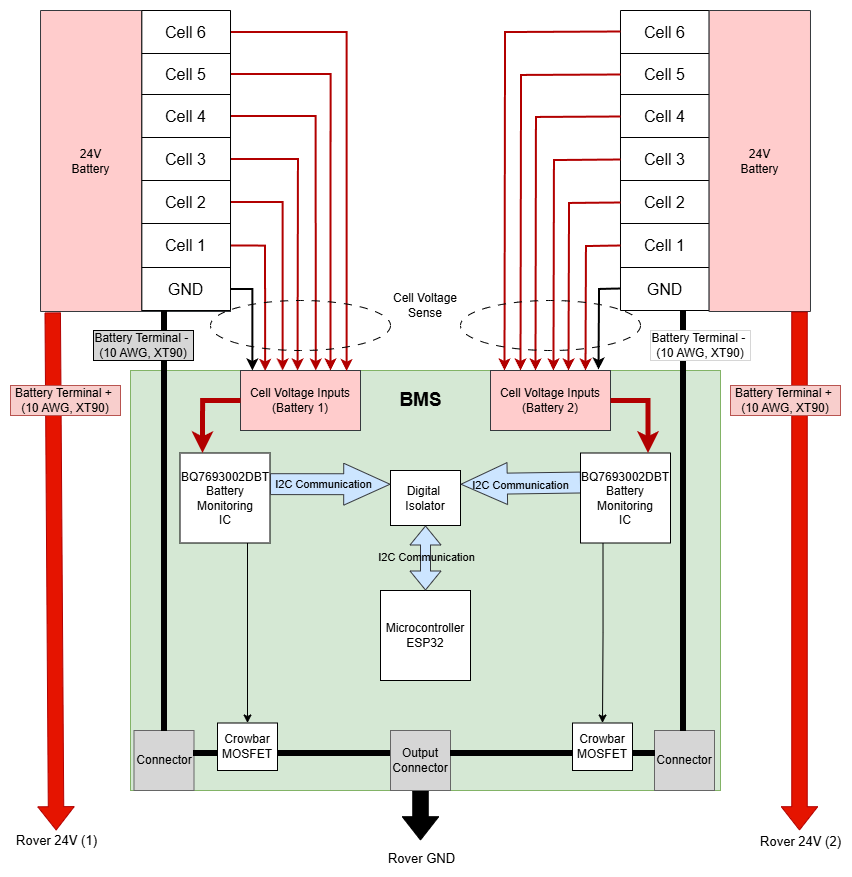
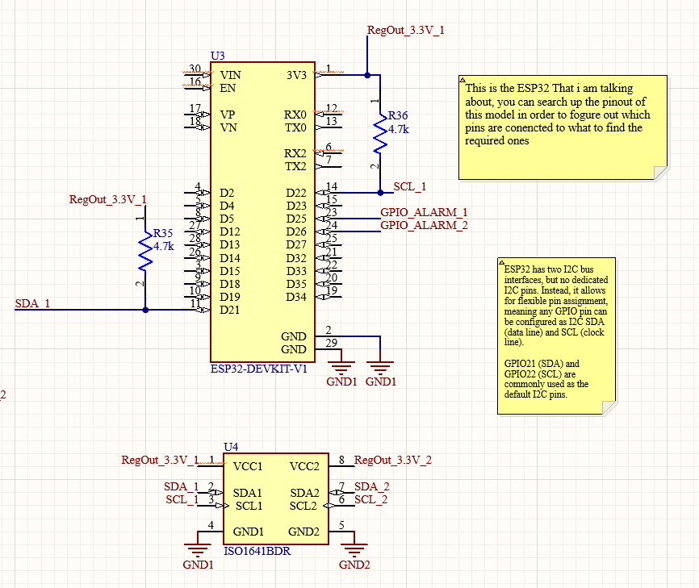
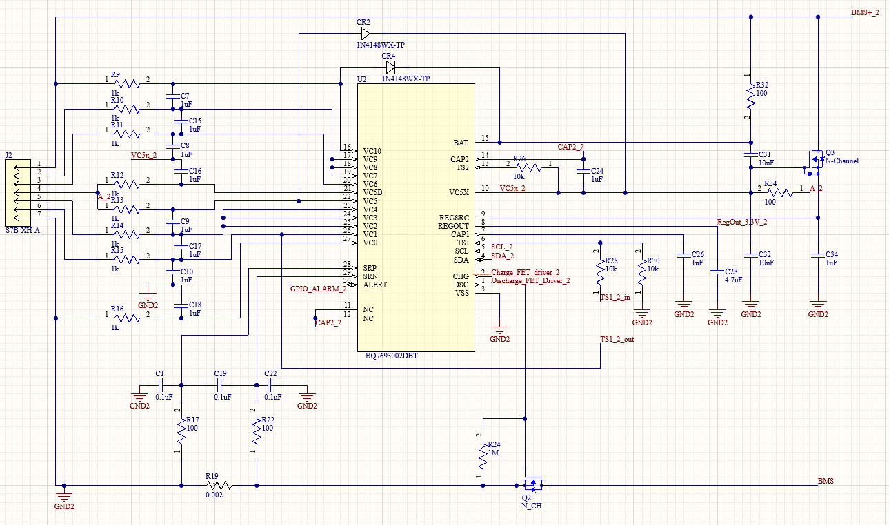
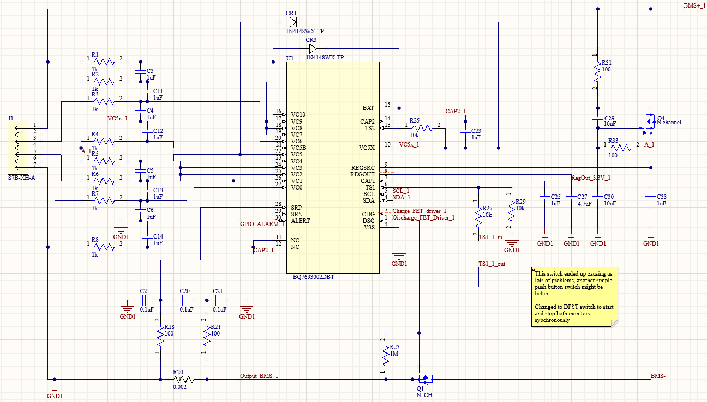
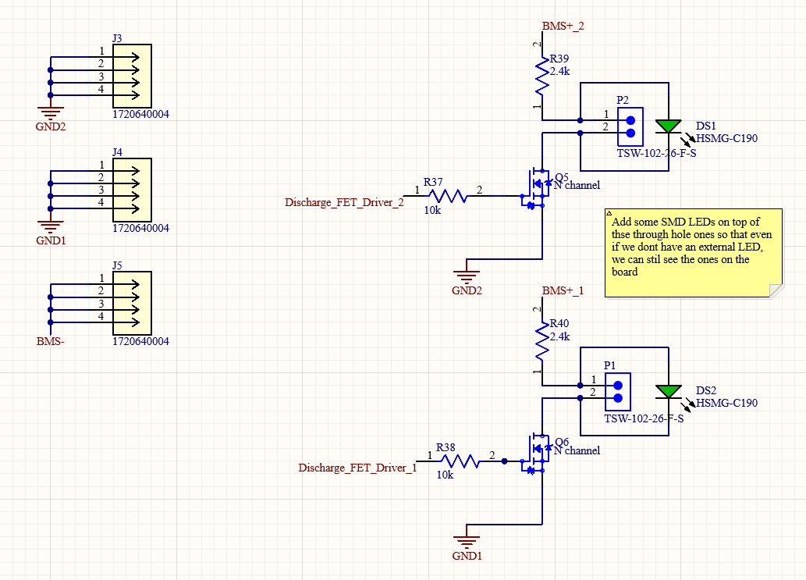
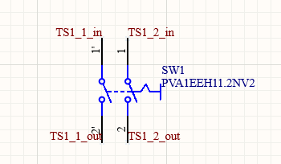

# Hardware

BMS PCB Documentation

## Purpose of the PCB: 

The board regulates and monitors the operation of the two batteries powering the rover, cutting the power in case anomalies are detected. 

## Functionality Description: 

	  
	An ESP32 microcontroller communicates with two battery monitor chips (BQ7693002DBT), each monitoring one six-cell battery (2 input channels placed under the board and two other input channels for their respective grounds). The chips are booted synchronously via a double pole single throw (DPST) switch.   
One common ground is outputted to the rest of the rover. This ground is disconnected if one of the battery management chips detects a problem, cutting the power. 

## Components Communication:

- An ESP32 is mounted on the board.   
- A digital isolator connects the SDA and SCL lines from both monitoring chips, which are then connected to the ESP32 for communication. 

## Components Connections (routing):
| PIN | Function  |
| :---- | :---- |
| ESP32 11 | SDA  |
| ESP32 14 | SCL |
| ESP32 23 | GPIO alarm battery \#1 |
| ESP32 24  | GPIO alarm battery \#2 |
|  |  |
| Isolator 2 | SDA battery 1 |
| Isolator 3 | SCL battery 1 |
| Isolator 6 | SCL battery 2 |
| Isolator 7 | SDA battery 2 |

## Power & Grounding:

- The two battery monitoring chips are powered by the respective batteries they monitor.   
- The ESP32 receives power from the reg\_out pin of the first monitoring chip.   
- The isolator receives power from the reg\_out pins of both monitoring chips. 

## **Diagram:** 

## Schematic:

****  
  
  
  
