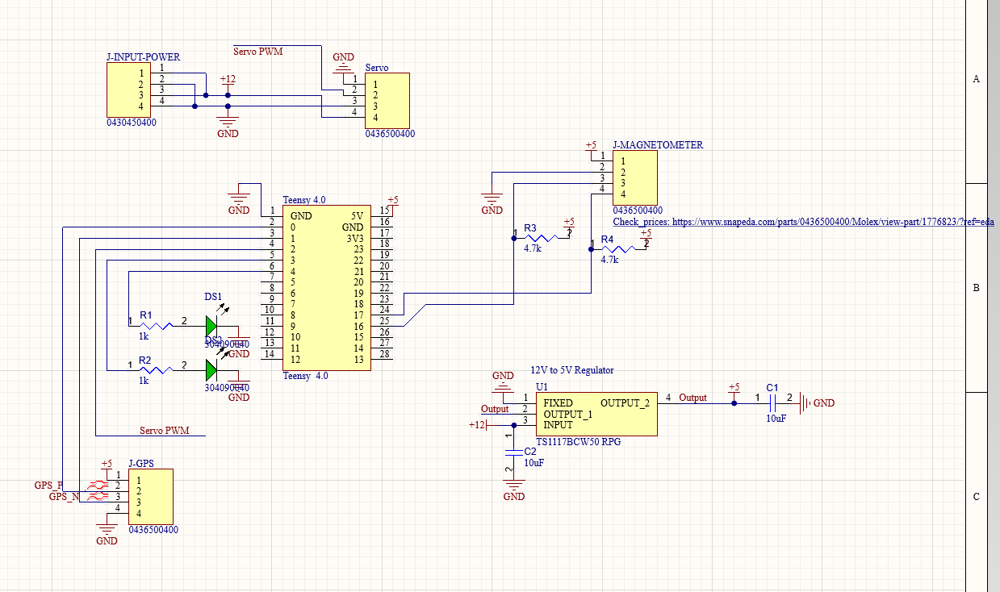

# Hardware

Base Antenna PCB Documentation

## Purpose and functionality

This PCB functions as a control unit for the base station antenna. It reads the UART signal from the GPS, and the I2C signal from the magnetometer, processes them using the Teensy 4.0, then drives the servo motor to turn the antenna towards the rover. The PCB also serves as a router for the servo motor 12V power supply, to keep wiring tidy and centralized.   
The LEDs are just for monitoring the system status.

## Component wiring

### Pinout 

| Teensy 17 | Magnetometer SDA |
| :---- | :---- |
| Teensy 16 | Magnetometer SCL |
| Teensy 2 |  Servo PWM |
| Teensy 3 | GPS TX |
| Teensy 1 | GPS RX |
| Teensy 3 | LED 1 |
| Teensy 4 | LED 2 |

### Power supply

Power for the Teensy, magnetometer and GPS come from the 12V power supply converted to 5V (the LDO Linear Regulator used for this has a max output current of 1A)  
Power for servo comes from the same raw 12V power supply.

## Schematic

![]

### Components list

| Name on PCB  | Manufacturer code |
| :---- | :---- |
| U1 | TS1117BCW50 RPG LDO 12v to 5V regulator  |
| C1, C2 | 10uF SMD capacitor  |
| DS1, DS2 | Green through hole LED |
| J-GPS, J-MAGNETOMETER, Servo | Microfit 3.0 4pin horizontal connector |
| J-INPUT-POWER | Molex 3mm 4pin through hole  |
| R1, R2, R3, R4 | 470R 0.125W 5% 0805 (2012 metric) SMD  |
| Teensy 4.0 | Teensy 4.0  |