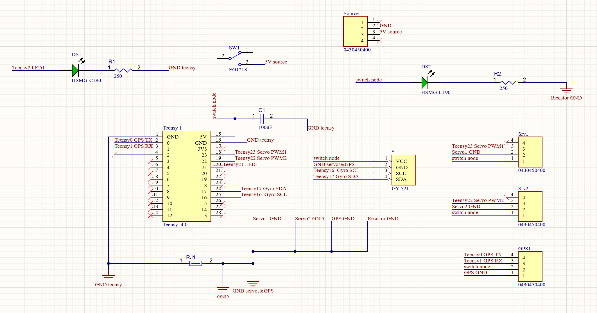

# Hardware
Pan-Tilt & GPS PCB Documentation  
## **Purpose of the PCB:**   
Read UART output from GPS and control two Pan-Tilt servo motors.

## **Functionality Description:**   
The Teensy4.0 reads UART data from GPS (input), reads the rover’s angle position data with a gyroscope (input), and sends instructions to the servos (output). It communicates with the Jetson via USB.

## ***Components Communication:***

- A teensy4.0, is mounted on the PCB. The 2 servos, the GPS and the gyroscope each have an associated connector mounted on the PCB.   
- Each servo’s PWM pin connects to a PWM pin on the Teensy, allowing us to control the servos.  
- The GPS TX pin connects to the Teensy RX pin and the GPS RX pin connects to the Teensy TX pin, enabling the Teensy to read GPS UART outputs.   
- The Teensy SDA and SCL pins are respectively connected to the gyroscope SDA and SCL pins, allowing us to read data on the rover’s position and orientation.

***Components Connections (routing):***
| Pin | Function |
| :---- | :---- |
| Teensy 18 | Servo1 PWM |
| Teensy 19 | Servo2 PWM |
| Teensy 0  | GPS TX |
| Teensy 1 | GPS RX |
| Teensy 24 | Gyro SDA |
| Teensy 25 | Gyro SCL |
| Teensy 20 | LED1 |

***Power & Grounding:***

- All components on the board are powered by an external 5V source, through one connector. The power is then distributed to each component’s VCC pin through the PCB’s internal routing.   
- The circuit's ground routing includes a net tie, separating the Teensy ground from the components ground.

## **Notes for Assembling:**  
On the back of the Teensy, there is a copper trace connecting the USB port to the Vin pin. Using an X-Acto knife, cut this copper trace to disconnect them. (This is so that the Teensy draws power from the external 5V, and not its micro USB connection.)  

## **How to crimp wires for molex connectors:**  
[***https://www.youtube.com/watch?v=WFvEeWHDt1E***](https://www.youtube.com/watch?v=WFvEeWHDt1E)     ***(3:15)***

## **Schematic:**  
  