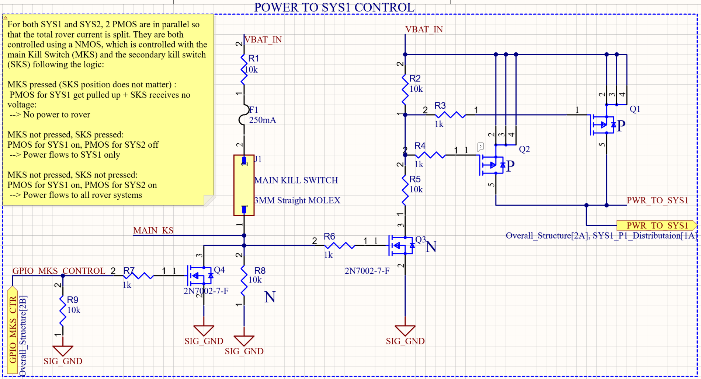
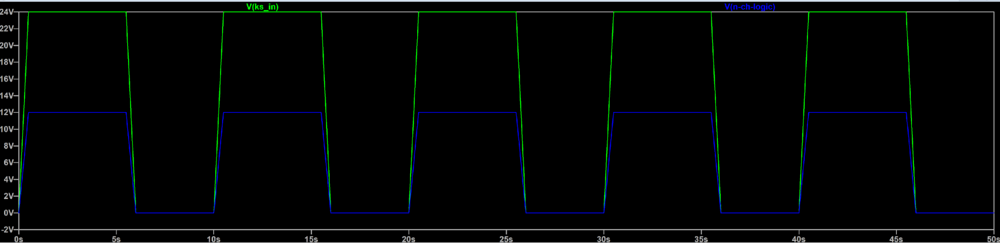
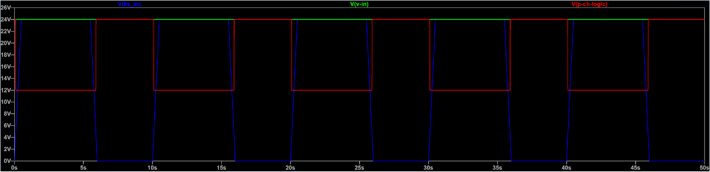
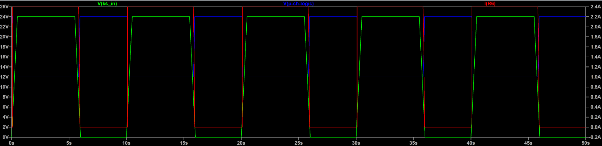
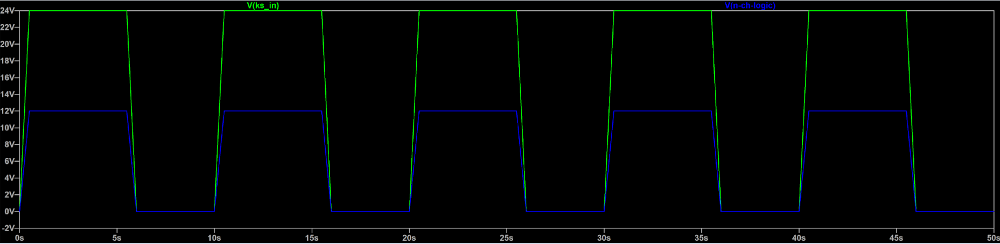
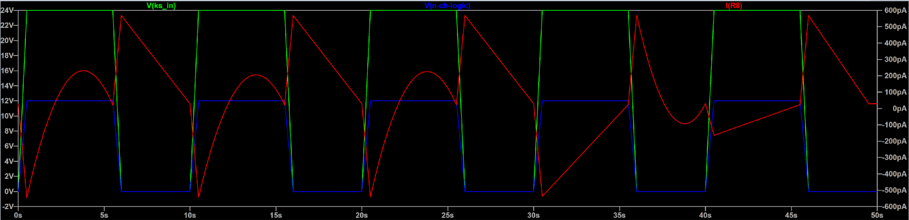
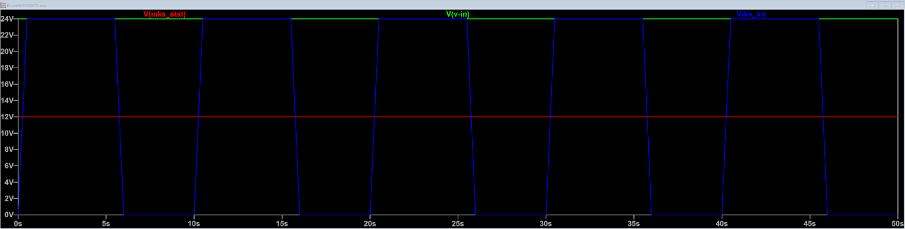
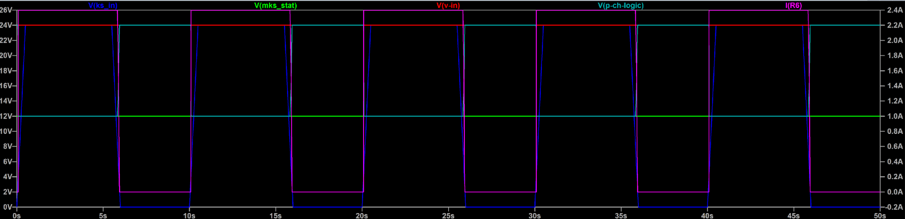

# Analysis and Simulations
## Simulation Report

The main goal of the following simulations is to validate the circuit which is created to control the power flow of the rover system. The power flow is controlled through P-Ch Mosfets (PMOS), which either allow current to flow to the rest of the system if all is well or cut off power if anything goes wrong. The board contains two sets of PMOS which divide the power of the board into 2 systems: 

1) System 1: Which provides power to the following elements:  
   1. Converters (24-12V and 24-5V)  
   2. Jetson  
   3. RaspberryPi  
   4. Teensy  
   5. Antenna  
   6. Remote KS  
   7. Fans  
2) System 2: Which provides power to the following elements:  
   1. Drive  
   2. Arm/Science  
   3. Spares 

Power is delivered to these systems depending on three main conditions: the status of the main kill switch (MKS), the status of the secondary kill switch (SKS), and state of software. Software can act as a “kill switch” being able to kill both System 1 and System 2 individually, thus its logic is incorporated by that of the kill switch, available below. “Pressed” indicates that the kill switch has been activated, thus no power should be delivered.

| Conditions |  | System Status |  |
| ----- | :---- | ----- | :---- |
| Main Kill Switch | Secondary Kill switch | System 1 | System2 |
| Pressed | Pressed | OFF | OFF |
| Pressed | Unpressed | OFF | OFF |
| Unpressed | Pressed | ON | OFF |
| Unpressed | Unpressed | ON  | ON |

The main logic which is used to drive the PMOSs on the power board, and thus create the logic from the above table, is created with a network of N-Ch Mosfets and resistors. The circuits which were simulated in this file are: “POWER\_TO\_SYS1\_CONTROL”  and “POWER\_TO\_SYS2\_CONTROL”, which are both from the schematics are available in the Altium cloud, or available below.

###  Simulation Circuit 1- Power To SYS1 Control 

The circuit from Altium was reconstructed in LT spice with similar mosfet characteristics to those which are used in the actual components from the board. The circuit from LT Spice is available below (contact me if you want the simulation files 😊). Do note: this circuit is not modeling the software NMOS since it is strictly testing the logic of the kill switch and the PMOS. The software mosfets will not disturb the logic and can also be removed should any disturbances be detected.

To simulate a kill switch being pressed and unpressed, two battery sources are used. One of them is a square wave to mimic pressing and unpressing the kill switch, while the other is a constant 24V to simulate the battery, this is shown in **Figure 1**. A load of 10 ohms was used to make life easier when verifying proper functionality.

  
***Figure 1**: V1 and V2 from the simulations, V1 acting as a kill switch being toggled while V2 acting as the rover's battery.*

Next up is to verify that the NMOS which is controlling the PMOS is behaving correctly. The gate of the NMOS should be high when V1 is high, and low then V1 is low. Due to a current divider, the Voltage should also be half of that from V1, to respect the Voltage maximum threshold of the gate of the mosfet (which is 20V).

  
***Figure 2**: V1 and the voltage of the NMOS  Gate*

Since the N-CH Is behaving appropriately, we can also now look at the current passing through the N-MOS, thus the same current which is passing through R2 of the simulation circuit. Here, current should be passing when all the systems are enabled, and it should be 0 when the rover is killed, which is shown below.

  
***Figure 3**: V1, the voltage of the NMOS gate, and the current passing through the drain of the NMOS.*

Now that the main kill switch logic, that of the NMOS that it is controlling is correct, the PMOS controlling current to the system will now be verified. The next plot will show the voltage at the gate of both the PMOS, and the state of the “kill switch” voltage V1:

***Figure 4**: V1, V at the source of the Mosfet, and the voltage at the PMOS gate (for both PMOS)*

This figure validates the proper function of the resistor network, where the voltage at the gate is low (0V wrt source) when the kill switch is pressed, and high (-12V) otherwise. The gate of the PMOS also has a voltage divider to ensure the voltage does not exceed the maximum threshold of the PMOS (-20V)

The next figure will show the current passing through the “load” resistor in the simulation plot, as well as the two previous elements from the previous circuit.  
  
 ***Figure 5**: V1, the voltage at the PMOS gate (for both PMOS), and the current through the load resistor of 10ohms.*

The amount of current passing is expected, as it reflects the battery voltage divided by the load resistor, and that of the Rdson of both PMOS which are closed. The current is also 0 when the kill switch is activated, and current is allowed otherwise.

### Simulation Circuit 2- Power To SYS2 Control 

The circuit for this simulation is largely the same from the one before, except with the addition of an extra NMOS in series with the current one controlling the gate of the PMOS. Thus, the simulation will have V1 toggle to mimic the response of the second kill switch being pressed and unpressed consecutively, while that for the PMOS remains at a 24V. 

Since this circuit depends on the state of System1, another voltage source is present V3, to represent the state of the main kiss switch. There is two versions of this circuit, one where this voltage is zero (to see how the system responds when the main kill switch is killed) and one version where it is 12V (the nominal voltage for MKS when it is not pressed). 

Main Kill Switch pressed:  

The first plot is thus all three voltage sources which are present in the circuit.

***Figure 6:** Secondary kill switch voltage V1, rover battery voltage V2, and main kill switch voltage V3.*

This next plot is to verify that the NMOS control circuit operates as intended. This circuit is the exact same as the one explored in System1 simulation, thus no elaboration needed here.

  
***Figure 7**: V1 and the voltage of the NMOS  Gate*

Since the MKS in this simulation is pressed, the V3 voltage is zero, thus no current should be passing thought the NMOS that is controlled by the circuit.

  
***Figure 8**: V1, the voltage of the NMOS t, and the current passing through the drain of the NMOS.*

Although the current looks pretty funky, the scale is in the pico-A thus there is essentially no current as expected. The little current there is due to imperfection of the mosfet (capacitance \+ diode business). 

We can now investigate how the PMOS are controlled. It is expected that they are open circuits, since the main kiss switch is pressed, thus no current should be able to flow to the rest of the circuit. 

***Figure 9**: V1, V at the source of the PMOS, and the voltage at the PMOS gate (for both PMOS)*

*** Figure 10**: V1, V at the source of the PMOS, the voltage at the PMOS gate (for both PMOS), and the current through the load.*

This shows how the voltage controlling the PMOS is always pulled high to 24V Since the MKS is at 0V. Thus, the current is also essentially 0\. In the graph, again the current is in the pico-scale, thus will not have an effect on the efficiency of the circuit. Simulations were also ran with non-toggling systems, and this effect diminishes greatly as well.

Main Kill Switch not pressed:  

The first plot is thus all three voltage sources which are present in the circuit.

***Figure 11:** Secondary kill switch voltage V1, rover battery voltage V2, and main kill switch voltage V3.*

This next plot is to verify that the NMOS control circuit operates as intended. This circuit is the exact same as the one explored in System1 simulation, thus no elaboration needed here.

  
***Figure 12**: V1 and the voltage of the NMOS  Gate*

In This case, both NMOS are closed, thus current should be flowing through the NMOS when the secondary kill switch is not pressed (V1=24V).

  
***Figure 13**: V1, the voltage of the NMOS t, and the current passing through the drain of the NMOS.*

This demonstrates that when both kill switches are unpressed, the NMOS controlling the PMOS are properly controlled. Thus, now the PMOS behavior will be examined for proper functionality. Since the NMOS logic is correct, we expect to see the voltage at the gate of the PMOS to be pulled to 24V when V1 is low, and to be at 12V when V1 is at 24V.

***Figure 14**: V1, V of MKS, V at the source of the PMOS, and the voltage at the PMOS gate (for both PMOS).*

Thus, this logic validates the proper functionality of this circuit. Now all is left is to verify that the current that is passing through the load resistor matches with what is expected. The current should be 0 when the SKS is low, and should be non-zero when SKS is high. 

*** Figure 15**: V1, V at the source of the PMOS, the voltage at the PMOS gate (for both PMOS), and the current through the load.*

### Simulation Summary

The simulations for the resistor and mosfet network show that the logic implemented on the power board is correct to produce the table which was previously explored. Thus, the circuits which are initially proposed in the report will be used for the power board design. If any questions come up please reach out to me
