# **Actual Documentation**

**Rover 2025-2026**  
**RPI5 PD PSU BOARD DOCUMENTATION**

Sonia Ly

# **Table of Contents** 

# **Testing Procedure**

## **TEST \#1:**

## 

# **Scrap (Informal Doc)**

Sections I want in the documentation:

- Useful ressources/quick links  
- Purpose (why create that board in the first place, what problem is it trying to fix?)  
- Board design (Link resources used to design the board)  
- Assembly  
- Firmware  
- Testing procedure  
- Future Improvements/Mistakes 

# **Theory/Concepts**

**USB PD Notes/Concepts/Theory**

- Sources: [Silicon Labs](https://community.silabs.com/s/article/what-s-the-role-of-cc-pin-in-type-c-solution?language=en_US), [infineon](https://community.infineon.com/t5/Knowledge-Base-Articles/USB-Type-C-vs-USB-PD-The-Key-Differences/ta-p/249584), [eMarkers](https://www.totalphase.com/blog/2020/10/what-is-e-marker-how-does-it-work/), [ST](https://wiki.st.com/stm32mcu/wiki/Introduction_to_USB_Power_Delivery_with_STM32)

*USB Type-C current modes vs. USB Power Delivery (PD)*

* USB Type-C current modes used when divide draws Default power modes (ex. 3A at 5V)  
* PD used for higher power or odd power modes  
* By default, USB Type-C ports can provide up to 5V and 3A of power without power delivery  
* USB PD is a “standard” that enables devices to provide increased power  
* With USB PD, you can “customize” your power profiles  
* For USB PD, you need a higher quality USB cable, capable of withstanding high power  
  * Need cable with eMarker chip

	*What’s so special about e-marker cables? How do they work?*

* USB-C cable with embedded chip that communicated its capabilities- power, data speed and vendor info, to connected devices  
* Without an e-marker chip, high-power chargers will cap power output to prevent safety risks

	*CC lines*

* Means “Control Channel” lines  
* At 300 Kbits/s, the PD protocol protocol gives the possibility to exchange messages between the 2 connected partners  
* Determines cable detection, cable orientation and current-carrying

	  
	*Features/Quirks of PD*

* To determine the PD role, a pull-up/down resistor must be presented on the CC line, so that the power role change is reflected by the updated resistor on the CC lines  
* If you need PD, you need to manage the CC1 and CC2 lines  
  * Even if there is only one CC line used for communication, you still need to manage both lines\! → you can’t guess how the cable is plugged

	*The “stack”*

* Interface that allows you to mess with Type-C Port Controller Drivers

	*DFP vs. UFP*

* Downstream Facing Port DFP (Host): Source (Provider)  
* Upstream Facing Port UFP (Device): Sink (Consumer)

	*What exactly is the use of the TCPP02-M18 chip on my board?*

* \[to fill out?\]

**Firmware Questions**  
*What is an ST-Link used for?*

* Is a debugger and programmer  
* Is the bridge your laptop’s USB port and jumper cables to your PD board

# **PCB Design**

**Quick Documentation for RPI PD PSU BOARD Schematic**  
[Link to my board](https://mcgill-university-15.365.altium.com/designs/55A92F77-330F-4016-87E7-9697CD0323DA)

**Main General Sections of the board**: 

1. Connector that takes in either 5V or 24V from the Arm Box Panel  
2. Buck converter that takes 24V \-\> 5.1V, 6A  
3. LDO that does 3.3V  
4. Way of toggling PD vs. Non-PD on board (so board can simply just be a 24V \-\> 5.1V buck)  
5. USB-PD section  
   1. USB-C output connector  
   2. USB-C source protection (TCPP02-M18 chip)

	  
**Comments about each section (& resources used to make them):**

1. No much to say there  
2. Followed [this](https://webench.ti.com/appinfo/webench/scripts/SDP.cgi?ID=6E285C1A6D416C1A) WeBench design (need a TI account to see) for the Buck Converter  
3. Straight up copied UART LDO  
4. See blue sticky note  
5. I probably committed a thousand design crimes here, don’t hold back from criticism because I do not know what I am doing 🤡  
   1. To find pinouts, I used info on [this](https://www.st.com/resource/en/datasheet/stm32g474cb.pdf) datasheet. Below is a picture of the current pin setup I have for the STM chip I have (STM32G474RET6)  
      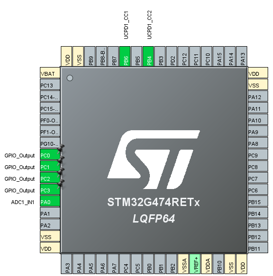  
   2. To figure how to wire the TCPP02-M18 chip to the STM32 MCU and the, I used the schema below (found in the [*documentation*](https://www.digikey.ca/en/products/detail/stmicroelectronics/TCPP02-M18/15295957) for the TCPP02-M18 chip \- p.3)  
      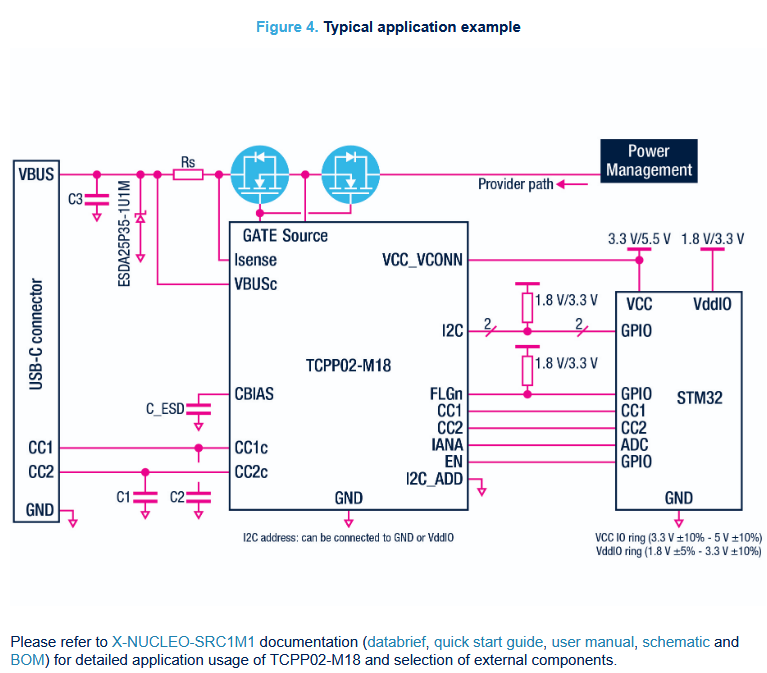  
        
   3. To figure out what values of resistors and capacitors to replace in the schema above, I referred to the X-NUCLEO-SRC1M1, as recommended by the TCPP02-M18 documentation. I very honestly copied the values found in the nucleo board. ([X-NUCLEO-SRC1M1 schematic](https://www.st.com/resource/en/schematic_pack/X-NUCLEO-SRC1M1_schematic.pdf))

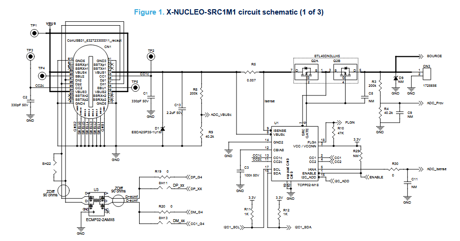  
**Buck converter layout example**:

* From [this](https://www.ti.com/lit/ds/symlink/lm5148.pdf) datasheet

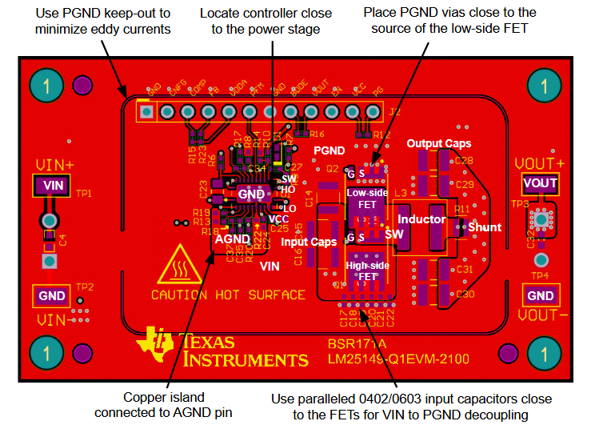

| 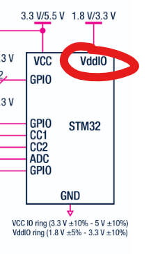 | From what I understood, VddIO is for powering I/O devices. Didn’t figure out how to set up this pin in the iso. |
| :---- | :---- |

**Other Comments**

* Let me know if I messed up the schematic so badly that it, realistically, isn’t feasible for me to complete this board for this Saturday. No hard feelings \- I’d rather hear the truth. We’ll discuss how to proceed if that’s the case. Realistically, I think it will be tough for me to complete placement and routing in a day and a half, but, given the challenge, I will actually take it on.

# **Board Testing**

# **Section 1: Testing the PCB**

1) **Verifying that things that may cause boom boom aren’t shorted DONE**

	Methodology: 

1. Put the multimeter in continuity testing mode  
2. Check that 24V bus and GND aren’t shorted  
3. Check that 5.1V bus and GND aren’t shorted  
4. Check that 3.3V bus and GND aren’t shorted  
5. Check that 24V bus and 5.1V bus aren’t shorted  
6. Check that 24V bus and 3.3V bus aren’t shorted  
7. Check that 5.1V bus and 3.3V bus aren’t shorted

Result:  
      Nothing’s shorted\! :D\!

2) **Connecting the board to a 24V power source and hoping that nothing explodes DONE**

	Methodology: 

1. Get a 1x2 micro male Molex connector and alligator clip those babies up  
2. Get 24V pumping through the board  
3. Hope that nothing explodes

Result:  
      Nothing exploded\! :D\!

3) **Verifying that Buck and LDO work** **DONE**

Methodology: 

1. Put the multimeter in DC voltage measuring mode  
2. Probe 5.1V bus   
3. Probe 3.3V bus

	Result:  
 	      Expected values measured on both busses :D\! 

4) **Verifying that PD works STUCK HERE**  
   Methodology:

	*(See section 2\)*

	Result:  
	*(See section 3 for testing log)*

5) **Plug into Pi and hope that nothing goes Kaboum**  
   

		

# **Section 2: PD Testing**

**Resources:**

* Keysight guide on [how to test USB-PD](https://www.keysight.com/il/en/use-cases/test-usb-type-c-power-delivery.html)   
* ST’s official [Introduction to USB Power Delivery with STM32](https://wiki.st.com/stm32mcu/wiki/Introduction_to_USB_Power_Delivery_with_STM32) wiki page  
* ST [code template](https://github.com/STMicroelectronics/x-cube-tcpp) to start off with

	*Probably useful, but I haven’t watched yet:*

* [*https://www.youtube.com/watch?v=6cwbeQqchn4\&t=17s*](https://www.youtube.com/watch?v=6cwbeQqchn4&t=17s)   
* [*https://www.youtube.com/watch?v=X1b8o4x-6Dk*](https://www.youtube.com/watch?v=X1b8o4x-6Dk) 

**Info to keep in mind:**  
	*Actually Relevant Info*

* My specific STM32 chip on the PD board: STM32G474RE 64pin lqfp64  
* This is the [nucleo board](https://www.st.com/en/evaluation-tools/nucleo-g474re.html#st_description_sec-nav-tab) we have access to: NUCLEO-G474RE ([documentation](https://www.st.com/resource/en/data_brief/nucleo-g474re.pdf))  
  * It also has a STM32G474RE chip  
* Only the STM32G0 family contained parts that contain up to 2 UCPD instances  
  * I checked, the STM32 MCU chip on my board does indeed support UCPD ([link](https://www.st.com/en/microcontrollers-microprocessors/stm32g474re.html))  
* I have a TCPP02-M18 IC on my board. It provides protections

	*Brain dump*

* ST provides PD protocol as a library\! (See image below)  
  * Customer application is in DPM (Device Policy Manager): this is where the strategy (choose the maximum power… is coded))  
  * Customer only need to adapt the DPM and the power parts  
  * The decide part depends on the STM32 family

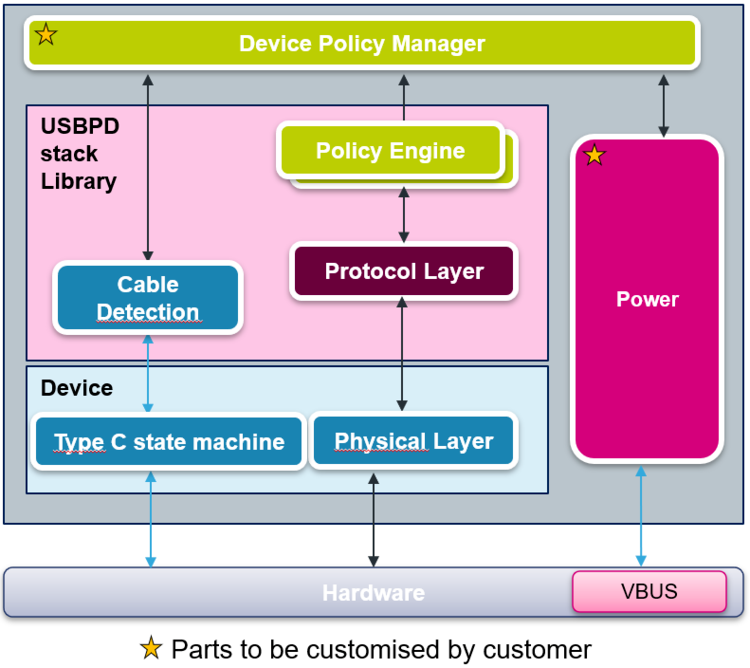

* I think I only have to build the source application? Because my board is on the source side? [This video](https://www.youtube.com/watch?v=tA5v4JjV-T8)?  
* There’s a specific tool by STM32 for UCPD development ([link](https://www.st.com/en/development-tools/stm32cubemonucpd.html))  
  * To debug and configure the stack  
  * Confusion: Do I connect my board to my laptop and my laptop becomes the drain?  
* Tangiblement, how am I going to test the PD thing?  
  * I have a USB-C power multimeter thing at home → Check how much voltage, current going to the sink  
  * There’s that load thing down at the shop  
  * Need a trigger board → pretends it’s a sink  
* Does the trigger board request a certain amount of voltage and current or just a certain amount of voltage?  
  * Trigger only requests a voltage / Selects a voltage profile  
  * Current is not actively requested, but limited by what the source advertises  
  * The source only advertises *MAX* current that is available → with PD, I can advertise 5A (cool\!)   
* Must check the overcurrent protection \-\> Maybe try to read current with the MCU

**Testing Gameplan:**

1) Refamiliarize with the STM32 IDE **DONE**  
* Ye old LED flash on the Nucleo  
2) Check if the STM32 chip on your personal board is alive **DONE**  
* Try to get it to print something in terminal (over SWD) **DONE**  
3) Download all of the pre-written base code PD from [ST’s code template](https://github.com/STMicroelectronics/x-cube-tcpp) **DONE**  
4) Adapt the ST code to your own board **DONE**  
5) Testing the PD firmware I wrote **STUCK HERE**  
   1) If possible, get one of those PD-Trigger Board modules  
   2) USB-C meter to test if you’re actually outputting 5.1V  
   3) Attach board to box load in the shop (set load to pull 5A \- gradual, pull small current first and then reach big current) and to USB-C meter  
   4) Reiterate until good

**Change of plans:**  
      **5\)   Shorting the 5.1V output of the buck directly to VBUS** 

6) Test on RPI

# **Section 3: Testing Log**

## **3.1 SETTING UP THE IOC**

According to my schematic, here is how the IOC pins should be set up:  
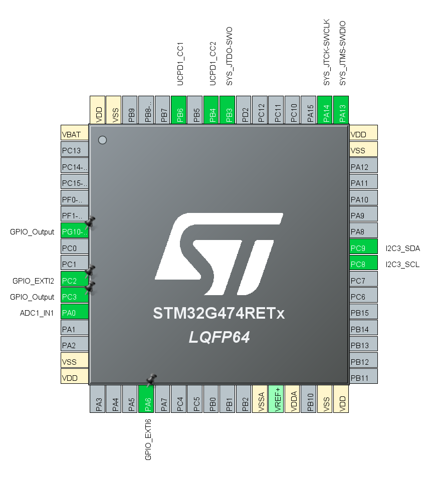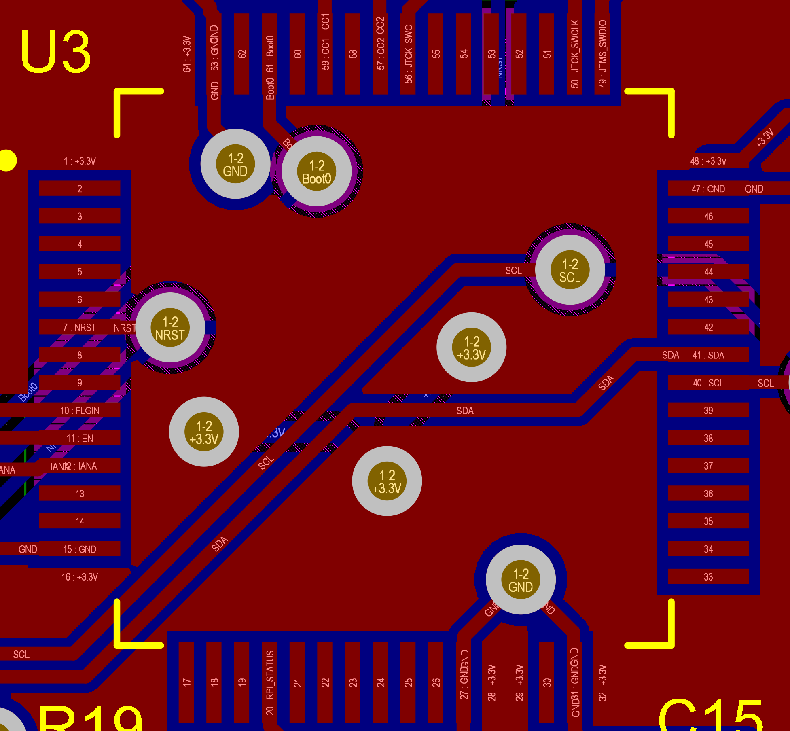  
Setting up the IOC pins:

1) JT Pins (SYS\_JTDO-SWO, SYS\_JTCK-SWCLK, SYS\_JTMS-SWDIO)  
   System Core → Debug → Trace Asynchronous Sw  
     
2) UCPD Pins (UCPD1\_CC1, UCDP2\_CC2)  
   Connectivity → UCPD1 → UCPD Mode → Source  
     
3) I2C Pins (I2C3\_SDA, I2C3\_SCL)  
   Connectivity → I2C3 → I3C  
     
4) NRST (GPIO\_OUTPUT)  
   Left click the pin → GPIO Output  
     
5) FLGIN  (GPIO\_EXTI2)  
   Left click the pin → GPIO\_EXTI2  
     
6) EN (GPIO\_OUTPUT)  
   Left click the pin → GPIO Output  
     
7) IANA Pin (ADC1\_IN1)  
   Analog → ADC1  
     
8) RPI\_STATUS Pin (GPIO\_OUTPUT)  
   Left click the pin → GPIO Output

Do the setup described above in STM32CubeMX, and then, make sure you put STM32CubeIDE as the toolchain before you generate the code.  
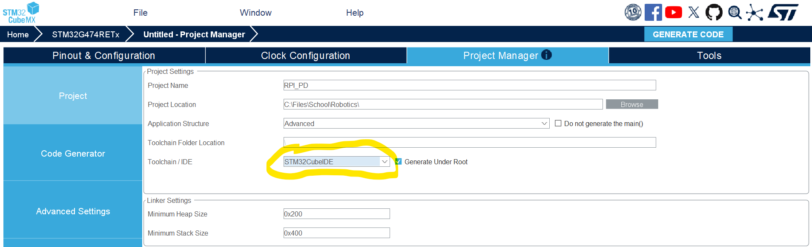

## **3.2 TEST PRINT A MSG WITH MY MCU (Checking that it’s alive)**

1) **Step \#1: Using the NUCLEO-F446RE as an ST-Link**  
   Using Jumper cables going from the NUCLEO-F446RE to the PD Board as follows:  
   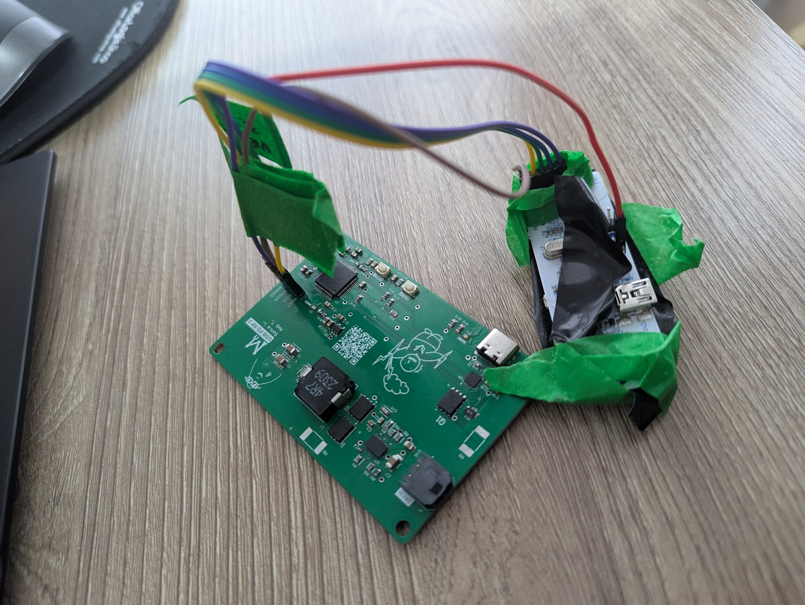

   

	Refer to [Datasheet](https://www.st.com/resource/en/user_manual/um1724-stm32-nucleo64-boards-mb1136-stmicroelectronics.pdf#page=18) for Pin placements (p.19-20)

2) **Step \#2: Hopping into STM32CubeProgrammer and seeing if device is connected**  
   PD board unpowered, Nucleo connected to laptop  
   Test a read, should be successful  
     
   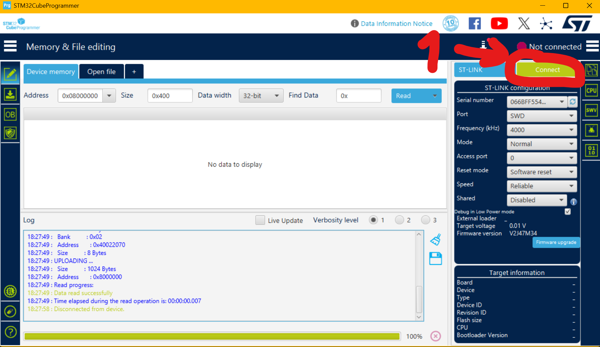  
     
3) **Step \#3: Try to print something to terminal with MCU**

For good measure, make sure can communicate with MCU

This code (in CubeIDE): [commit](https://github.com/LySonia/RPI_PD/commit/91be885c20c75b47960ee724d0271369fdd10865) (only edited main.c)

Clock frequency found in CubeMX  
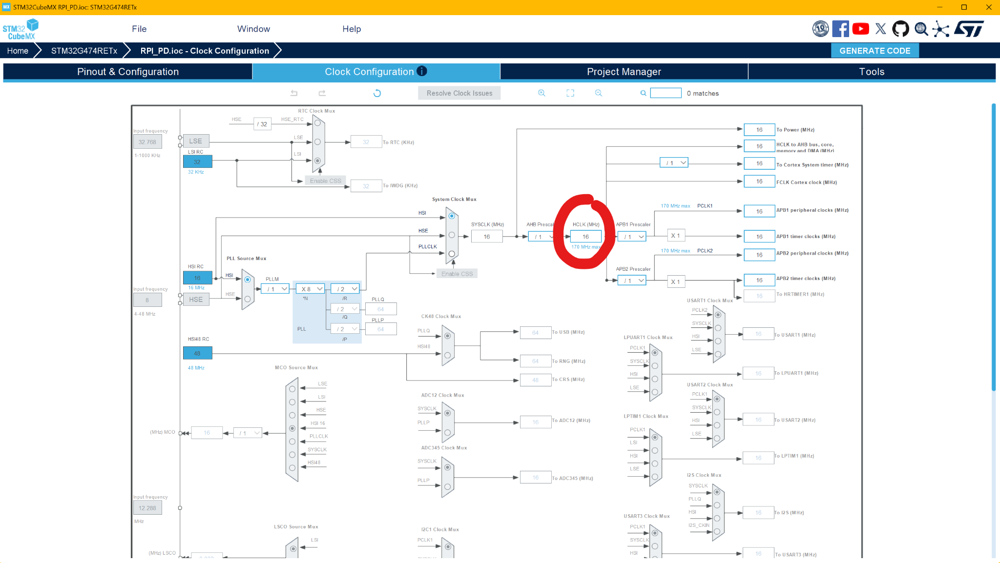  
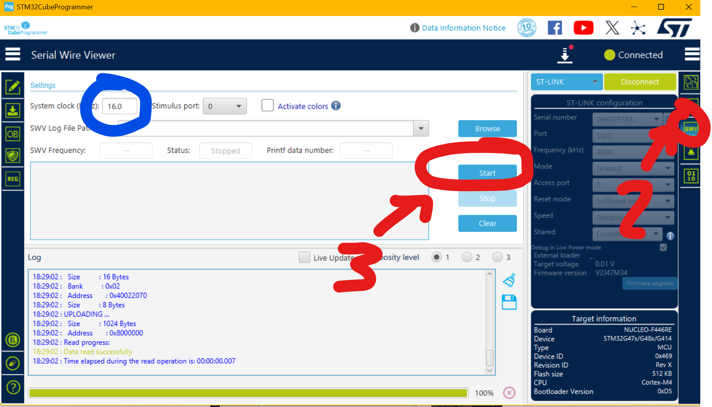

**3.3 Coding the PD firmware**   
This incredible tutorial: [https://wiki.st.com/stm32mcu/wiki/STM32StepByStep:Getting\_started\_with\_USB-Power\_Delivery\_Source](https://wiki.st.com/stm32mcu/wiki/STM32StepByStep:Getting_started_with_USB-Power_Delivery_Source) 

I simply followed section 10\. Project with custom board

**3.4 Testing the PD firmware**

1) Flash my board with the PD code   
2) Connect as follows: My board \-\> USB-C cable \-\> usb-c meter \-\> trigger board and seeing what voltage is read  
* usb-c meter didnt power up  
3) Probing VBUS on my board \-\> 4V is read  
* still 5.1V out the buck tho

Things that are confirmed:

* Buck converter works (Does successfully go from 24V \-\> 5.1V)  
* MCU flashes successfully (Test prints work)  
* when doing step 5, the LED of the trigger board lit up, I measured VBUS on the trigger board and it was 4V too  
* when doing step 5, my usb-c meter didn't power up because the min voltage it functions at is 4V

Beyond PD, this seems to be a board issue. Plans shift from here:

1) Go with the shorting trick   
2) Test and observe if, when shorting the 5.1V and VBUS lines, the board is able to provide a constant 5.1V, 5A

\=\> Ideally, for the time being, we have two boards:

1) The board that I’m currently testing on (we will short 5.1V out to )  
2) A second board 

**3.5 Shorting 5.1V from the Buck converter directly to VBUS 🫠**

### ***Everything’s going wrong here :O)***

The idea: Populate the pad below with a jumper resistor/finding a ways of shorting both pads together   
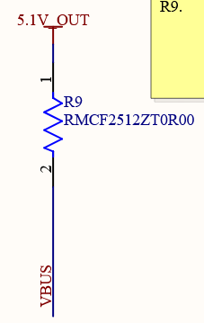

**3.5.1 Everything that’s been tested so far with results:**

1. Shorting the pads together with a 16 gauge wire \+ hot glue on top  
   1. Tested: 24V input → board → USB-C cable → USB meter → Electronic load  
   2. Voltage would sag below 5.1V the moment there was a current  
   3. Voltage does sag linearly

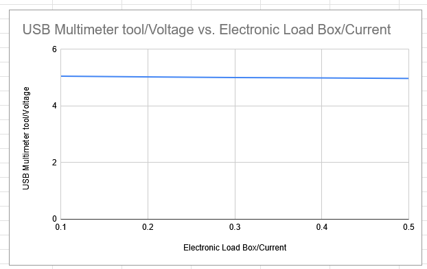

2. Removing the wire mod on R9, and soldering on a 0.002 Ohm resistor (to act as a Jumper resistor)

Table of tests to conduct:

| Test | Why?  | Priority | Results  |
| :---- | :---- | :---- | :---- |
| Make a spice simulation of the buck converter circuit | See if it’s a buck converter design problem | 1 |  |
| Figure out where exactly the voltage is being lost on the circuit. Probe: Voltage at buck input without load Voltage at buck output without load Voltage at buck input with load Voltage at buck output with load Voltage across inductor | If the converter is sagging at the load node, probably a wiring/trace issue. If the converter is sagging at its output, then it’s a converter issue |  |  |
| Figure out if the sag is linear by making a plot | Resistive path somewhere? |  | Done. Sag does seem to be linear… not too sure what to conclude from that though… |
| Test with a real battery  | “Cleaner” power |  |  |
| Check your Altium schematic and compare thoroughly with  |  |  |  |
| Removing everything PD-related on my board/ only populate the buck part of my board |  |  |  |

Resoldering board notes:  
Plan: resolder only the buck part  
Realisation: CCOMP capacitor is 4uF instead of 4nF   
→ CCOMP capacitor is for  
control loop and optimize transient response  
your control loop became *extremely slow*, so when you apply load the converter can’t react → output cap discharges → voltage sags.

What is the CCOMP capacitor for 

This whole section is the compensation network  
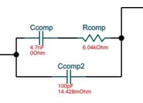

What is the compensation network for?  
[https://www.digikey.com/en/articles/designing-compensator-networks-to-improve-switching-regulator-frequency-response](https://www.digikey.com/en/articles/designing-compensator-networks-to-improve-switching-regulator-frequency-response) 

Compensating loop function:

- Dictates how fast the transient response is   
- Makes sure the transient response is stable  
- My CCOMP is 1000x larger than expected  
- Affect of having a CCOMP that’s too big: bigger transient settle time

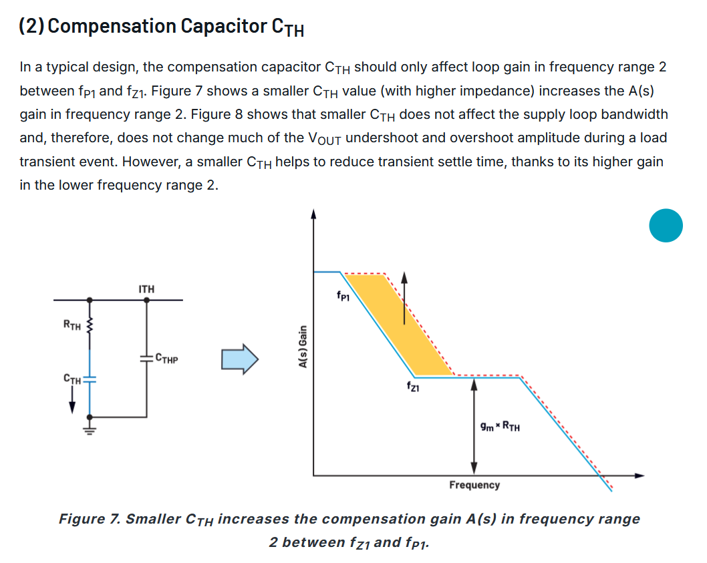  
[https://www.analog.com/en/resources/technical-articles/power-supply-loop-stability-compensation-part-3.html](https://www.analog.com/en/resources/technical-articles/power-supply-loop-stability-compensation-part-3.html) 

Take the time to review buck converter theory to have more debugging ideas

# **Section 4: Fumble Log (Log of the Fumbles 🫠)**

### **.ioc file not generating when I create a new project in** 

Solution: Have to use cubeMX to generate .ioc file for cubeIDE v.2.1.1 

**Tried using the NUCLEO-G474RE as an ST-Link, and detected and communicated with the MCU on the ST-Link instead of the MCU on my own board like a dummy**  
Solution: Had to use a NUCLEO 

**Used STM32CubeProg v.2.22.0 and my test “Hello world” prints wouldn’t print (genuinely baffles me \- I still don’t know why)**  
Solution: Switched to STM32CubeProg v.2.21.0 and my test prints work totally fine 

# **Section 5: Things I’ve realized I need to learn**

