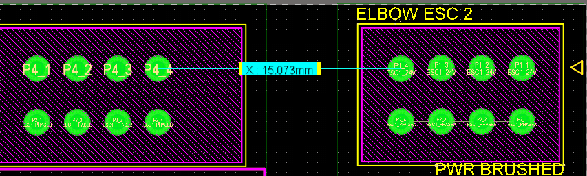

**Arm Box PCB V2**  
**Documentation**

Sonia Ly 

# 

# 

# **Task Overview**

* Modify the design of last year’s Arm Box PCB to include:  
  * Edge Card connector slots to slot in the new ESC Carrier Boards  
  * Add a toggle switch to turn on/off the fans  
  * LED to indicate if an ESC is in or not  
* Modify the layout to:  
  * Make removing and inserting connectors easier   
  * Change the Top → Bottom order to Elbow → Shoulder → Waist  (instead of S → E → W)

# **PCB Information**

* Size: 100x70mm (Same as last year)

**Signals coming out of the ESC**  
5 Power Signals: 

* Phases A,B,C, rate for \~20A if possible (3 connections here)  
* Power and Ground, rate for \~20A (2 connections here)

12 Data signals:

* 5 Encoder signals: 5V, GND, A, B, Z   
* 4 Limit Switch Signals: EXT\_INT1, EXT\_INT2, GND, GND  
* 2 CAN Signals: CAN\_H, CAN\_L  
* GND extra

**Choosing an Edge Card Connector**  
When choosing an Edge Card connector, I made the following assumptions:

* The new ESC Carrier board would be a 4-layer board  
  * (For reference, JLC PCB’s average 4-layer board thickness is 1.6mm)  
* We want the cheapest option possible   
  * (so getting the connector from Molex would be a big \+)  
* Ideally, want don’t want a connector that’s too long   
  * (around the width of an ESC, \~30mm)

The best option I could find that fit most of those criteria was combining the 2 following edge card connectors: 

| Type | Guides? | Female  (Sonia’s side) | Male right-angled (James’ side) |
| :---: | :---: | ----- | ----- |
| 4PW \+ 12SIG | Yes | [461144120](https://www.molex.com/en-us/products/part-detail/461144120) | [459854413](https://www.molex.com/en-us/products/part-detail/459854413) |
|  | No | [461144121](https://www.molex.com/en-us/products/part-detail/461144121#documents-and-resources) |  |
| 2PW | Yes | [461120203](https://www.molex.com/en-us/products/part-detail/461120203) *Cannot be sampled for free\!* | [459852932](https://www.molex.com/en-us/products/part-detail/459852932) |
|  | No | [461120201](https://www.molex.com/en-us/products/part-detail/461120201) |  |

---

# **Useful Links**

* [Arm Box Board 2025](https://mcgill-university-15.365.altium.com/designs/6B76D321-3953-4266-AF62-6831226D11E5#design)  
* [Arm Box Board 2026](https://mcgill-university-15.365.altium.com/designs/88AA3E9B-EFEF-4358-9C95-617D88C362E0#design)  
* Carrier ESC PCB Board 2026 (TDB)

# **Personal Notes**

Changes:

* Make the board longer, horizontally  
* Deal with all the CAN changes  
* Adjust Layer stack  
* Net tie

Changes to be made:

- 4 pos connectors for lim switches  
- Extra switch for can termination  
- Make the connector that goes to the brushed board on top (consider putting it on the other side)  
- Switch phase c is 24 v actually  
- Make the fuses more accessible  
- ~~TODO: DOUBLE CHECK IF CONNECTOR ORIENTATIONS ARE CORRECT~~ (not a concern whoops)  
- Fan connectors on the side perhaps  
- Via to probe gnd  
- on/off indicator for switches  
- Clean up molex connector sheet  
- Adjust layer stack  
- Review connector thickness and if it interferes with anything (perhaps just add the 2d model 

Modifs to make:

- Go the can stuff on layer 4  
- Make   
- Change pinouts on connectors to make life easier  
- 

Distance between 2 pins:  

Questions:

- Does signal GND always have to be different from power GND? Why?  
  - Prevent interference?  
- Are the limit switches tied to signal gnd or power gnd  
- How to implement CAN termination lol

NOTABLE CHANGES TO REPORT:

- Net label change of lim switches
