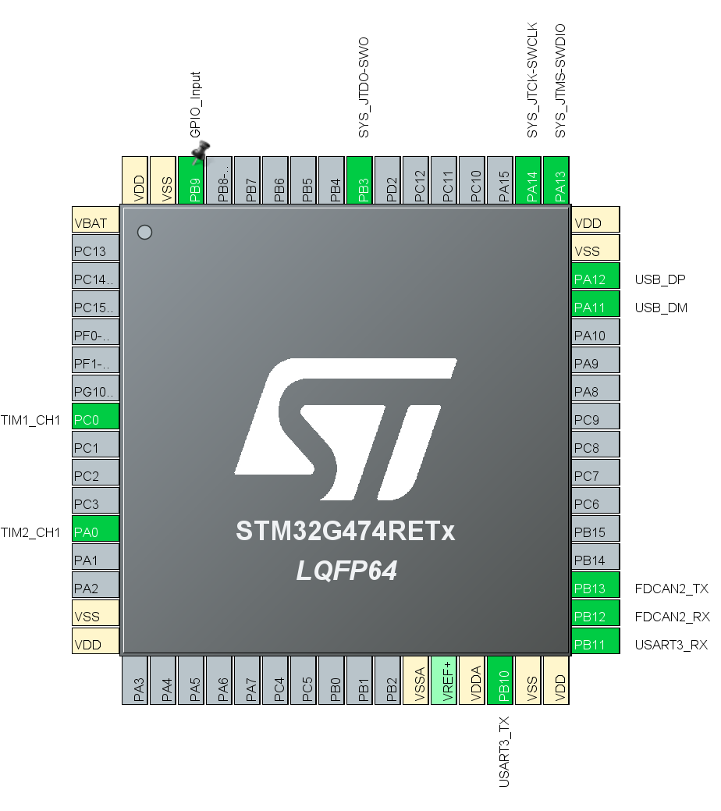
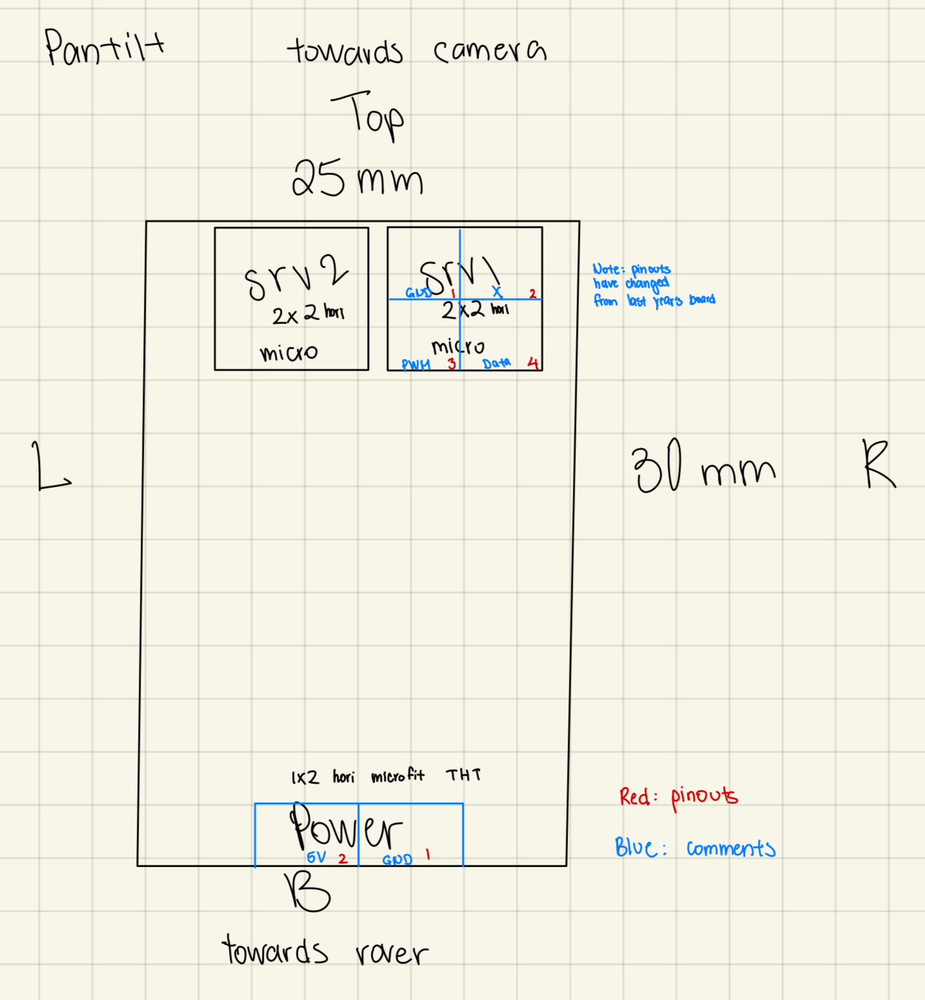
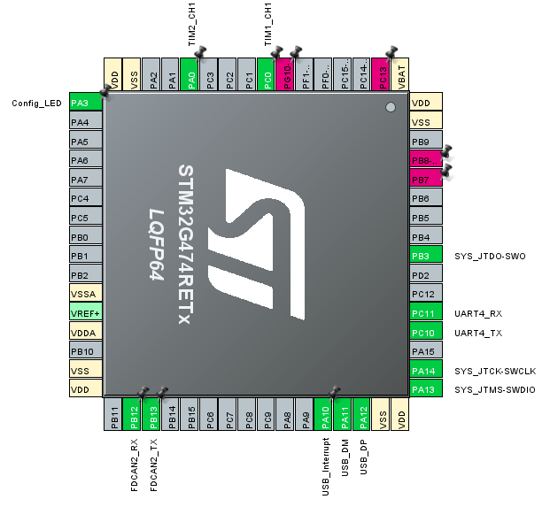
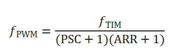
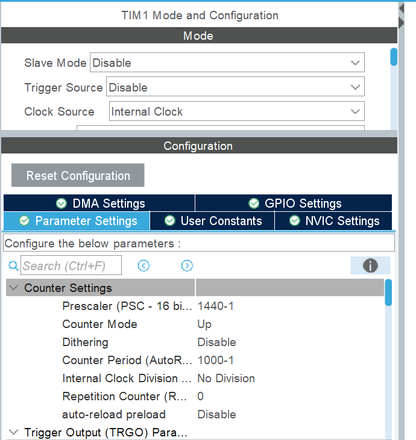
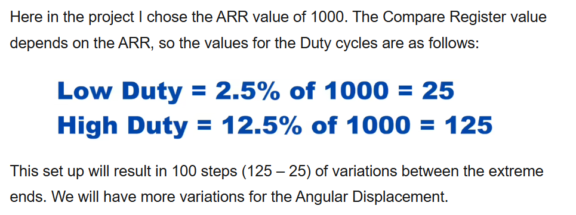
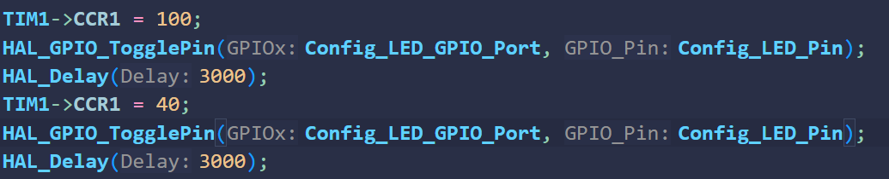
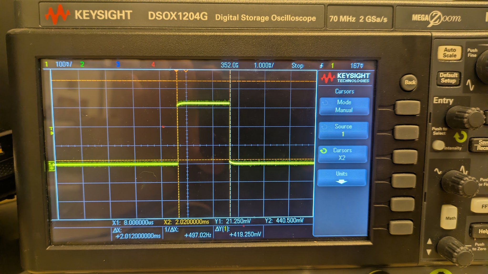
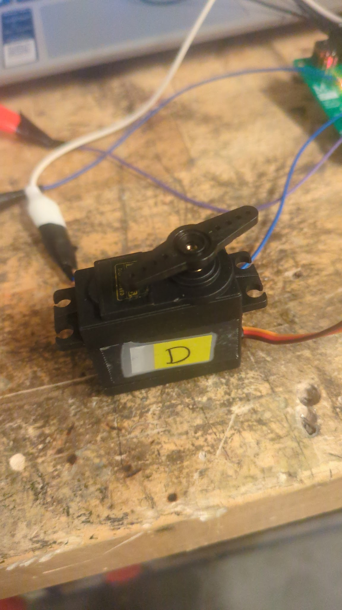
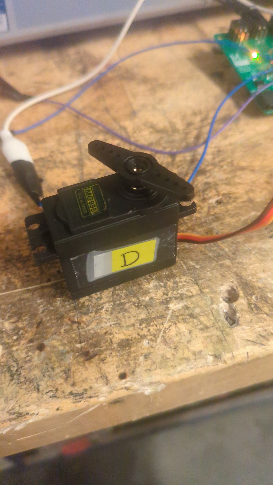

# Tab 1

# PanTilt Board Documentation

The PanTilt board ([Pantilt\_v4](https://mcgill-university-15.365.altium.com/designs/BAC844B2-6C7B-45C7-B180-1339BDB3D849?activeView=SCH&activeDocumentId=stm32.SchDoc&variant=[No+Variations]&location=[1,95,27.05,35.76]#design)) is designed to control two servos for camera positioning using one of three communication interfaces: USB, UART, or CAN. The design emphasizes compactness (estimated 25 mm × 30 mm) while meeting all mechanical, electrical, and programming requirements defined by the harness and system integration teams.

# Power System

* **Input voltage**: 5V  
* **Maximum Current**: 2.2 A?  
* **Voltage Regulation**:  
  A low-dropout (LDO) regulator AP7366-33W5-7 provides a stable 3.3 V supply to the STM32G474RE microcontroller and peripherals.  
  As per section 5.1.6 (Power Supply Scheme) of the [STM32G474RE datasheet](https://www.st.com/resource/en/datasheet/stm32g474cb.pdf), the MCU requires that each power supply pair (VDD/VSS, VDDA/VSSA) is decoupled with filtering ceramic capacitors.  
* **Connectors**:  
  Power input (Bottom of PCB): [1x2 Horizontal Microfit connector](https://docs.google.com/spreadsheets/d/1Oeg_WPtlBZXyiplVIpyahuClL3fWfGzlk_3tDz--Uok/edit?gid=1565166601#gid=1565166601&range=C20) 

| 2 5V source | 1 GND |
| :---: | :---: |

# Microcontroller and Pinout

To optimize routing:

* **PWM outputs** (TIM1\_CH1 on PC0 and TIM2\_CH1 on PA0) were placed on the left side  
* **Communication interfaces** (USB, CAN, UART) were grouped on the right side to simplify connector placement  
* **Connectorless JTAG**: Trace Asynchronous Sw

View the *Diagrams* section for the rough sketch of the placement.

Note that the necessary pinouts for STM32 and power were taken from the [UART Hub Board](https://mcgill-university-15.365.altium.com/designs/BC690B36-C733-49DA-B95D-7A563ACA5837?activeDocumentId=stm32.SchDoc&variant=[No+Variations]#design).  
For CAN, the schematic was taken from the [Brushed Motor Controller Board](https://mcgill-university-15.365.altium.com/designs/4581F60C-C6F7-47C4-AB92-1E87DE53E982?activeDocumentId=brushed_motor_controller.SchDoc\(1\)&variant=[No+Variations]&activeView=SCH&location=[1,95,27.05,35.76]#design) \- to be confirmed.   
For USB, the schematic is not done. USB type to be confirmed.

## Tentative Pinout Placement

# Servo and Connector Layout

* Servo Outputs (Top Edge): Two [2x2 Horizontal Microfit connector](https://docs.google.com/spreadsheets/d/1Oeg_WPtlBZXyiplVIpyahuClL3fWfGzlk_3tDz--Uok/edit?gid=1565166601#gid=1565166601&range=C29)

| 1 GND | 2 Empty |
| :---: | :---: |
| 3 5V source | 4 Data |

# Programming and Debugging Interface

* **USB DFU**: Enables firmware flashing through USB.  
* **Connectorless JTAG**: Used for programming and debugging via pogo-pin connection.  
  * SYS\_JTDO-SWO  
  * SYS\_JTCK-SWCLK  
  * SYS\_JTMS-SWDIO  
* **BOOT Configuration**: BOOT0 pin pulled low by default; can be set high for DFU boot mode.

# Indicators

* **Power LED:** Connected to 3.3 V and 5 V through a 250 Ω resistor (to be changed to a higher resistor for less light intensity), visually confirms supply availability.  
* **Activity LED:** Connected to a GPIO pin (PB9).

# Diagrams

# Firmware

# PanTilt Firmware

Author: Tony

Things that are moving here:

- CAN communication to the STM, accurate parsing (4)  
- UART communication to the STM (5)  
- The nucleo STM working at all, LED flashing(1) ✅  
- Servos turning (2) ✅  
- Servos receiving commands (3)  
- Multiple servos being distinguished from one another (6)  
- Servos turning simultaneously with two rapid commands (7)  
- USB communication to the STM (3.5)  
- THEIR stm on the board being flashed ok. ✅  
- Flashing THEIR stm with DFU  
- Blinking THEIR LED ✅  
- Generating a PWM Signal ✅

1. Installing vscode stm stuff

I followed this dude’s tutorial: [https://www.youtube.com/watch?v=CDqQXCO6F4A](https://www.youtube.com/watch?v=CDqQXCO6F4A)   
As far as I can tell, it works.

I got the damn thing to blink which is pretty damn fire. I can’t find their actual board cause WHY ON EARTH WOULD THEY STORE IT IN A PLASTIC BAG HOLY. is this the “find the absolute dumbest way to organize ur stuff” challenge??? If it is they for sure got first place. The board may not even be in this country as far as I can tell.

2. Flashing their IC.

Their IC can be flashed which is poggers.

3. Rotating their LEDs

Now they light up.

4. Blinking their LED

DFU does not work apparently so I’m going to just do the normal way.

Here’s the IOC for their board that I generated. It’s oriented so that it corresponds to the text-up view looking at the board.

Ok so with a simple blink script, their LED blinks which is good to know.

5. Servo time\!

I want to measure the PWM signal first. Measured\!  
Now, I want to know what sort of control signal these puppies need.  
They say their operating frequency is 50Hz to 300Hz so let’s just use 50Hz.  
So they say they need a 500us \- 2500 us pulse duration.  
One period of my 50Hz signal is 0.02s, so 20000 us.  
Thus, it looks like they want a 2.5% \- 12.5% duty cycle.  
Cool\! For testing I will make a script that switches from, say, 4% to 10% duty cycle every two seconds.  
  
  
Ok this is what I want. (After, I’ll edit TIM2)  
In terms of what to set the CCR \- this guy in the tutorial is using the same ARR as me so the info below applies: ([https://controllerstech.com/servo-motor-with-stm32/](https://controllerstech.com/servo-motor-with-stm32/))  
  
Time to write the control loop to switch between my desired pulse widths. 4 becomes 40 and 10 becomes 100\.  

Now I want to see if the oscilloscope confirms that the pulse widths are the right size.

Small (4%) would give me a 0.8ms pulse width and big (10%) would give me a 2ms pulse width. Looks about right from the photo.

Now to actually spin the motor. Just gotta make sure that the 5V input is A-OK to be powered in Altium.

If I’m right, 4% should give 27 degrees and 10% should give 135 degrees.

Eh close enough.   
(spins)

Now I want to figure out how to print stuff on the console.  
Ok, that was a one hour long adventure with no outcome. I was trying to get live expressions to work in the vscode stm stuff but I didn’t get anywhere.

Then I tried to follow vincent’s tutorial, I need to do step four now.

