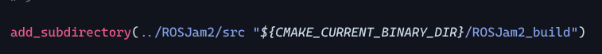
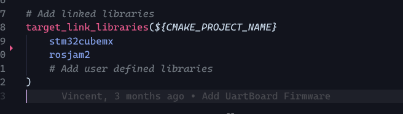
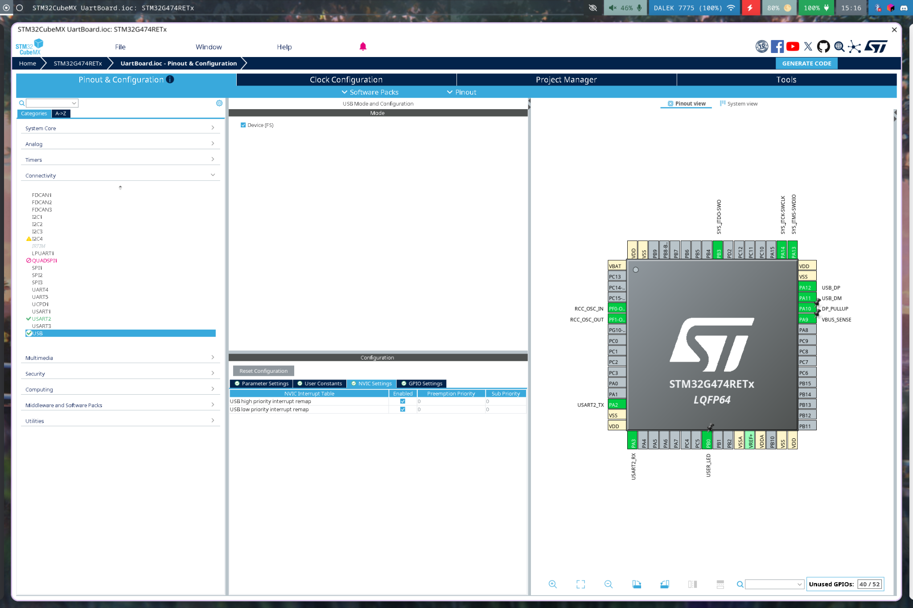
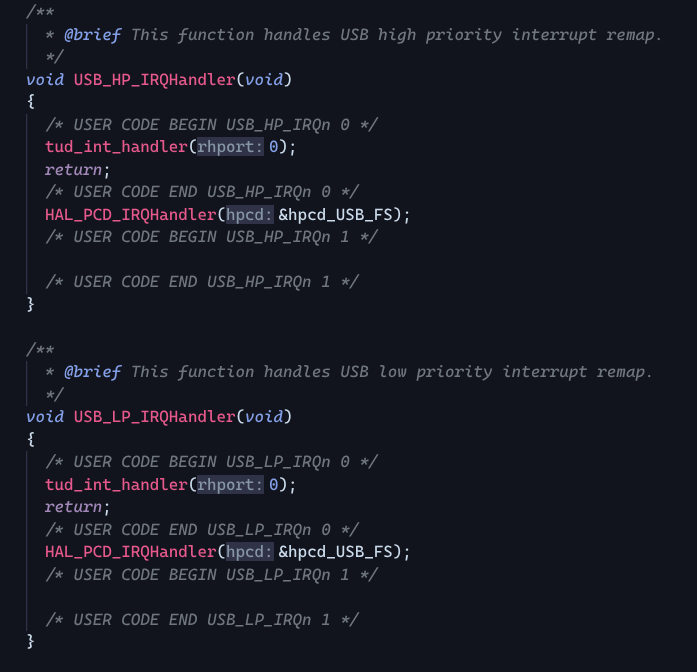
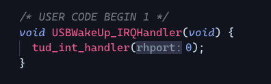
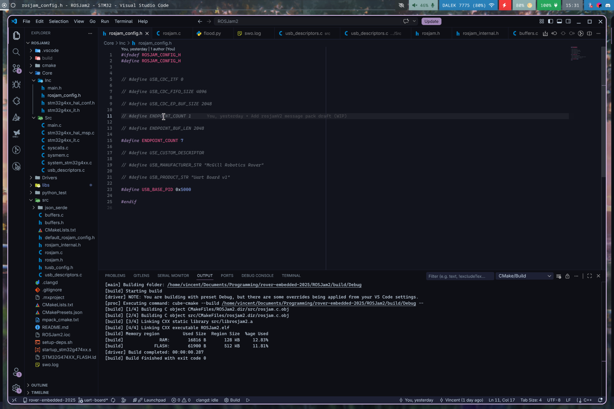
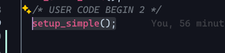

**Simple USB communication on STM32**  
This guide will explain how to get a virtual com port working on stm32 so we can get gps and pantilt working for QRC.t  
**This guide assumes a CMAKE based build**

1. ~~Merge the changes from the simple-usb-stm32 branch into your branch (you should see a ROSJam2 folder appear in the git repository)~~  
   Merge changes from main into your branch.  
2. Setup the rosjam2 library using the [setup-dep.sh](http://setup-dep.sh) script(for Linux) or setup-dep.bat script(for Windows). Those are in the rosjam2 folder.  
3. Add the following lines into the CMakeLists.txt of your project   
* set(CMAKE\_EXE\_LINKER\_FLAGS "$\{CMAKE\_EXE\_LINKER\_FLAGS\} \-u \_printf\_float")  
* add\_subdirectory(../ROSJam2/src "$\{CMAKE\_CURRENT\_BINARY\_DIR\}/ROSJam2\_build")  
* target\_link\_libraries($\{CMAKE\_PROJECT\_NAME\}

      stm32cubemx

      rosjam2

      \# Add user defined libraries

  )

	The second one (target\_link\_libraries) should already exist, you just need to add rosjam2 to the list.  
  

4. In CubeMX, enable the usb interrupts  
     
5. Modify Core/Src/stm32g4xx\_it.c with these lines  
     
     
     
     
6. Add a rosjam\_config.h file to Core/Inc with the following contents.  
   Change the USB\_BASE\_PID to some other number (5001 for pantilt and 5002 for gps for example, as long as they dont conflict with another board)  
     
7. Add these to main to enable the usb communication  
     
   (with other includes in the file)  
     
   (before the main loop)  
     
   (in the main loop)

⚠️ Note: process\_simple ***must*** be called in the main loop otherwise the USB connection will not work

8. Use these functions to implement the communication to usb (do not use the other functions in rosjam.h they don't quite work yet)  
   

⚠️ Note: you can also use functions available in tinyusb (by including “tusb.h”) but these should be sufficient to replicate the old firmware’s behaviour on the new boards.

