# **Hardware**

# **Rover 2025-2026**

# **UART Board Hardware Documentation**

# **Overview**

The UART board helps connect multiple systems to the Jetson Nano by passing up to 6 UARTs inputs to a single USB-C input.

# **Components**

## Overview

The microcontroller used for this board is the standardized [STM32G474RET6](https://www.digikey.ca/en/products/detail/stmicroelectronics/stm32g474ret6/10326780), which allows for up to 6 UARTs. There is one LPUART designed for low-power, but is fast enough to be used as a normal UART, three USARTs designed for synchronous and asynchronous use, but are only used in the project as asynchronous, and two standard UARTs. The two general-purpose UARTs use two different standards, one is used as an RS-232 connection, and the other as an RS-485 connection. Debugging is done through ARM SWD and flashing can also be done through USB DFU. A programmable red LED and 2 green LEDs for power are available to monitor the board’s status.

## Pinout

## Oscillator

The crystal oscillator used for the STM32 is the [RH100-16.000-9-1010-TR](https://www.digikey.ca/en/products/detail/raltron-electronics/RH100-16-000-9-1010-TR/10272711), a 16.000 MHz crystal. This has been chosen since it is already used by another board, so it is known to work properly. This should not cause any issues with the USB since the PLL can be configured to lock the USB connection at 48 MHz. The LPUART also is not an issue since it can be configured with the system clock inside CubeIDE instead of needing a low-frequency 32 KHz crystal and using the system clock should allow higher baud rates. The crystal requires 9 pF load capacitance, which when considering 5 pF stray capacitance, means the crystal requires 8 pF capacitors, which were chosen to be the [CC0603BRNPO9BN8R0](https://www.digikey.ca/en/products/detail/yageo/CC0603BRNPO9BN8R0/11491204). Another one is used for a separate IC, which is described in the UART section. Based on [this post](https://community.st.com/t5/stm32-mcus/how-to-select-a-compatible-crystal-and-load-capacitors-for-stm32/ta-p/780236%20) in the ST forums, the crystal should be suitable for the chip. We can compute if a crystal if suitable if we have 5\<(1.5\*5)/gmcrit. We can compute gmcrit=4ESR(2pif)2(Cshunt+Cload)2= 400100(2pi16MHz)2(3.5pF+9pF)2=0.631mA/V. The STM32G474 has a gmcritmax=1.5 such that we get 5\<(1.5\*5)/gmcrit \= 11.8736.

## Power

5 V external power is provided through a 1x2 vertical microfit connector. The board also accepts 5V through the USB-C connector. To switch between the two power sources, we chose to use [TPS2116DRLR](https://www.digikey.ca/en/products/detail/texas-instruments/TPS2116DRLR/15205127), a power switch IC for its small board space and lower cost compared to having to design a robust design with multiple MOSFETs as well as it fitting our needs better than simply using Schottky diodes. The IC allows us to prioritize the external power source over the USB connection when both are connected. If the external power supply drops below approximately 3V then it will switch over to using USB as the power source. This is because the PR1 pin is compared to a reference voltage of 1V and with our chosen voltage divider with a 10K Ohm resistor to external voltage and a 5.1K resistor to ground, the voltage of PR1 would be less than 1V if the external voltage reaches about 3V.

Since the rest of the board requires 3.3 V, an LDO is required. The [AP7366-33W5-7](https://www.digikey.ca/en/products/detail/diodes-incorporated/AP7366-33W5-7/9867322) was chosen because it was already used on the steering board, so it is known to work properly. The standard green LED was chosen to show if 5 V and 3.3 V power is working.

A reverse polarity prevention circuit is added to the external power source to make sure it does not cause any issues. The PMOS transistor [AO3407A](https://www.digikey.ca/en/products/detail/alpha-omega-semiconductor-inc/AO3407A/1855778) seems to have Vgs \= ±10 V, so the zener diode needs to ensure it is in that range at all times. If the voltage is around \-5 V (if polarity is reversed), then I \= 0.5 mA, and the power of the zener diode is 6.2 x 0.5 m \= 3.1 mW. So the 6.2 V, 300 mW zener diode MM3Z6V2T1G should be good.

## USB

For the USB-C connector the [UJ20-C-H-G-SMT-1-P16-TR](https://www.digikey.ca/en/products/detail/same-sky-formerly-cui-devices/UJ20-C-H-G-SMT-1-P16-TR/24818576) was chosen due to it being able to sustain USB 2.0 speeds (up to 12 Mbps @ 48 MHz using STM32) and being cheap. For the pinout of the USB-C connector,

* VBUS is the 5 V power given through USB;  
* GND is the USB’s ground;  
* DP1, DP2, DN1, DN2 are differential pairs for USB 2.0 data transfer, one pair for each possible orientation of the connector;  
* CC1 and CC2 must have 5.1 KOhm resistors each chosen as the [RC0603FR-075K1L](https://www.digikey.ca/en/products/detail/yageo/RC0603FR-075K1L/727268);   
  * The 5.1K Ohm CC resistors are chosen to allow up to 3A at 5V on VBUS if necessary (see [this](https://forum.digikey.com/t/simple-way-to-use-usb-type-c-to-get-5v-at-up-to-3a-15w/7016/39))  
* SBU1 and SBU2 are not needed since only USB 2.0 data transfer speed is required;  
* All shield pins go directly to ground.

Since the power is provided externally, there is no need for VBUS power on the board. However, the VBUS voltage is used to detect if there is an USB cable connected to disable the DP pull-up resistor as specified by the USB spec [see ST application note](https://www.st.com/resource/en/application_note/an4879-introduction-to-usb-hardware-and-pcb-guidelines-using-stm32-mcus-stmicroelectronics.pdf) (section 3.1.1). To ensure the voltage is low enough for the STM32 to use VBUS, a voltage divider is required. A 33kOhm and 83 kOhm resistor are used. As recommended by A standard red LED is added to show any activity on the USB, labelled as USER\_LED.

There are 0 Ohm jumper resistors placed on the D+ and D- lines in case the builtin ones of the MCU do not work which would allow us to fix the termination resistance without reordering boards. The same is done for an extra controllable 1.5K pull up resistor between D+ and a GPIO. In case the internal D+ pull up does not work we have pads where we can place our own.

## Debug interface

SWD Debug is available using a simple 4 pins connector with 2.54 mm pitch.

## UART

There are 6 UARTs in total. The following table shows the naming of the UARTs on the board and to which ones they correspond on the STM32’s pinout.

| Board Name | STM32 Name | Properties |
| :---- | :---- | :---- |
| UART0 | LPUART1 | Isolated power and ground, for BMS |
| UART1 | USART1 | Isolated power and ground, for BMS |
| UART2 | USART2 | Standard general purpose UART (RS-485) |
| UART3 | USART3 | Can provide power through connector, for GPS |
| UART4 | UART4 | Can provide power through connector, for GPS |
| UART5 | UART5 | Standard general purpose UART (RS-232) |

To isolate the BMS UARTs, the [TPT7721-SO1R](https://www.digikey.ca/en/products/detail/3peak/TPT7721-SO1R/22229586) is used since it provides two unidirectional channels, each one going in the opposite direction, which allows the use of a single IC per isolated UART. Each UART uses a 1x4 horizontal microfit connector, with pin 1 being ground or isolated ground for isolated UARTs, pin 2 TX, pin 3 TX, and pin 4 being either nothing for standard connectors, isolated power for isolated UARTs, or providing 5 V power for GPS UARTs. 

According to the GPS [datasheet](https://content.u-blox.com/sites/default/files/products/documents/NEO-7_DataSheet_%28UBX-13003830%29.pdf), logic high on digital IO is Vcc-0.4 with Vcc being max 3.6V (typical 3V). This should be safe for the stm32 we are using hence we do not need to add a level shifter to translate to 5V logic level. However the gps takes in a 5V input to power itself which we can supply from our board which allows reducing the number of wires on the rover.

RS-232 (UART3):

- CTS (clear to send).  
- RTS (request to send).  
  Both are used to prevent buffer overflow issues on each side, making it more reliable. They are put on a separate 2-pin 2.54 mm pitch connector.  
- G (ground), used for reference.  
- TXD (TX, same as UART), uses different voltages, requires transceiver IC.  
- RXD (RX, same as UART), uses different voltages, requires transceiver IC.

RS-485 (UART5):

- G (ground), used for reference.  
- A, B (differential pair), used to receive / transmit data, transceiver IC seems to have A as positive and B as negative, converted from RX and TX using the IC.  
- DE (driver enable), used to enable / disable the driver, only needed from STM23 to transceiver IC.

For RS-232, the [MAX3232EIPWR](https://www.digikey.ca/en/products/detail/texas-instruments/MAX3232EIPWR/968150) transceiver IC is used to get the required voltages for the RS-232 standard. It requires the multiple 0.1 uF capacitors for 3.3 V power as detailed in its datasheet in addition to RX, TX, GND, CTS, and RTS.

**RS-232 Transceiver Typical Application:**  
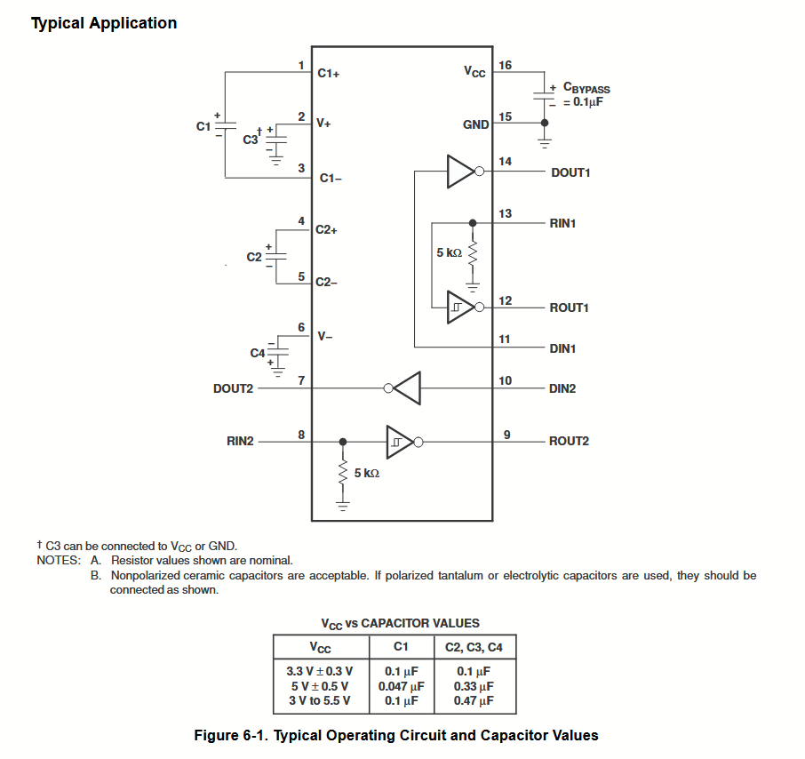

For RS-485, the [THVD1400DR](https://www.digikey.ca/en/products/detail/texas-instruments/THVD1400DR/13636656) transceiver IC is used to convert RX and TX into the differential pair A and B with the required voltages. Since this connector would be at the end of a bus, it requires a termination resistor of 120 Ohm. It requires a 0.1 uF capacitor for power and a 10 kOhm pull-down resistor for the DE pin from the STM32, which connects to both DE and nRE pins on the IC.

**RS-485 Transceiver IC Typical Application:**  
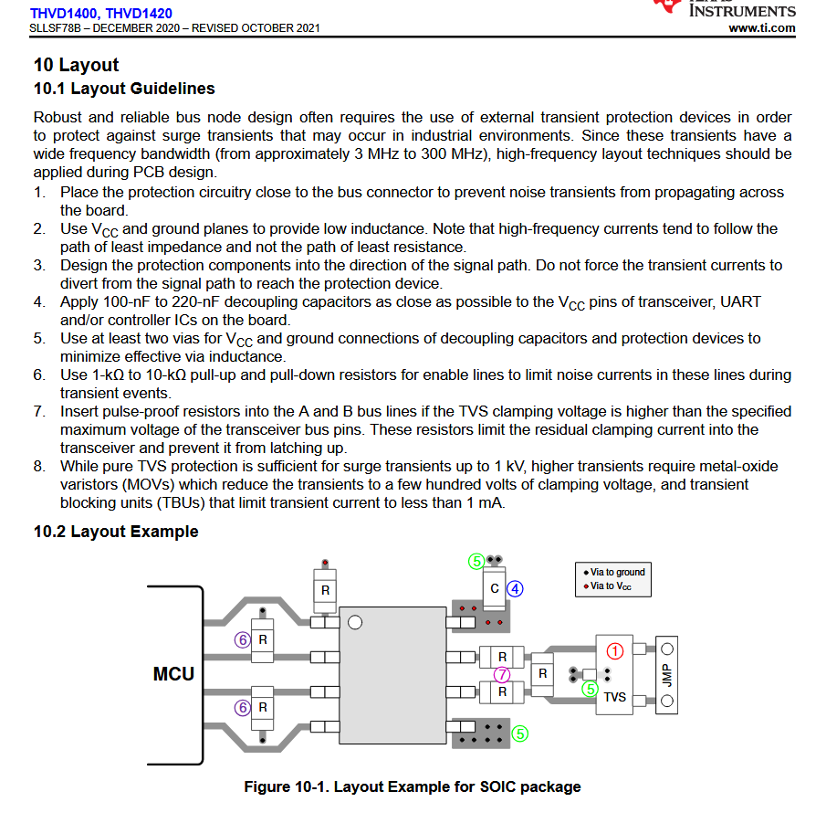

## TVS Diodes

To protect the data lines from any voltage spikes, TVS diodes are added to all the UART and USB differential lines. The [D1213A-02SOL-7](https://www.digikey.ca/en/products/detail/diodes-incorporated/D1213A-02SOL-7/3340397) is used since it starts conducting electricity at 3.3 V and breakdown voltage of 6 V, with maximum clamping voltage of 10 V. This is exactly what is needed for the 3.3 V lines to protect the SMT32 from any higher voltages such as 5 V without the breakdown voltage being too low.

To ensure the TVS diode won't slow down the signals on the lines being protected, we calculate the rise time due to the capacitance of the TVS diode as  \=2.2RC, and f=1. In this case, assume for an average trace R=50 Ohms with C=1.2 pF taken from the TVS diode capacitance found in the datasheet so f=1(2.2501.210-12)=7.576109 Hz, which is equal to 7.576 GHz. In this case, it is clear that 7.675 GHz \>48 MHz, which is the USB clock, and 7.675 GHz \> 115.2 KHz, which is the max UART clock. There are therefore no issues caused by the TVS diodes.

Different TVS diodes are used for the RS-232 and RS-485 transceiver ICs. Different diodes were required as our RS-232 and RS-485 interfaces would be operating at 5V instead of 3.3V so the other TVS diodes would be outside of their intended operating regions and would start conducting. The [SM712](https://www.digikey.ca/en/products/detail/smc-diode-solutions/SM712/16584910) was chosen due to matching the exact specifications of the recommended TVS diode for the RS-485 transceiver in its datasheet. It also works for the RS-232 transceiver, so is used for both.

# **PCB**

## Layout

Top Side  
Bottom Side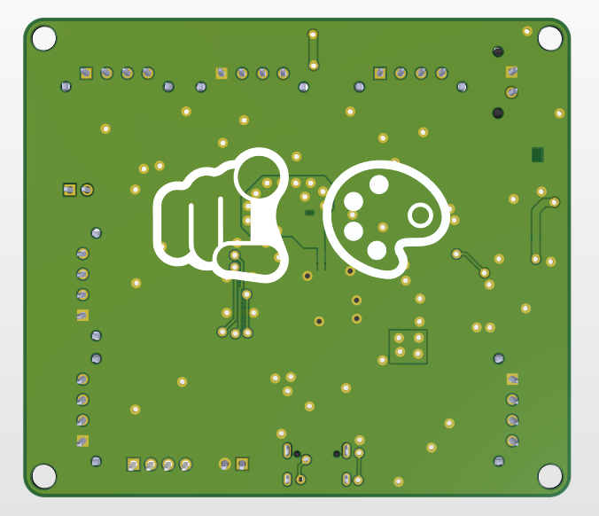  
The USB Type-C connector is at the bottom of the board, with the BMS connectors at the top (isolated UARTs, RS-485 will likely be used for the BMS as well). In the top-left corner, there is the external power connector. In the bottom-left corner, there is the first GPS UART, and on the right side, there are the second GPS UART and RS-232 connectors. SWD debug and 3.3 V, GND connections are available to the right of the USB-C connector, with boot and reset buttons on top of them.

The board is 80.0 mm x 70.0 mm, with rounded corners (3.0 mm radius). The mounting holes are 3.0 mm away from the edge of the PCB.

# **Firmware**

# **Rover 2025-2026**

# **UART Board Firmware Documentation**

# **Overview**

The current firmware implementation allows up to two GPS modules and the pantilt board to communicate to the Jetson Nano via an USB COM port. The user can send pantilt commands via COM port (pan angle, tilt angle) and receive GPS information (number of satellites, longitude, latitude, etc).

# **USB**

The USB stack is managed using the ROSJam library, please view the [documentation](https://docs.google.com/document/d/1J6eTxEv4Xrg9VQ0W-ciEwU6E3jks3iCTR9Kns-M-bss/edit?usp=sharing) for it to get started. It is solely used as a COM port to send commands and get GPS data back.

# **GPS**

The GPS library is based on a ported version of TinyGPS with a different C API. The original TinyGPS can only decode the standard NMEA protocol, while an added state machine can also decode UBX-NAV-PVT packets. The UBX-NAV-PVT packet is meant specifically for the new M10G-5883 module used on the rover. The newer M10G-5883 module runs at 115200 baud rate while the older NMEA module runs at 9600 baud. The firmware handles this automatically on GPS initialization.

Currently, the GPS provides the number of satellites *numSV*, the longitude *lon*, latitude *lat*, and can also display the altitude *alt*, speed *gSpeed*, and heading of motion *headMot* inside *gps\_data\_t*. Each GPS requires a struct *gps\_t* to be initialized. Then a snapshot of the previous *gps\_t* struct can be read from each and then used to send data. The heading of motion is based on the velocity of the rover, therefore it will only work when the rover is moving. The GPS, both old and new versions, are inaccurate and will likely be 3-5 meters off from the rover itself. When using two GPS modules at the same time, the firmware will fuse the data based on the number of satellites each is connected to. Therefore, the satellite with the most satellites connected to it will have the largest influence. To enable dual GPS, make sure to uncomment the define for *DUAL\_GPS* at the top of *main.c*, then reflash the UART board.

A Kalman filter implementation is used to smooth random noise for the longitude and latitude. Different R values can be given to the Kalman filter to tweak it (view [README](https://github.com/mcgill-robotics/rover-embedded-2025/blob/uart-board-gps/GPS/src/tinygps/README.md)). Currently, this will require a reflash of the board for the changes to apply, there are no other ways to change this.

# **Pantilt**

The pantilt board is controlled via the COM port and requires the following format: *pan\_angle\_float*,*tilt\_angle\_float*, with a newline at the end. These values represent deltas from the current positions, so they will move by that many degrees clockwise or counterclockwise. Any other format will not parse properly and will be ignored by the firmware. The UART board also returns these values so that the current angle can properly be tracked in software. To differentiate GPS and pantilt lines in the COM port, the GPS lines start with *g* and pantilt lines start with *p*. They are all separated with a comma in between for easy parsing. An example Python script is provided at *python\_connector/pantilt\_firmware.py*.

Pantilt uses PWM from two separate timers to change their current angle. Standard servos operate at a 50 Hz frequency (20 ms period). During each period, there is a PWM pulse that tells the servo the current angle. PWM pulses can vary in length, with a minimum of 500 us up to 2.5 ms (2500 us). This can then be mapped to a range with *MIN\_ANGLE* and *MAX\_ANGLE*, and simple math shows that pulse=MIN`_PERIOD+(angle(MAX_PERIOD-MIN_PERIOD))MAX_PERIOD`. In our case, the servos can go from *0* to *270* degrees. While the tilt servo is normal, the pan servo is connected to a gear with a *2:1* gear ratio, which speeds it up, giving it a technical maximum rotation from *0* to *540* degrees. To simplify this, panning is limited to 360 degrees (equivalent to 180 degrees on the servo itself).

# **Implementation**

To implement the TinyGPS library into other code, follow the [README](https://github.com/mcgill-robotics/rover-embedded-2025/blob/uart-board-gps/GPS/src/tinygps/README.md) instructions. In summary, you must:

1. Initialize in STM32CubeMX the wanted UART(s)  
2. Initialize the *gps\_t* using the *gps\_init()* function  
3. Add the required *gps\_process()* functions inside of *HAL\_UART\_RxCpltCallback()*  
4. Add the *gps\_read\_snapshot()* function inside of the main while loop

# Draft

**UART HUB Board Documentation**

**TODO:**  
**maybe increase size a bit to allow lip of the screw to not interfere with connector (mainly look at top right screw hole)**  
**Revisit power ORing based on James question**   
**Can reduce via sizes a bit to 70/40**

**Hardware**

**Power**

**Dual Supply switching circuit(Bus-Powered vs Self-Powered)**  
Requirements:   
be able to power from the both VBUS and an external source  
Current should not flow back into the secondary source if both are connected  
(both could provide power but not necessary/we might want to prioritise one source over the other)  
Must be able to sustain enough current for all our possible logic level circuits (TTL 5V or CMOS 3.3V)(5V optional if we choose not to power that domain through USB like higher voltages would be handled)

Options:  
*Power mux IC:*  
[https://www.digikey.ca/en/products/detail/texas-instruments/TPS2116DRLR/15205229](https://www.digikey.ca/en/products/detail/texas-instruments/TPS2116DRLR/15205229)   
Most expensive solution  
Benefits: Controllable via MCU(dont know if thats actually useful for us)  
Limited to 2.5A and to a 6V input

*Dual Schottky diode:*  
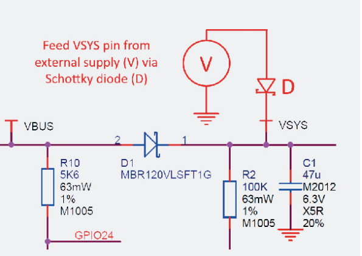  
Pic from Raspberry Pi Pico datasheet  
Downsides: Largest voltage always wins (If external power dips under VBUS, USB port will pull power(we might not want that))

*Schottky \+ P-MOSFET:*  
****  
Pic from Raspberry Pi Pico datasheet

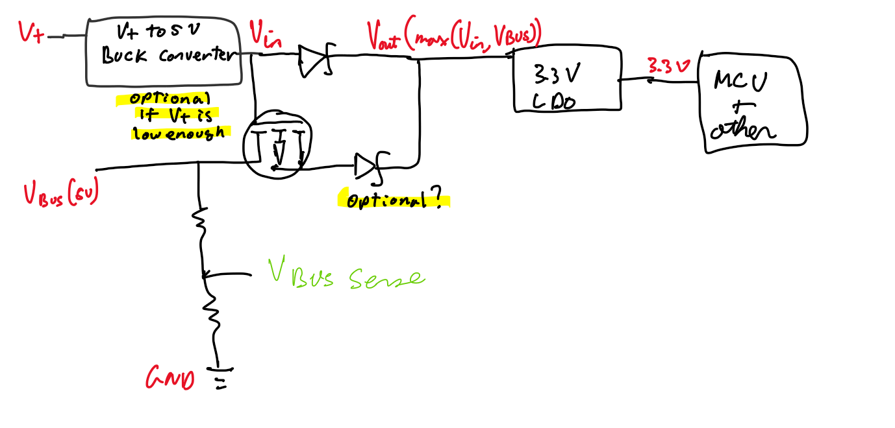  
Possible general power setup for boards with USB  
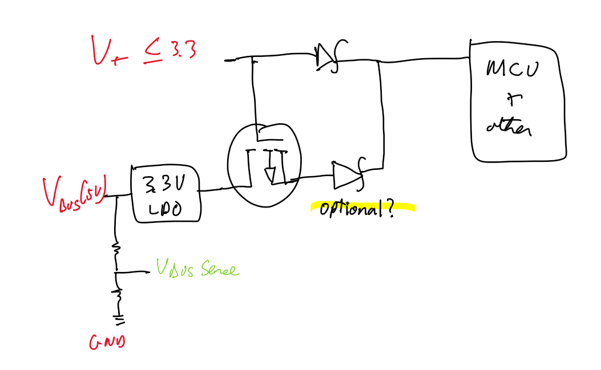  
Alternative supply scheme if *V+* \<= 3.3V  
Might be the best option. Cheaper than dedicated power mux IC and allows controlling priority (favor external if present) without relying on external source to have a higher voltage  
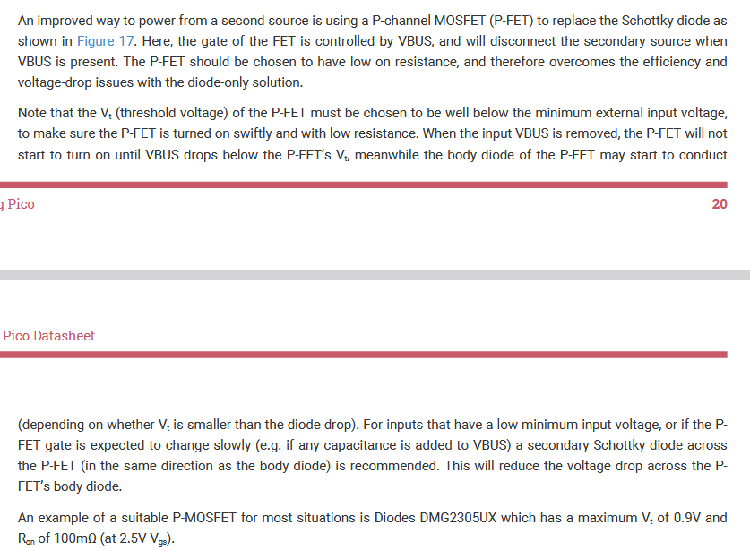  
Relevant info for checking suitable mosfet  
*Note: Check cost and performance benefit of replacing Schottky diodes with Ideal Diode Controllers (Probably more expensive and complex)*

[https://www.digikey.ca/en/products/detail/diodes-incorporated/DFLS130L-7/673198](https://www.digikey.ca/en/products/detail/diodes-incorporated/DFLS130L-7/673198) Chosen Schottky diode  
[https://www.digikey.ca/en/products/detail/diodes-incorporated/DMG2305UX-7/4340667](https://www.digikey.ca/en/products/detail/diodes-incorporated/DMG2305UX-7/4340667) Chosen P-MOSFET

*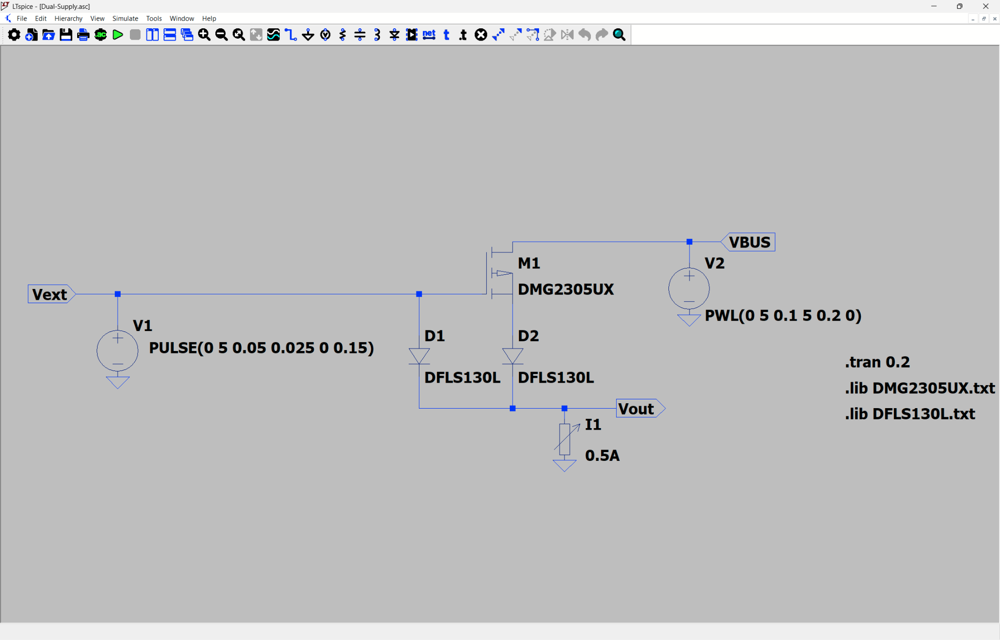*  
Simulation used for testing the circuit  
  
Results from connecting and disconnecting both VBUS and Vext in sequence

On a disconnection/connection of the Vext supply the 5V supply may dip as low as 4.13V but will stabilize around 4.7V for both VBUS and Vext power. This should be high enough to power the LDO which has at 600mA a max Vdrop of 400mV such that a 3.3V output can be reliably generated as long as we give 3.7V. 4.7 should also be enough to power MCP2561/2 transceivers which expect a VDD of at least 4.5V

LDO tentatively:  
External power, so not from vbus.

[https://www.digikey.ca/en/products/detail/diodes-incorporated/AP7366-33W5-7/9867322](https://www.digikey.ca/en/products/detail/diodes-incorporated/AP7366-33W5-7/9867322)

**MCU**  
STM32G474RE mcu:  
[https://www.digikey.ca/en/products/detail/stmicroelectronics/stm32g474ret6/10326780](https://www.digikey.ca/en/products/detail/stmicroelectronics/stm32g474ret6/10326780)

Lpuart1 and usart2 are bms, so have isolator ics  
Usart1, uart4 are gps, so they also need power pins.  
Rest, i.e. usar3, uart4, uart5, uart6, and uart7 (6 and 7 are from spi to dual uart ic) are standard

Crystal:  
[https://www.digikey.ca/en/products/detail/raltron-electronics/RH100-32-000-9-F-1010-TR/10272861](https://www.digikey.ca/en/products/detail/raltron-electronics/RH100-32-000-9-F-1010-TR/10272861)  
Changed back to 16 mhz crystal  
[https://www.digikey.ca/en/products/detail/raltron-electronics/RH100-16-000-9-1010-TR/10272711](https://www.digikey.ca/en/products/detail/raltron-electronics/RH100-16-000-9-1010-TR/10272711)  
Check suitable crystal  
[https://community.st.com/t5/stm32-mcus/how-to-select-a-compatible-crystal-and-load-capacitors-for-stm32/ta-p/780236](https://community.st.com/t5/stm32-mcus/how-to-select-a-compatible-crystal-and-load-capacitors-for-stm32/ta-p/780236)   
gmcrit \= 4\*ESR\*(2\*pi\*f)^2\*(Cshunt+CLoad)^2 \= 4\*100\*(2\*pi\*16\*10^6)^2\*((3.5+9)\*10^(-12))^2 \= 0.631mA/V  
Gain margin \= gmcritmax \* 5 / gmcrit \= 1.5\*5/0.631 \= 11.8736 \> 5 OK  
**CL \= (C1 \* C2) / (C1 \+ C2) \+ Cstray**  
Need 8 pF capacitors to drive the crystal  
[https://www.digikey.ca/en/products/detail/yageo/CC0603BRNPO9BN8R0/11491204](https://www.digikey.ca/en/products/detail/yageo/CC0603BRNPO9BN8R0/11491204)

16Mhz should be fine for usb anyways because we can configure in cubeide to use the PLL which will lock the usb clock to 48MHz, switched to 32 mhz now, still fine

No need for LSE crystal for LPUART (can be configured from system clock) in cubeide

Pinout (tentative)  
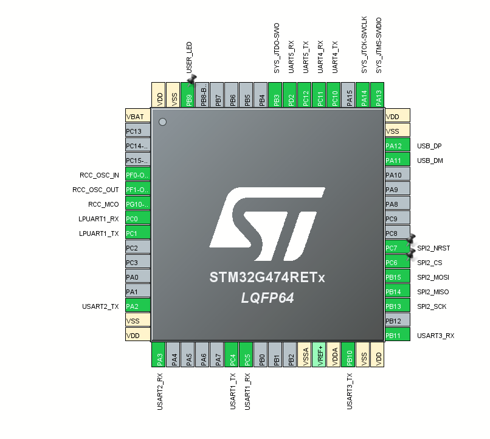  
Old pinout  
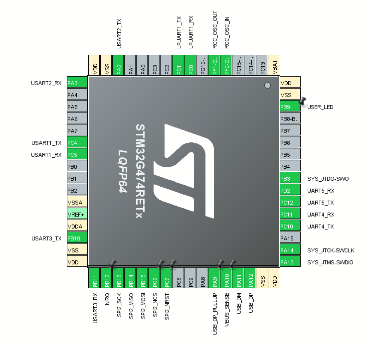

TODO  
Added PA10 for VBUS sensing  
Added  PA9 for USB D+ resistor pullup  
Added PB12 for NIRQ of SPI to Dual UART IC

Clock setup(tentative), probably needs to be updated  
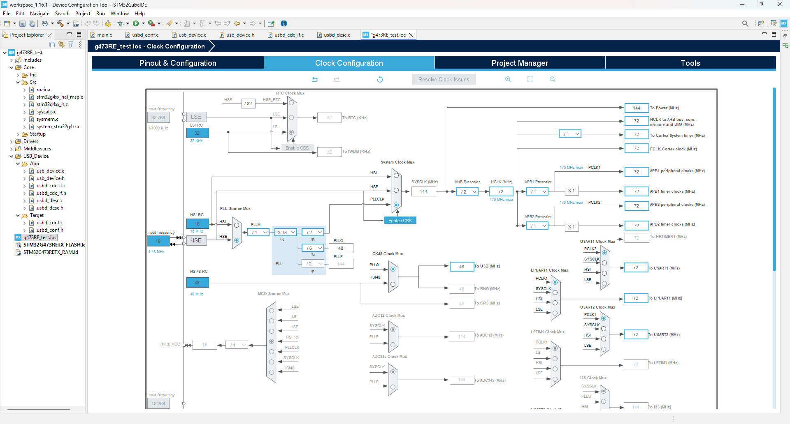

**USB-C**

USB-C connector   
[https://www.digikey.ca/en/products/detail/same-sky-formerly-cui-devices/UJ20-C-H-G-SMT-1-P16-TR/24818576](https://www.digikey.ca/en/products/detail/same-sky-formerly-cui-devices/UJ20-C-H-G-SMT-1-P16-TR/24818576)

USB-C connector pinout:  
VBUS is 5V  
GND(self-explanatory)  
DN1, DN2, DP1, DN2 are the DP, DN (or D+, D-) differential pair, there are 2 to support the 2 orientations of usb-c  
CC1 and CC2 (configuration) must have the appropriate resistors to have enough current over the usb connection \-\> 5K1 Ohm resistors ([https://www.digikey.ca/en/products/detail/yageo/RC0603FR-075K1L/727268](https://www.digikey.ca/en/products/detail/yageo/RC0603FR-075K1L/727268) )  
SBU1 and SBU2 (Sideband use) are not needed as we are only usb using 2.0 FS (no alt modes)  
Shield goes to ground  
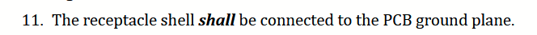  
[https://usb.org/document-library/usb-type-cr-cable-and-connector-specification-release-24](https://usb.org/document-library/usb-type-cr-cable-and-connector-specification-release-24)   
Usb-c spec 2.4 shield should be connected to ground (p. 47\)

From usb-c spec on connector end DP1 and DP2 (same for DN) can be shorted as close as possible to connector (keep traces under 3.5mm) see table 3-4  
[https://www.usb.org/sites/default/files/USB%20Type-C%20Spec%20R2.0%20-%20August%202019.pdf](https://www.usb.org/sites/default/files/USB%20Type-C%20Spec%20R2.0%20-%20August%202019.pdf) 

No need for usb termination resistors they are embedded in the mcu(see p. 174 of [datasheet](https://www.st.com/resource/en/datasheet/stm32g473re.pdf)) (maybe add pads just in case it doesn't work so we at worst at a 22 ohm)  
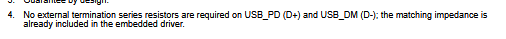

Figure out how to handle self-powered device(may need VBUS monitoring to disable internal pull up) in case the hub is not VBUS powered  
(Add external pull up also just in case would be 1.5k if placed on dp line on connector side relative to termination pads)  
VBUS monitoring   
Use PA10 for monitoring (its 5V tolerant just in case) (set as interrupt)  
Want 0.7\*3.3=2.31 to 3.3V from 4.4V to 5V on vbus  
2.31=4.4\*R1\*(R1+R2)  
R1\*(R1+R2) \= 0.525  
If R1 \= 10K and R2= 9.09K  
[https://www.digikey.ca/en/products/detail/yageo/RC0805FR-079K09L/728185](https://www.digikey.ca/en/products/detail/yageo/RC0805FR-079K09L/728185) 9.09k   
[https://www.digikey.ca/en/products/detail/yageo/RC0603FR-0710KL/726880](https://www.digikey.ca/en/products/detail/yageo/RC0603FR-0710KL/726880) 10k  
If we use identical resistors then R1\*(R1+R2) \= 0.5238  
So lowest VBUS voltage in our case would be 2.31/0.5238 \= 4.4097V

Try to keep ground plane uninterrupted under usb signal lines

**Additional ICs**

RS-232 transceiver(tentative)  
[https://www.digikey.ca/en/products/detail/texas-instruments/MAX3232EIPWR/968150](https://www.digikey.ca/en/products/detail/texas-instruments/MAX3232EIPWR/968150)   
(We can power from a 3.3V input such that the receiver high level output voltage is 3.3-0.1 so the stm32’s rx pin is not damaged from a high voltage)  
There are 2 driver/receivers(one is used for rx,tx, the other for cts,rts)  
  
Rin is rx from connector  
Rout is Rx from stm32  
Din is Tx from stm32  
Dout is tx from connector  
Vcc will be 3.3V

For other driver R is for cts  
D is for rts

(put jumpers in case we get things wrong)

Rs-485 transceiver(tentative)  
[https://www.digikey.ca/en/products/detail/texas-instruments/THVD1400DR/13636656](https://www.digikey.ca/en/products/detail/texas-instruments/THVD1400DR/13636656)   
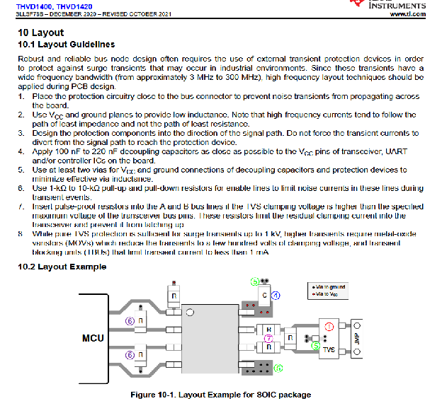

Level Shifter for TTL uart (not needed, gps output 3.3V logic level from gps datasheet) [https://content.u-blox.com/sites/default/files/products/documents/NEO-7\_DataSheet\_%28UBX-13003830%29.pdf](https://content.u-blox.com/sites/default/files/products/documents/NEO-7_DataSheet_%28UBX-13003830%29.pdf) ):  
[https://www.digikey.ca/en/products/detail/nexperia-usa-inc/NXS0102DC-Q100H/13575107](https://www.digikey.ca/en/products/detail/nexperia-usa-inc/NXS0102DC-Q100H/13575107) 

SPI to dual UART expander:  
[https://www.digikey.ca/en/products/detail/nxp-usa-inc/SC16IS752IPW-128/1158200](https://www.digikey.ca/en/products/detail/nxp-usa-inc/SC16IS752IPW-128/1158200) 

4Mbps spi

Needs a secondary lower frequency crystal 1.8432 MHz or derive a 2MHZ clock from mcu through RCC\_MCO on pin PG10 \-\> doesn’t work :(

Secondary crystal will be the same component as for the mcu to achieve higher baud rates(actually maybe not, try a 11.0592mhz crystal instead of the 1.8432 from the datasheet)  
[https://www.digikey.ca/en/products/detail/raltron-electronics/RH100-11-0592-18-3030-EXT-TR/10246253](https://www.digikey.ca/en/products/detail/raltron-electronics/RH100-11-0592-18-3030-EXT-TR/10246253)   
**CL \= (C1 \* C2) / (C1 \+ C2) \+ Cstray**  
Need 26pF capacitor(closest value is 25pF)  
[https://www.digikey.ca/en/products/detail/yageo/CC0805JRNPO9BN250/5884044](https://www.digikey.ca/en/products/detail/yageo/CC0805JRNPO9BN250/5884044) 

For common uart speeds:  
9600 bauds  
19200 bauds  
115200 bauds

In the worst case scenario, one uart will take up bandwidth of 115.2 Kb/s.  
SPI overhead of 4/3, with mbps spi, results in 1.5 mbps per uart, much larger than 115.2 kb/s, so no issues with spi to dual uart ic.

UART ISO:  
[https://www.digikey.ca/en/products/detail/3peak/TPT7721-SO1R/22229586](https://www.digikey.ca/en/products/detail/3peak/TPT7721-SO1R/22229586)

**Passives**

Power Leds:  
Choose from standard ones  
Indicator for 5V power, 3V power and programmable(check GPIO pin can supply enough current)  
All are using 250 ohm or 125 ohm resistances to try and keep the current low but not too low. Brightness should be very similar (todo add calculations)

TVS diodes for all uart lines:  
Must be able to operate with 5V level due to TTL uart lines  
[D1213A-02SOL-7](https://www.digikey.ca/en/products/detail/diodes-incorporated/D1213A-02SOL-7/3340397)  
Speed calculation 2.2RC \= rise time with R \= 50Ohm, C \= 1.2 pF  
1 / (2.2 x 50 x 1.2 pF) \= 7.576 x 10^9 \= 7.576 GHz  
7.576 GHz \> 48 MHz (USB 2.0)  
7.576 GHz \> 115.2 KHz (UART max speed)  
So no issues with tvs diode rise time since it is much faster than rest of clock speeds

TVS diode for usb line VBUS?:  
[https://www.digikey.ca/en/products/detail/stmicroelectronics/USBLC6-2SC6/1040559](https://www.digikey.ca/en/products/detail/stmicroelectronics/USBLC6-2SC6/1040559)  
[https://www.digikey.ca/en/products/detail/diodes-incorporated/D1213A-02SM-7/3340448](https://www.digikey.ca/en/products/detail/diodes-incorporated/D1213A-02SM-7/3340448)   
 Consider using this for vbus and d+, d- (cost lower than individual tvs)  
Maybe even on all uart lines to protect at the 5V output

TVS Diodes for RS485:  
[https://www.digikey.ca/en/products/detail/smc-diode-solutions/SM712/16584910](https://www.digikey.ca/en/products/detail/smc-diode-solutions/SM712/16584910)  
Same specs as wanted component from data sheet

TVS Diodes for RS232  
[https://www.ti.com/document-viewer/lit/html/SSZT891](https://www.ti.com/document-viewer/lit/html/SSZT891)  
Using these recommendations,

**Software**

**USB**  
Choose USB stack (st middleware vs tinyusb)  
Find out which is easier to integrate for a composite multi cdc port device

Reset USB/ Enable on cable disconnection detected with VBUS monitoring so it can be ready for reconnection  
Look into USB\_BCDR\_DPPU‎ To disable pull up when not connected   
Or dcd\_connect and dcd\_disconnect if using tinyusb

Implement booting into USB DFU  
[https://www.st.com/resource/en/application\_note/cd00167594-stm32-microcontroller-system-memory-boot-mode-stmicroelectronics.pdf](https://www.st.com/resource/en/application_note/cd00167594-stm32-microcontroller-system-memory-boot-mode-stmicroelectronics.pdf)   
Pattern for STM32g474RE  

**UART**  
Read mcu’s native uart ports(with DMA?)

**~~UART expander~~**  
~~Interface with SPI to uart expander(with DMA?)~~   
~~See datasheet [https://www.nxp.com/docs/en/data-sheet/SC16IS752\_SC16IS762.pdf](https://www.nxp.com/docs/en/data-sheet/SC16IS752_SC16IS762.pdf)~~ 

**St Middleware:**  
Must code manually any composite devices support, there are some older projects showcasing how to do it.  
[https://github.com/stm32-hotspot/CKB-STM32-DUAL-CDC-ACM](https://github.com/stm32-hotspot/CKB-STM32-DUAL-CDC-ACM)  
[https://github.com/alambe94/I-CUBE-USBD-Composite?tab=readme-ov-file](https://github.com/alambe94/I-CUBE-USBD-Composite?tab=readme-ov-file)

CubeMX issue with endpoint addresses?  
[https://community.st.com/t5/stm32-mcus-products/usb-endpoint-limitations/td-p/734884](https://community.st.com/t5/stm32-mcus-products/usb-endpoint-limitations/td-p/734884)

“For a ‘serious’ project the best option is using a good supported (commercial) USB library. “  
[https://community.st.com/t5/stm32-mcus-embedded-software/stm32f4-multi-instance-usb-cdc-device/td-p/357609](https://community.st.com/t5/stm32-mcus-embedded-software/stm32f4-multi-instance-usb-cdc-device/td-p/357609)

**TinyUSB:**  
Support for composite CDC devices already exists inside an example.  
[https://github.com/hathach/tinyusb/tree/master/examples/device/cdc\_dual\_ports](https://github.com/hathach/tinyusb/tree/master/examples/device/cdc_dual_ports)

TinyUSB seems simpler and better in almost every way.

From the RM0440 manual, STM32G4 has only 8 endpoints, with 2 in, 1 out (3 total) needed per CDC connection. Therefore, **it is impossible to have a composite device with 6 CDC ports** (requires 18 endpoints). Multiplexing is required to get all 6 ports, so would require writing code to determine which is being used. Would also require a small program on the Jetson Nano.  
[https://community.st.com/t5/stm32-mcus-products/usb-multiple-cdc-firmware/td-p/436467](https://community.st.com/t5/stm32-mcus-products/usb-multiple-cdc-firmware/td-p/436467)  
[https://www.st.com/resource/en/reference\_manual/rm0440-stm32g4-series-advanced-armbased-32bit-mcus-stmicroelectronics.pdf](https://www.st.com/resource/en/reference_manual/rm0440-stm32g4-series-advanced-armbased-32bit-mcus-stmicroelectronics.pdf)

Unsure about the actual STM32 configuration and settings inside CubeMX (DMA, etc.)

See if we can define this ourselves (not necessary just in case with the external pull up) [https://docs.tinyusb.org/en/latest/porting.html\#dcd-connect-dcd-disconnect](https://docs.tinyusb.org/en/latest/porting.html#dcd-connect-dcd-disconnect)   
Otherwise make sure its called on vbus monitoring

**ArduinoJSON**  
Based on [https://arduinojson.org/v7/how-to/use-arduinojson-with-cmake/\#method-3-using-git-submodule](https://arduinojson.org/v7/how-to/use-arduinojson-with-cmake/#method-3-using-git-submodule)   
Add it using *git submodule add [https://github.com/bblanchon/ArduinoJson](https://github.com/bblanchon/ArduinoJson) libs/ArduinoJSON*  
Checkout the latest version  
*cd libs/ArduinoJSON*  
*git tags (to see all versions)*  
*git checkout \<latest version tag\>*  
Adjust CMakeLists.txt  
Add *add\_subdirectory(libs/ArduinoJSON)*  
Change linked libraries to   
*target\_link\_libraries(${CMAKE\_PROJECT\_NAME}*  
    *stm32cubemx*  
    *ArduinoJson*  
    *\# Add user defined libraries*  
*)*  
Note: ArduinoJson requires a C++ compiler to compile code using it so we need the following changes:

* Change CMakeLists to have enable\_language(C ASM CXX) instead of enable\_language(C ASM)  
* Any files using the library will have to be a .cc or .cpp file so we cannot directly use it in our main.c file(not a super big deal but it forces us to organize code in a certain way)  
* also add extern “C” in .cc/.cpp file to ensure code works  
* Also add extern “C” in .h file (with ifdef \_\_cplusplus so definitions are done for C only if the c++ compiler is used)  
* See [https://drive.google.com/file/d/1v7NdpbkxVlp2s2BKxmeLn4wmpDRaO7KT/view?usp=drive\_link](https://drive.google.com/file/d/1v7NdpbkxVlp2s2BKxmeLn4wmpDRaO7KT/view?usp=drive_link) for an example project (check serialization.h/.cc and deserialization.h/.cc and their use in main.c)

**Debugging**  
Let’s try to get print debugging working too through SWO [https://www.phippselectronics.com/debug-an-stm32-with-printf-using-only-an-st-link/](https://www.phippselectronics.com/debug-an-stm32-with-printf-using-only-an-st-link/) 

**Code Structure**

GPS NMEA library for processing gps data

USB ROSJAM CDC library

USB \-\> ArduinoJSON Serialize \-\> rxCallback \-\> whatever  
whatever \-\> txFunction \-\> ArduinoJSON Deserialize \-\> USB

**Proposed rosjamv2 communication format  (WIP)**

Between Software and the bridge script all communication is done in Json format for simplicity. Between the bridge script and embedded devices all communication is done in a MessagePack based protocol augmented with a packet size header, and Consistent Overhead Byte Stuffing(COBS) for easy deserialization from a stream. 

Encoder design:

1. Packet encoded with MessagePack,   
   1. MessagePack object layout, topic string first, then the Data map for user defined data associated with the topic  
   2. Data contains some MessagePack object to be determined by the end user (deserialization and serialization will be done by the end user if the topic matches)  
2. Prepend size of MessagePack data as a fixed 16-bit field (to be read as a uint\_16t)  
3. Consistent Overhead Byte Stuffing (COBS) over the MessagePack data to ensure framing over the wire. The delimiter chosen will be ‘\\n’ to make reading the data over the wire easier as a human.

Decoder design:

1. Seek ‘\\n’ delimiter from stream of data  
2. Read the next 2 bytes to determine how much is needed to decode the MessagePack data  
   1. If buffer does not contain enough data, wait to fill  
   2. If larger than max buffer size, drop message  
   3. If size is available move onto parsing  
3. Run MessagePack parser to extract the topic  
4. Pass raw Data map to end user so they can parse the MessagePack.  
5. Cleanup by marking the MessagePack as read in stream/buffer

Decoder behavior on Jetson:

Decode full MessagePack data into Json, implicit topic string gets assigned key “topic” and the data map because a nested Json object under the “data” key. For human readability and ease of processing for higher level interfaces only the Json format will be available.

**//TODO**   
**// USB stack with TinyUSB (see USB documentation as well)**  
**// single cdc serial device(maybe a second in debug mode to print to or SWO) \+ ROSJAM**  
**// ArduinoJSON**  
**// UART with and without DMA**  
**// describe test setup**

**BUG:**  
STM32CubeMX version 6.18.0 changes the STM32G474XXX\_FLASH.ld file name to STM32G474xxx\_FLASH.ld. When generating with the new version, it will create a new file with that specific name. Projects such as GPS/ still only compile using the old file name, and removing it will give compilation errors. Either ignore the new file name or rename the new file with the old name.  
\* Unknown whether new projects have the same issue.

