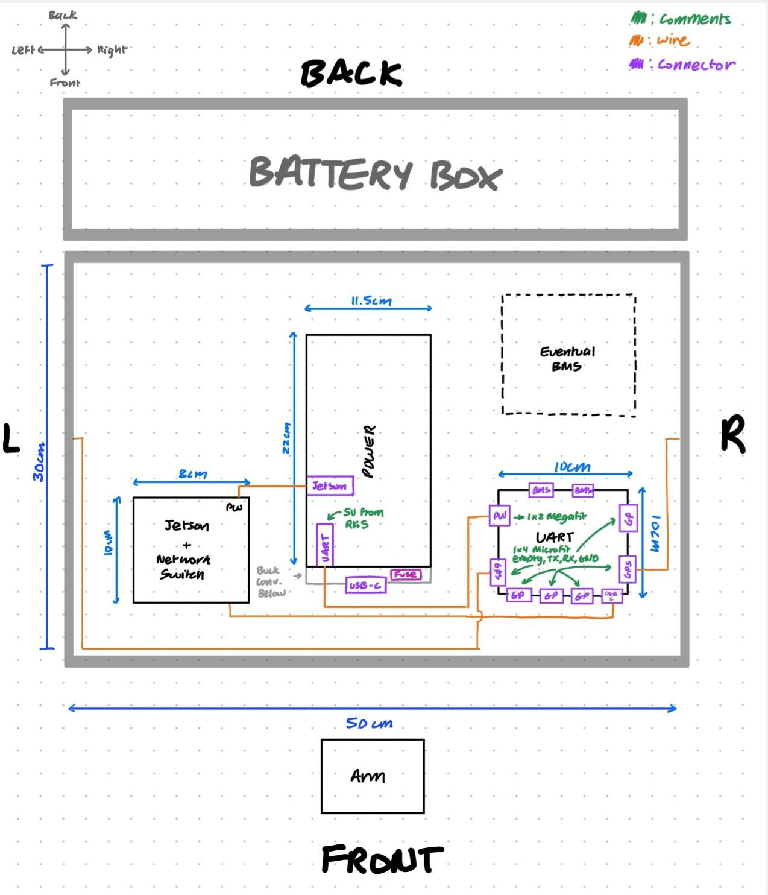
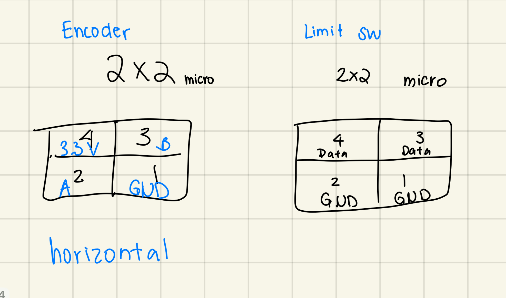
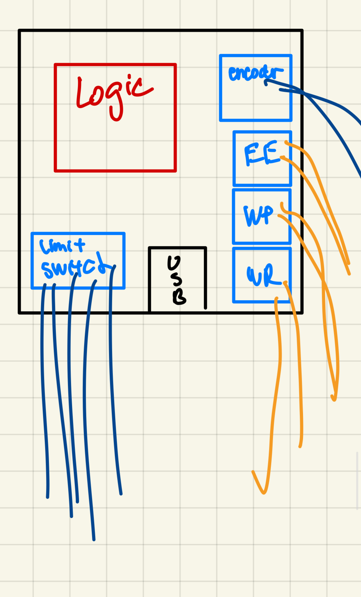
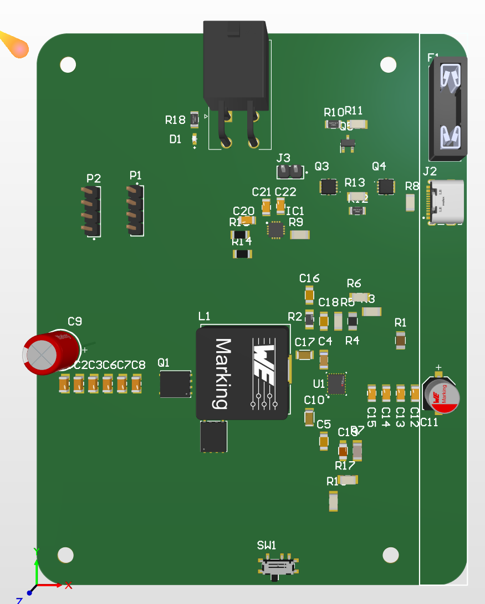
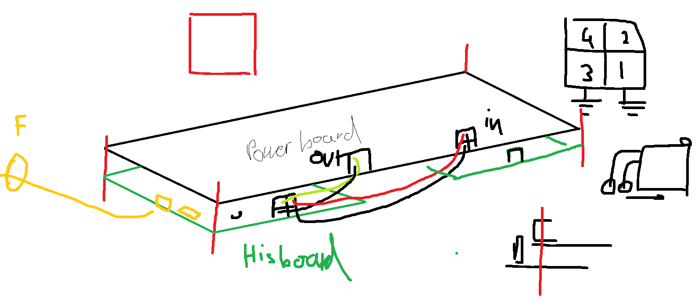
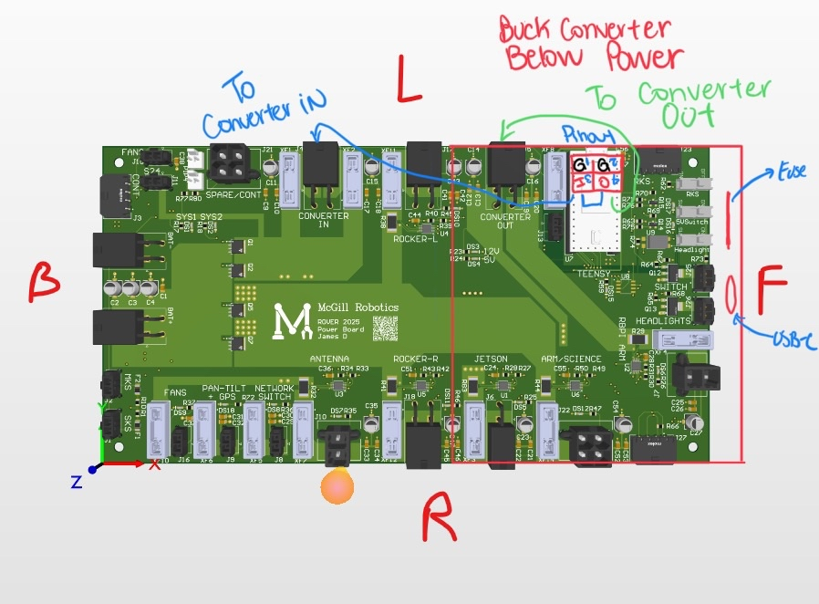

# **Boards**

**Harnessing Guide for**  
**Elec Boards Rover 2025-2026**

**Universally Useful Links:**

* [Power Board Altium](https://mcgill-university-15.365.altium.com/designs/3C032A56-D74A-47A4-B663-8960608BEE8D#design)  
* [Electrical Components Quick Sheet](https://docs.google.com/spreadsheets/d/1Oeg_WPtlBZXyiplVIpyahuClL3fWfGzlk_3tDz--Uok/edit?usp=sharing) 

# **UART**

UART Harnessing Specs Rover 2025-2026  
---

**Roles:**

* *Harnesser:* Sonia (Main),   
* *Board Designer(s):* Vincent, Dragos   
* *Other people related to board:* William (firmware person for UART)

**Key elements of the board to take into consideration (Serves as a “checklist” for harnesser):** 

* I/Os:  
  * Power/GND input coming from Powerboard (Megafit)  
  * 4 General Purpose (GP) UARTs  
  * 2 GPS UARTS  
  * 1 USB-C going to Jetson  
  * 2 connectors going to BMS \-\> Currently unsure of BMS model we’re going for

**Quick Links:** 

* [UART Board Altium](https://mcgill-university-15.365.altium.com/designs/BC690B36-C733-49DA-B95D-7A563ACA5837#design)  
* [Power Board Altium](https://mcgill-university-15.365.altium.com/designs/3C032A56-D74A-47A4-B663-8960608BEE8D#design)  
* [Electrical Components Quick Sheet](https://docs.google.com/spreadsheets/d/1Oeg_WPtlBZXyiplVIpyahuClL3fWfGzlk_3tDz--Uok/edit?usp=sharing) 

**General Location of the board:** Inside of the electrical box

| Drawings | Description |
| ----- | ----- |
|  | **Board characteristics (Updated 2025/11/03):**  *Board Dimensions*: 100mmx100mm 2-layer PCB unless too difficult (Please let leads know if 2-layer too difficult)  **Types of connectors & Pin Order:** This [1x2 Vertical Microfit connector](https://docs.google.com/spreadsheets/d/1Oeg_WPtlBZXyiplVIpyahuClL3fWfGzlk_3tDz--Uok/edit?gid=1565166601#gid=1565166601&range=C23) for receiving 5V and GRD from Powerboard in following order: 1 GND 2 PW (5V) This [1x4 Vertical Microfit connector](https://docs.google.com/spreadsheets/d/1Oeg_WPtlBZXyiplVIpyahuClL3fWfGzlk_3tDz--Uok/edit?gid=1565166601#gid=1565166601&range=C27) for GPS UARTs & General Purpose UARTs in following order: 1 GND 2 TX 3 RX 4 Empty No particular restriction on specified model for USB (but to check in [Unstandardized components](https://docs.google.com/spreadsheets/d/1Oeg_WPtlBZXyiplVIpyahuClL3fWfGzlk_3tDz--Uok/edit?usp=sharing) and use one that’s already there if possible) **Uncertainties/Cannot confirm for the moment:** Type of connector for the BMS **Mounting holes:** Mounting holes size constraint: 3.5mm diameter (Should be able to fit a M3 screw with a bit of wiggle room) No particular constraints on where the mounting holes should be on the board. Just make sure there are at least 4 in each corner ish. Refer to mounting holes on the power board PCB if needed. **Other:** No strict constraints on distances between the connectors on each edge. Just make sure that the connectors are the same edge and order as in the drawing.  |

# **Arm**

ARM Harnessing Specs Rover 2025-2026  
---

**Roles:**

* *Harnesser:* Julie (Main), Sonia (Secondary)  
* *Board Designer(s):* Iris Zheng, Vincent, Josh  
* *Other people related to board:* Mech

**Key elements of the board to take into consideration (Serves as a “checklist” for harnesser):** 

* I/Os:  
  * Power/GND input coming from Powerboard (Megafit)  
  * 3 Quadrature encoder inputs/hall encoder hybrid  
  * 6 limit switch inputs  
  * USB Comms Option  
  * CAN Comms Option  
* Size  
  * Same as previous boards

**Quick Links:** 

* [ARM Rover Board 2025 2026](https://mcgill-university-15.365.altium.com/designs/D2E0DDCA-9737-42E0-95A4-32BE01A9BFA4)  
* [Rover Arm Board by Vincent](https://mcgill-university-15.365.altium.com/designs/8B8E22D6-9440-4987-81F0-CFD59ED1B16E)   
* [Electrical Quick Sheet](https://docs.google.com/spreadsheets/d/1Oeg_WPtlBZXyiplVIpyahuClL3fWfGzlk_3tDz--Uok/edit?usp=sharing)   
* [Requirements Documentation](https://docs.google.com/document/d/1goZ4ggCJiNFlxfUGNua2IZMduxiczWzUszTArkUisHo/edit?usp=sharing)

**General Location of the board:** On the ARM

**Comments**

| Drawings | Description |
| ----- | ----- |
|  | **Board characteristics (Updated 2025/11/03):**  *Board Dimensions*: 100mmx50mm (or 100mmx70mm if needed. Just an estimate. Go as small as possible.) 2-layer PCB (4 layers if too difficult, but please notify the leads) Single-sided PCB **Mounting holes:** Mounting holes size constraint: 3.5mm diameter (Should be able to fit a M3 screw with a bit of wiggle room) No particular constraints on where the mounting holes should be on the board. Just make sure there are at least 4 in each corner ish. Refer to mounting holes on the power board PCB if needed. **Other:** No strict constraints on distances between the connectors on each edge. Just make sure that the connectors are the same edge and order as in the drawing.  |

# **Arm Modifications Request**

~~PRE-EMPTIVE UN~~**CONFIRMED** CHANGES

PWR connectors

* Change the connector models from a 1x2 Microfit ([768250002](https://www.molex.com/en-us/products/part-detail/768250002)) to a 2x2 Megafit right-angle ([768250004](https://www.molex.com/en-us/products/part-detail/0768250004))  
* Have the following pinouts:  
  1- GND   
  2- GND  
  3- 24V  
  4- 24V  
* Explanation and reason:   
- Generally speaking, we would like to standardize the connectors such that microfit connectors are used for data and megafit connectors are used for power. Initially, we wanted to implement that for the connectors on your board too, because the old arm power box panel board had a microfit connector going into your board. Since we have a new sponsor that seems to be willing to provide new boards for free, we decided to redesign the arm power box panel (that’s the board I’m currently working on).  
- New pinouts To match the pinouts on my board, so that making the wires for this connector is a bit more intuitive :o)

**For the change above, please let me know as soon as possible if you have enough space on your board to use a megafit instead of a microfit. Otherwise, try to go for a 2x2 microfit instead of a 1x2 microfit.**

~~Encoder connectors~~

* ~~Change the connector model from 2x2 microfit right-angle ([430450400](https://www.molex.com/en-us/products/part-detail/430450400)) to 2x3 microfit right-angle ([430450600](https://www.molex.com/en-us/products/part-detail/430450600))~~  
* ~~Have the following pinouts~~  
  ~~1- Encoder GND~~  
  ~~2- 5V~~  
  ~~3- Encoder A~~  
  ~~4- Nothing~~  
  ~~5- Encoder B~~  
  ~~6- Encoder X~~  
* ~~Essentially, we are adding a 5th pin for the Encoder X signal~~   
* ~~Explanation: James told me to have have a Encoder X data line on my board, so I assume that yours may need one too :o)~~

**All in red to ignore lol, you have the correct connectors. That said, if possible, please make sure your pinouts match the following:**  
**1- GND**  
**2- Encoder A**  
**3- Encoder B**  
**4- 5V**

Note:   
If any of these pinouts are very inconvenient for you, routing-wise, lmk and I will adjust on my side accordingly. The main goal of these modifications is simply to match your power and encoder connectors to my power and encoder connector.

Thank you and good luck\!

# **Pantilt**

PanTilt Harnessing Specs Rover 2025-2026  
---

**Roles:**

* *Harnesser:* Julie & Sonia  
* *Board Designer(s):* Yoon, Revan  
* *Other people related to board:* N/A

**Key elements of the board to take into consideration (Serves as a “checklist” for harnesser):** 

* I/Os:  
  * PW/GND  
  * 2 outputs to servos: Data, PW, GND

**Quick Links:** 

* [ARM Rover Board 2025 2026](https://mcgill-university-15.365.altium.com/designs/D2E0DDCA-9737-42E0-95A4-32BE01A9BFA4)  
* [Rover Arm Board by Vincent](https://mcgill-university-15.365.altium.com/designs/8B8E22D6-9440-4987-81F0-CFD59ED1B16E)   
* [Electrical Quick Sheet](https://docs.google.com/spreadsheets/d/1Oeg_WPtlBZXyiplVIpyahuClL3fWfGzlk_3tDz--Uok/edit?usp=sharing)   
* [Requirements Documentation](https://docs.google.com/document/d/1goZ4ggCJiNFlxfUGNua2IZMduxiczWzUszTArkUisHo/edit?usp=sharing)

**General Location of the board:** On the ARM

**Other Comments**

| Drawings | Description |
| ----- | ----- |
|  | **Board characteristics (Updated 2025/11/03):**  *Board Dimensions*: 25mmx30mm (Just an estimate. Go as small as possible.) 2-layer PCB  **Types of connectors & Pin Order:** This [2x2 Horizontal Microfit connector](https://docs.google.com/spreadsheets/d/1Oeg_WPtlBZXyiplVIpyahuClL3fWfGzlk_3tDz--Uok/edit?gid=1565166601#gid=1565166601&range=C29) towards servos 1 GND 2 Empty 3 5V source 4 Data For Power connector on the bottom, [1x2 Horizontal Microfit connector](https://docs.google.com/spreadsheets/d/1Oeg_WPtlBZXyiplVIpyahuClL3fWfGzlk_3tDz--Uok/edit?gid=1565166601#gid=1565166601&range=C20)  2 5V source 1 GND **Mounting holes:** Mounting holes size constraint: 3.5mm diameter (Should be able to fit a M3 screw with a bit of wiggle room) No particular constraints on where the mounting holes should be on the board. Just make sure there are at least 4 in each corner ish. Refer to mounting holes on the power board PCB if needed. **Other:** No strict constraints on distances between the connectors on each edge. Just make sure that the connectors are the same edge and order as in the drawing.  |

# **Buck Converter**

Buck Converter Harnessing Specs Rover 2025-2026  
---

**Roles:**

* *Harnesser:* Julie (Main), Sonia (Secondary :P)  
* *Board Designer(s):* Tony  
* *Other people related to board:* William HB (no relation whatsoever)

**Key elements of the board to take into consideration (Serves as a “checklist” for harnesser):** 

* I/Os:  
  * 24V coming in from the power board  
  * 5V coming out of the buck  
  * USB C port for 5V output  
* Size  
  * 9cm width x 11.5cm height x 3 cm (generous) stature

**Quick Links:** 

* [My Documentation](https://docs.google.com/document/d/1hZT8BZTpOYZFSzIXpd8zQ_i7fu6dgxxhWiN2f22BmhI/edit?usp=sharing)  
* 

**General Location of the board:** Under the power board

**Comments**  

| Drawings | Description |
| :---: | ----- |
|  | **Board characteristics (Updated 2025/11/03):**  *Board Dimensions*: 2 **Dimensions of board: Types of connectors & Pin Order:** **Uncertainties/Cannot confirm for the moment:**  **Mounting holes:**  **Other:**  |

# **Cleaner Documents**

