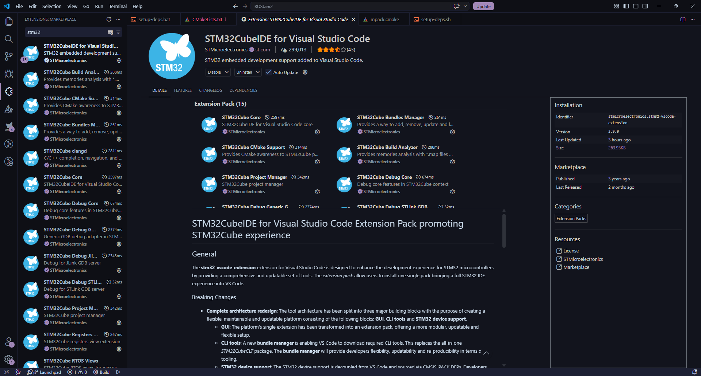
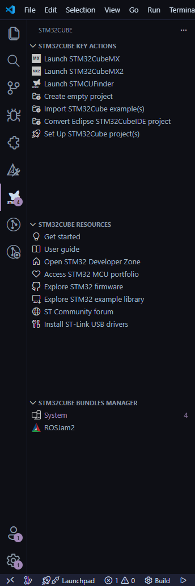
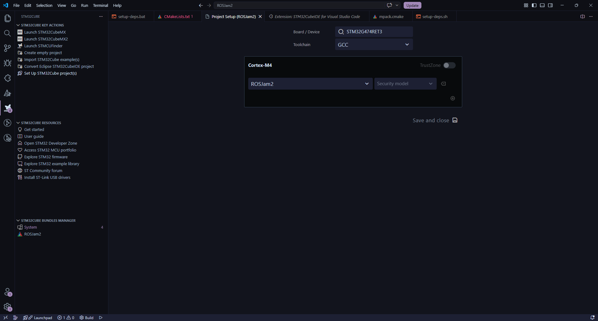
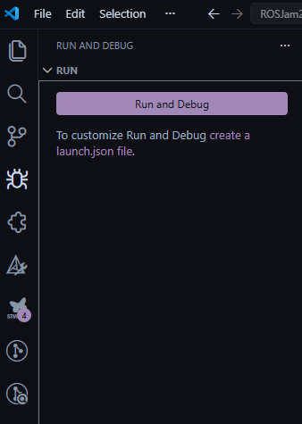
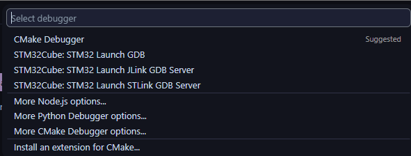

**Instructions to get an existing STM32 cmake project to work in VSCode**

1. Install the STM32 vscode extension pack. This will download all the extensions needed to start working with STM32 in VSCode.

[https://marketplace.visualstudio.com/items?itemName=stmicroelectronics.stm32-vscode-extension](https://marketplace.visualstudio.com/items?itemName=stmicroelectronics.stm32-vscode-extension)   

2. Open the Stm32Cube panel in the sidebar and find Set Up STM32Cube projects  
     
3. Wait for this screen to show up and put in the STM32 MCU you are using in the device field. Press save and close  
     
4. Wait for the CubeIDE extension to download packages and configure CMake. Sometimes you may have to close VSCode after downloading packages before it is able to run the CMake configuration.  
5. Make sure your *CMakeLists.txt* is well configured and has all the files needed otherwise your project might fail configuration or it might not compile.  
6. In the bottom bar, you can press *Build* to compile the code. You should see whether it succeeded or failed in the output panel.  
     
7. To run the code, go to the *run and debug* panel in the sidebar. Press run and debug to start running.  
     
8. In the debugger choice, choose STM32 Launch STLink GDB server. VSCode should then compile your code and start trying to run it.  
     
9. If you just need to flash you can set the code to continue in the debugger and press the stop button to detach. The code will keep running even if the debugger is no longer running.  
   

