# Introduction

# Buck Converter Version 2 (WORKS)

Womp womp. 

# Ref. Pictures

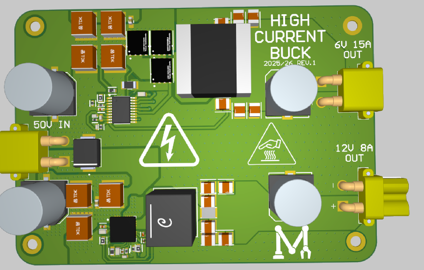

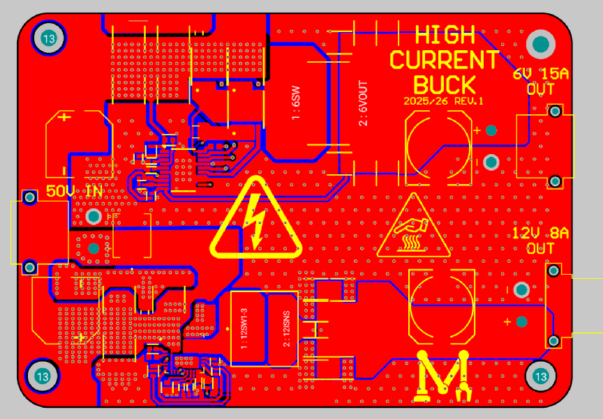

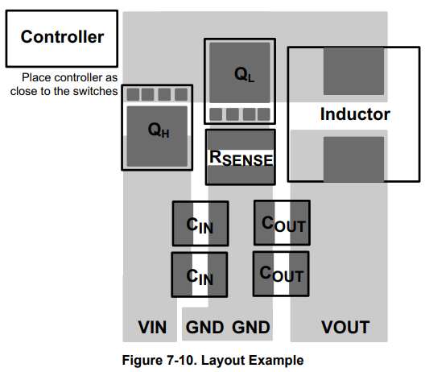

# BOM V2

# **Bill of Materials**

In WEBENCH we trust.

Green means multiple things:

1) Digikey has it  
2) Price is correct and in CAD  
3) If a part is unavailable, the OG recommended part details are marked in yellow. I am keeping it like this so that I can prove to Ambroise that I did not downgrade any parts originally from WEBENCH’s BOM.

| Part / Designator | Manufacturer | Part Number | Quantity | Price (each) ($CAD) | Description |
| :---- | :---- | :---- | :---- | :---- | :---- |
| U1 / IC1 (none left) | Texas=======’\] | LM5116MH/NOPB | 1 | 10.36 |   |
| L1 / L1 | Coilcraft Vishay Dale | XAL6030-182MEB IHLP4040DZER1R8M11 | 1 | 1.11 | L: 1.8 µH  DCR: 9.6 mΩ  IDC: 14 A  L: 1.8 µH  DCR: 5.0 mΩ  IDC: 17 A  |
| Cout / C2 C3 C4 | MuRata | GRM32ER61C476KE15L GRM32EC81C476KE15L | 3 | 0.48 | Cap: 47 µF VDC: 16 V Package: 1210 Cap: 47 µF VDC: 16 V Package: 1210     |
| D1 / D1 | Nexperia | BAS516 115 BAS16 235 | 1 | 0.10 | VRRM: 100 V  Io: 250 mA VRRM: 100 V  Io: 215 mA  (best they had) |
| M1 / Q1 (none left) | Texas Instruments | CSD17307Q5A | 1 | 1.86 | VdsMax: 30 V  IdsMax: 73 Amps   |
| Rsense / R5 | Susumu Co Ltd | PRL1632-R006-F-T1 | 1 | 1.23 | Resistance: 6 mΩ  Tolerance: 1.0%  Power: 1 W   |
| M2 / Q2 (none left) | Texas Instruments | CSD17577Q5A | 1 | 1.82 | VdsMax: 30 V  IdsMax: 60 Amps   |
| Cin / C10 | TDK | CGA5L3X7R1V225K160AB | 1 | 0.50 | Cap: 2.2 µF  Total Derated Cap: 1.3 µF  VDC: 35 V  ESR: 3.73 mΩ  Package: 1206   |
| Css / C7 | TDK | CGA4J2C0G1H333J125AA | 1 | 0.48 | Cap: 33 nF  Total Derated Cap: 33 nF  VDC: 50 V  ESR: 0 Ω  Package: 0805   |
| Rfbb / R7 | Yageo | RT0805BRD0710K4L | 1 | 0.25 | Resistance: 10.4 kΩ  Tolerance: 0.1%  Power: 125 mW   |
| Cvcc / C6 | TDK | C1005X5R1E105K050BC | 1 | 0.15 | Cap: 1 µF  Total Derated Cap: 1 µF  VDC: 25 V  ESR: 11.4 mΩ  Package: 0402   |
| Ccomp / C9 | Taiyo Yuden | UMK105CG181JV-F | 1 | 0.15 | Cap: 180 pF  Total Derated Cap: 180 pF  VDC: 50 V  ESR: 0 Ω  Package: 0402   |
| Ruv2 / R2 | Vishay-Dale | CRCW080526K1FKEA | 1 | 0.16 | Resistance: 26.1 kΩ  Tolerance: 1.0%  Power: 125 mW   |
| Rcomp / R6 | Vishay-Dale | CRCW0402100KFKED | 1 | 0.16 | Resistance: 100 kΩ  Tolerance: 1.0%  Power: 63 mW   |
| Cramp / C5 | Taiyo Yuden | UMK105CG151JV-F | 1 | 0.15 | Cap: 150 pF  Total Derated Cap: 150 pF  VDC: 50 V  ESR: 0 Ω  Package: 0402   |
| Ccomp2 / C8 | MuRata | GRM1555C1E5R1CA01D | 1 | 0.15 | Cap: 5.1 pF  Total Derated Cap: 5.1 pF  VDC: 25 V  ESR: 1 mΩ  Package: 0402   |
| Ruv1 / R1 | Panasonic | ERJ-6ENF2321V | 1 | 0.17 | Resistance: 2.32 kΩ  Tolerance: 1.0%  Power: 125 mW   |
| Renable / R4 | Vishay-Dale | CRCW04021M00FKED | 1 | 0.16 | Resistance: 1 MΩ  Tolerance: 1.0%  Power: 63 mW   |
| Rt / R3 | Vishay-Dale | CRCW04025K23FKED | 1 | 0.16 | Resistance: 5.23 kΩ  Tolerance: 1.0%  Power: 63 mW   |
| Rfbt / R8 | Panasonic | ERJ-6ENF3242V | 1 | 0.17 | Resistance: 32.4 kΩ  Tolerance: 1.0%  Power: 125 mW   |
| Cinx / C11 | Kemet | C0805C104M5RACTU | 1 | 0.15 | Cap: 100 nF  Total Derated Cap: 100 nF  VDC: 50 V  ESR: 35.47 mΩ  Package: 0805   |
| Cboot / C1 | AVX | 08053C104KAT2A | 1 | 0.12 | Cap: 100 nF  Total Derated Cap: 100 nF  VDC: 25 V  ESR: 280 mΩ  Package: 0805   |
| Molex and other connection/LED stuff below |  |  |  |  |  |
|  | Molex | 0768250004 | 1 | 3.34 | The typical four-pin big boy. |
|  | Molex | 0768290002 | 1 | 1.47 | Vertical 5V output |
| 1 | Keystone Electronics | 3557-2 | 1 | 1.66 | Normal fuse holder |
| 1 | Stackpole Electronics | RMCF2010ZT0R00 | 1 | 0.20 | Jumper for 5V vertical output |
| 0 | Inolux | IN-S85AT5UW | 1 | 0.34 | White LED |
| 1 | Vishay Dale | CRCW08051K00FKEA | 1 | 0.16 | LED resistor |
|  |  |  |  |  |  |

# BOM Checklist vers

# **Bill of Materials**

In WEBENCH we trust.

Green means multiple things:

4) Digikey has it  
5) Price is correct and in CAD  
6) If a part is unavailable, the OG recommended part details are marked in yellow. I am keeping it like this so that I can prove to Ambroise that I did not downgrade any parts originally from WEBENCH’s BOM.

| Part / Designator | Manufacturer | Part Number | Quantity | Price (each) ($CAD) | Description |
| :---- | :---- | :---- | :---- | :---- | :---- |
| U1 / IC1 (none left) | Texas=======’\] | LM5116MH/NOPB | 1 | 10.36 |   |
| L1 / L1 | Coilcraft Vishay Dale | XAL6030-182MEB IHLP4040DZER1R8M11 | 1 | 1.11 | L: 1.8 µH  DCR: 9.6 mΩ  IDC: 14 A  L: 1.8 µH  DCR: 5.0 mΩ  IDC: 17 A  |
| Cout / C2 C3 C4 | MuRata | GRM32ER61C476KE15L GRM32EC81C476KE15L | 3 | 0.48 | Cap: 47 µF VDC: 16 V Package: 1210 Cap: 47 µF VDC: 16 V Package: 1210     |
| D1 / D1 | Nexperia | BAS516 115 BAS16 235 | 1 | 0.10 | VRRM: 100 V  Io: 250 mA VRRM: 100 V  Io: 215 mA  (best they had) |
| M1 / Q1  | Texas Instruments | CSD17307Q5A | 1 | 1.86 | VdsMax: 30 V  IdsMax: 73 Amps   |
| Rsense / R5 | Susumu Co Ltd | PRL1632-R006-F-T1 | 1 | 1.23 | Resistance: 6 mΩ  Tolerance: 1.0%  Power: 1 W   |
| M2 / Q2 (none left) | Texas Instruments | CSD17577Q5A | 1 | 1.82 | VdsMax: 30 V  IdsMax: 60 Amps   |
| Cin / C10 | TDK | CGA5L3X7R1V225K160AB | 1 | 0.50 | Cap: 2.2 µF  Total Derated Cap: 1.3 µF  VDC: 35 V  ESR: 3.73 mΩ  Package: 1206   |
| Css / C7                                  | TDK | CGA4J2C0G1H333J125AA | 1 | 0.48 | Cap: 33 nF  Total Derated Cap: 33 nF  VDC: 50 V  ESR: 0 Ω  Package: 0805   |
| Rfbb / R7 | Yageo | RT0805BRD0710K4L | 1 | 0.25 | Resistance: 10.4 kΩ  Tolerance: 0.1%  Power: 125 mW   |
| Cvcc / C6 | TDK | C1005X5R1E105K050BC | 1 | 0.15 | Cap: 1 µF  Total Derated Cap: 1 µF  VDC: 25 V  ESR: 11.4 mΩ  Package: 0402   |
| Ccomp / C9 | Taiyo Yuden | UMK105CG181JV-F | 1 | 0.15 | Cap: 180 pF  Total Derated Cap: 180 pF  VDC: 50 V  ESR: 0 Ω  Package: 0402   |
| Ruv2 / R2 | Vishay-Dale | CRCW080526K1FKEA | 1 | 0.16 | Resistance: 26.1 kΩ  Tolerance: 1.0%  Power: 125 mW   |
| Rcomp / R6 | Vishay-Dale | CRCW0402100KFKED | 1 | 0.16 | Resistance: 100 kΩ  Tolerance: 1.0%  Power: 63 mW   |
| Cramp / C5 | Taiyo Yuden | UMK105CG151JV-F | 1 | 0.15 | Cap: 150 pF  Total Derated Cap: 150 pF  VDC: 50 V  ESR: 0 Ω  Package: 0402   |
| Ccomp2 / C8 | MuRata | GRM1555C1E5R1CA01D | 1 | 0.15 | Cap: 5.1 pF  Total Derated Cap: 5.1 pF  VDC: 25 V  ESR: 1 mΩ  Package: 0402   |
| Ruv1 / R1 | Panasonic | ERJ-6ENF2321V | 1 | 0.17 | Resistance: 2.32 kΩ  Tolerance: 1.0%  Power: 125 mW   |
| Renable / R4 | Vishay-Dale | CRCW04021M00FKED | 1 | 0.16 | Resistance: 1 MΩ  Tolerance: 1.0%  Power: 63 mW   |
| Rt / R3 | Vishay-Dale | CRCW04025K23FKED | 1 | 0.16 | Resistance: 5.23 kΩ  Tolerance: 1.0%  Power: 63 mW   |
| Rfbt / R8 | Panasonic | ERJ-6ENF3242V | 1 | 0.17 | Resistance: 32.4 kΩ  Tolerance: 1.0%  Power: 125 mW   |
| Cinx / C11 | Kemet | C0805C104M5RACTU | 1 | 0.15 | Cap: 100 nF  Total Derated Cap: 100 nF  VDC: 50 V  ESR: 35.47 mΩ  Package: 0805   |
| Cboot / C1 | AVX | 08053C104KAT2A | 1 | 0.12 | Cap: 100 nF  Total Derated Cap: 100 nF  VDC: 25 V  ESR: 280 mΩ  Package: 0805   |
| Molex and other connection/LED stuff below bn nnnnnnnnnnnnnnnnnnnnnnnnnnnnnnnnnnnnnnnnnnnnnnnnnnnnnnnnnnnnnnnnnnnnnnnnnnnnnn |  |  |  |  |  |
|  | Molex | 0768250004 | 1 | 3.34 | The typical four-pin big boy. |
|  | Molex | 0768290002 | 1 | 1.47 | Vertical 5V output |
| 1 | Keystone Electronics | 3557-2 | 1 | 1.66 | Normal fuse holder |
| 1 | Stackpole Electronics | RMCF2010ZT0R00 | 1 | 0.20 | Jumper for 5V vertical output |
| 0 | Inolux | IN-S85AT5UW | 1 | 0.34 | White LED |
| 1 | Vishay Dale | CRCW08051K00FKEA | 1 | 0.16 | LED resistor |
|  |  |  |  |  |  |

# Stats

# Parameters

| Stat | Value |
| :---- | :---- |
| Efficiency | 94.2% |
| Soft Start Time | 3ms |
| Switching Frequency | 517kHz |
| Output Voltage | 5V |
| Max Current | 10A |
| Minimum Vin | 18.5V |
| Maximum Vin | 24V (100V max) |
|  |  |
|  |  |

Testing Experience:

This converter was tested at 5A with no droop, i.e. only 17mV below 5V which it had at 0A anyways. This gives confidence in the amount of power that it can put out.

# Knowledge

# Knowledge, old and new

Switching Diode: A diode that can toggle very very fast. Low junction capacitance. 

Refresher on MOSFET Symbols: See below photo

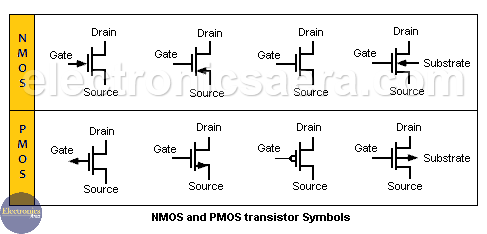

Refresher on voltage follower (easy for dum dum brain cause can’t visualize): See photo  
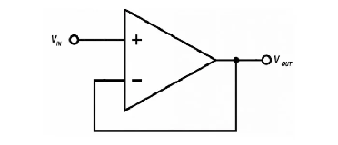

# IC Deets

# IC Deets

*“To understand your enemy, one must first understand what function each pin of their IC has”* 

\-Sun Tzu

| Pin Name | Function |
| :---- | :---- |
| AGND | Analog Ground. Supposed to be connected to PGND through the exposed pad of the IC. |
| COMP | Error output. Connected to FB through cap/resistor network. |
| CS | Current Sense Input \+ |
| CSG | Current Sense Input \- |
| DEMB | Monitoring pin for one of the MOSFETs to emulate a diode (weird magic). |
| EN | Must be pulled above 3.3V for normal operation. |
| FB | Feedback signal, connected to the inverting input of the op-amp whose output is COMP. |
| HB | Bootstraps the high-side MOSFET through a conveniently placed diode. Put these components as close to the controller as possible. |
| HO | High-side gate drive. |
| LO | Low-side gate drive. |
| PGND | Power ground. |
| RAMP | Ramp control signal. Bro I looked in the datasheet and they are doing CRAZY stuff with this pin. It’s basically to provide the PWM controller inside with a replica of the inductor current signal, generated by this pin (without the messy parts of the OG signal). |
| RT/SYNC | Frequency setting. |
| SS | Soft-start time constant setter (boring). |
| SW | Switching node. |
| VIN | Input voltage. |
| UVLO | Undervoltage condition setter.  |
| VCC | Internal supply, must be decoupled with a capacitor. |
| VCCX | Optional external VCC supply. |
| EP | Exposed pad. |

Ok this looks pretty chill.

# WEBENCH Link

WeBench Link 24V → 5V:  
[https://webench.ti.com/appinfo/webench/scripts/SDP.cgi?ID=57C1EA4563157568](https://webench.ti.com/appinfo/webench/scripts/SDP.cgi?ID=57C1EA4563157568) 

WeBench Link 24V → 12V: [https://webench.ti.com/appinfo/webench/scripts/SDP.cgi?ID=AF145DC90CB60D1A](https://webench.ti.com/appinfo/webench/scripts/SDP.cgi?ID=AF145DC90CB60D1A) 

# \[OLD\] Revision Info

# Jan 11

| Change | Before | After |
| :---- | :---- | :---- |
| Kelvin sense traces need to be routed differentially | 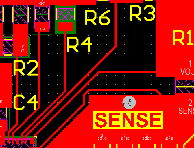 |  |
| It makes sense to put spokes on all relevant sides of the inductor pads | 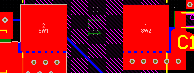 | 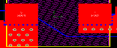 |
| Reduction of hole density on thermal vias needed for cost/complexity reasons \+ L \+ ratio | 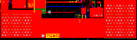 | 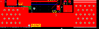 |
| No via stitching needed WHATSOEVER on the AGND pin of the switch lmao | 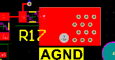 |  |
| Inner layers should be 1oz copper and not 2oz | 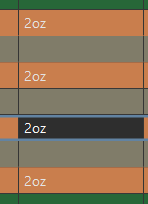 | 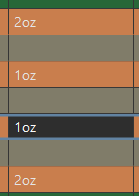 |
| “5V” label on output should be left blank, to be filled in with sharpie |  |  |
| J1 silkscreen bad (ofc it’s a nothingburger thing to fix, just putting cause u mentioned it) |  |  |
| The thermal vias on the USB IC are in fact not necessary because the chip sees no big currents. | 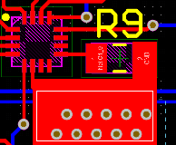 | 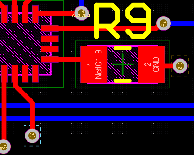 |
| Vertical long rectangle trace could be thicker (The new width is 4mm, altium says that is good for 14A so we’re big chillin) | 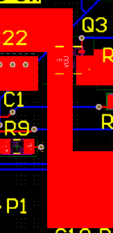 | 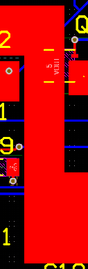  |
| The board should have an outline where no copper is allowed in order to prevent delamination \+ hella aura |   |  |
| QR Code Addition | (nothing) |  |

# Jan 12

  
(more stuff to change)

| Change | Before | After |
| :---- | :---- | :---- |
| Net Ties: Making distinct AGND/PGND/RGND/BGND nets to properly separate the grounds. RGND is digital ground AGND is analog ground PGND is power ground | The below boxes denote the multiple changes that I did | / |
| ^ (Molex) | 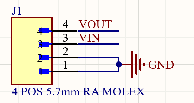 | 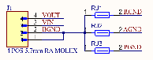 |
| ^ (Renaming) | 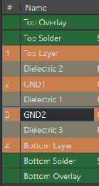 | 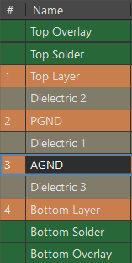 |
| ^ (Buck IC) | 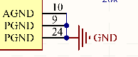 | 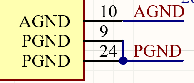 |
| ^ (Flashing headers) | 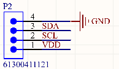 | 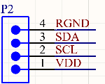 |
| ^ (USB PD IC) | 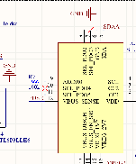 | 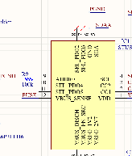 |
| ^ (USB C port) | 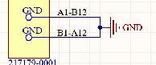 | 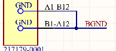 |
| ^ (Input caps) | 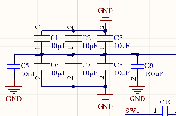 | 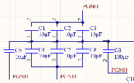 |
| ^ (VCC cap) | 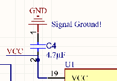 | 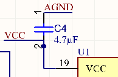 |
| ^ (Config pins) | 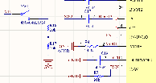 | 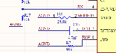 |
| ^ (Output caps and mosfet) | **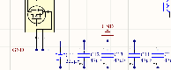** | 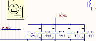 |
| ^ (COMP network) | 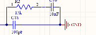 | 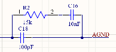 |
| ^ (Discharge circuit) | 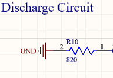 | 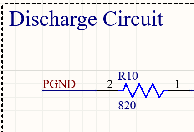 |

# \[OLD\] USB PD Info

# USB BOM

This tab contains the components previously intended for the PD section of the board.

| Part | Ref. \# | Model \# | Price | Notes | Qty. |
| :---: | :---: | :---: | :---: | :---: | :---: |
| 100k Resistor | 18 | RG3216P-1003-B-T1 [Link](https://www.digikey.ca/en/products/detail/susumu/RG3216P-1003-B-T1/1272606) | $0.23 | / | 1 |
| USB C Receptacle port | 17 | 2171790001 [Link](https://www.digikey.ca/en/products/detail/molex/2171790001/13913749) | $0.83 | / | 1 |
| USB Controller chip | 18 | STUSB4710AQ1TR [Link](https://www.digikey.ca/en/products/detail/stmicroelectronics/STUSB4710AQ1TR/9997356) [Footprint Source](https://www.mouser.ca/ProductDetail/STMicroelectronics/STUSB4710AQ1TR?qs=5aG0NVq1C4yCe%252Bv%252Bl%252BvPOA%3D%3D&srsltid=AfmBOoq3Zysgaa_LbcPQ5_7WKeN3QpxtY2HgkKtkjix5Z3jW91FM2ZbL) | $2.11 | / | 1 |
| P-Channel MOSFETs | 18 | STL6P3LLH6 [Link](https://www.digikey.ca/en/products/detail/stmicroelectronics/STL6P3LLH6/5170838) | $1.54 | / | 2 |
| 1uF Ceramic Capacitor | 18 | CL31B105KBHNNNE [Link](https://www.digikey.ca/en/products/detail/samsung-electro-mechanics/CL31B105KBHNNNE/3886726) | $0.13 | Decoupling caps. | 3 |
| Discharge MOSFET | 18 | STR2P3LLH6 [Link](https://www.digikey.ca/en/products/detail/stmicroelectronics/STR2P3LLH6/5244876) | $0.56 | / | 1 |
| 10 kOhm Resistors | 18 | RC1206FR-0710KL [Link](https://www.digikey.ca/en/products/detail/yageo/RC1206FR-0710KL/728483) | $0.10 | Datasheet-specified. | 2 |
| 2.2 kOhm Resistor | 18 | CRGCQ1206F2K2 [Link](https://www.digikey.ca/en/products/detail/te-connectivity-passive-product/CRGCQ1206F2K2/8576416) | $0.10 | Datasheet-specified. | 1 |
| 800 Ohm Resistor | 18 | CRGCQ1206F820R [Link](https://www.digikey.ca/en/products/detail/te-connectivity-passive-product/CRGCQ1206F820R/8576411) | $0.10 | Datasheet-specified. | 1 |
| 100 Ohm Resistor | 18 | TNPW1206100RBEEA [Link](https://www.digikey.ca/en/products/detail/vishay-dale/TNPW1206100RBEEA/1607739?s=N4IgTCBcDaICoDkAKB1AjGADANjZzASgEICiJAgiALoC%2BQA) | $0.41 | Termination of USB 2.0 data line. | 1 |
| 4.7 kOhm Resistors | 18 | RC1206FR-074K7L [Link](https://www.digikey.ca/en/products/detail/yageo/RC1206FR-074K7L/728887) | $0.10 | Pullup Resistors for SCL and SDA. | 2 |
| 4 Pin Male 2.54mm Headers, Vertical | 18 | 61300411121 [Link](https://www.digikey.ca/en/products/detail/jst-sales-america-inc/S4B-XH-A-1/9961923) | $0.17 | For a togglable connection between SDA/SCL and their pullups. | 2 |
| 2-Pin Jumpers | 18 | QPC02SXGN-RC [Link](https://www.digikey.ca/en/products/detail/sullins-connector-solutions/QPC02SXGN-RC/2618262) | $0.10 | / | 2 |
| 2 Pin Male 2.54mm Headers, Vertical | 20 | M20-9990246 [Link](https://www.digikey.ca/en/products/detail/harwin-inc/M20-9990246/3728226) | $0.10 | / | 1 |

# 17 \- USB C Port

### 17 \- USB C Connector

The device needs to output 5 volts via a USB C port. 

# 18 \- PD Details

# 18 \- USB Controller Details

## I want a quick solution to negotiate 5V power over USB C.

To do this, I am working with the STUSB4710AQ1TR. It is a standalone controller (no MCU needed). Below is a typical application of the chip in a buck converter:

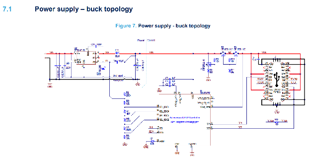

### Connections

I need four header pins for VDD/SDA/SCL/GND (flashing). I put the associated part in the list.

Next, I can connect VDD to VBUS because it can take 4.1V-22V of input power, meaning 5.1 is fine.

Everything else is more or less copied from the above schematic.

### The VBUS MOSFETs

There are two MOSFETs at the top separating VOUT and VBUS. I was questioning why there were two and not one. This is called a back-to-back configuration, and makes sure that upon powering the circuit off, no reverse current will flow. I am choosing the ones they use in the datasheet. They are guaranteed to work at 5A (6A rated) and have decent efficiency. We’ll see 0.75W of power drain each at max capacity.

One additional MOSFET (different model, similar specs) is placed in the VBUS\_DISCH node as visible below. Its role is to get rid of excess power when one disconnects the usb cable. I am replicating this too, as well as the corresponding resistor values.  
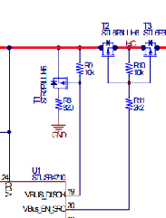

### Signal Resistors

There are numerous signal resistors to the left of the IC.

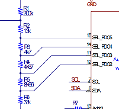

Allegedly, they are there to configure multiple output voltages:  
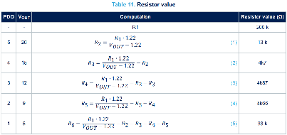

This is actually unimportant for our use case. By default, PDO 1 is selected. I am leaving the other selection pins floating. See the next table below:  
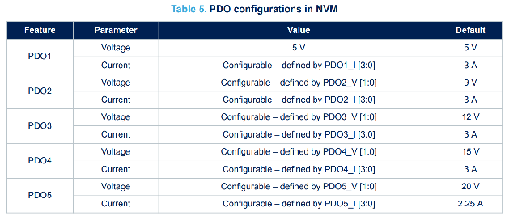

As is visible, I only ever need to use PD1, and program PDO1\_I \[3:0\] such that it allows 5A of current. Speaking of which:  
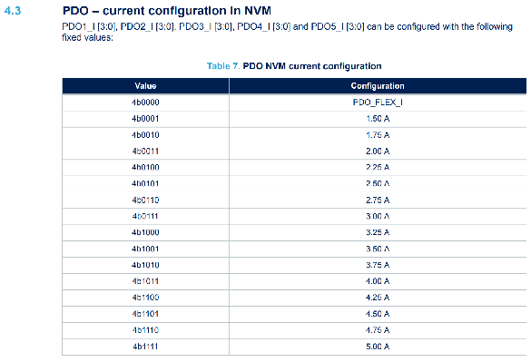

So, I just have to send 4b1111 to PDO1\_I and we’ll be well off. When testing, it’ll be worth trying the other values too, to see if it changes something (meaning that I designed it right).

Next, there is a group of capacitors at the top of the chip in the diagram:  
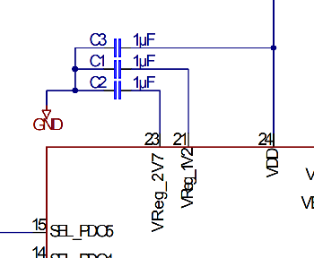

From the datasheet:

  
They’re part of the internal supply and need some decoupling capacitance. I will put three 1uF capacitors there as well.

### Small Points

* ADDR0 is pulled down to GND via a 100k resistor. The pin serves to determine the 0 bit of the device’s I2C address. The pin itself is only important if you have more than one of the ICs on the network.  
  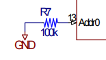  
* A6/B6/A7/B7 on the USB C connector itself should be tied together in pairs and connected with an 100 Ohm resistor. This is because it’s a differential signal. Now, are we actually going to be transmitting data? No. Is this useless? Probably. But the datasheet is doing it, so it definitely won’t hurt.

### How to flash the IC

Look at the tables below and focus on the conditions for Vscl and Vsda.

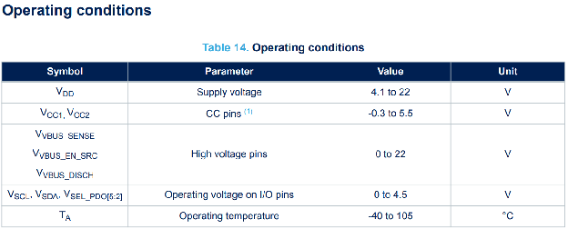

This pretty much means I should be using a VDD of 4V when flashing the chip. Additionally, I will add 4.7kOhm pullups to both SCL and SDA.

Lastly, I also separated the SCL/SDA pullups from the VDD node via jumpers on another set of header pins. The reason I did this was because the SDA and SCL pins can only handle up to 4.5V. The thing is, my VDD is going to be 5V under normal operation. 

The table below summarizes what I mean:

| Voltage on VDD | SDA/SCL \<-\> SDAA/SCLA Connections |
| :---- | :---- |
| 4.2V (flashing, rest of board is off) | Connected via jumper |
| 5V (normal operation) | Disconnected. Jumpers gone. |

# 20 \- VOUT/VDD

### 20 \- VOUT / VDD Separation

This is my reasoning for separating the VDD node from VOUT via jumpers:

1)  I need a voltage of 4-20V on VDD of the USB IC such that it turns on.

2) VDD should be connected to VOUT during normal operation, accomplishing (1).

3) During flashing, VDD will need to get 4V from an external source.

4) Due to (2) and (3), VOUT will have 4V applied to it as well. Now \- is that bad? Probably not. Nevertheless, I will add another pair of headers on that node to separate the buck VOUT from the IC’s VDD. They will be jumped during normal use.

# Old Schematic

# Old Layout

# \[OLD\] First Buck :(

# Title Page

# McGill Robotics 2025/2026

# 24V \- 5V Buck Converter

## Tony Ozerov

This board is a 24V to 5V buck converter meant to provide consistent power to sensitive consumers. We are developing it because in the past, our Raspberry Pi has been randomly shutting off during competition tasks, presumably because of a voltage sag on the 5V rail. When other devices turned on, the voltage transients were so big that the Pi was not getting enough power, shutting it down.

This design is robust, enabling a nominal 10A throughput with 90%+ efficiency. Parts were chosen to restrict voltage drops to 0.4V, within range of acceptable Raspberry Pi operation.

Additionally, the board was originally designed to also feature a USB PD 5V 5A output. Unfortunately, due to the sudden discontinuation of the selected PD chip, that functionality was removed and will be outsourced to a daughter board made by another member.

# BOM

# **Bill of Materials**

Each reference number corresponds to a section in the tab “Sizing Calculations”.

| Part | Ref. \# | Model \# | Price | Notes | Qty. |
| :---: | ----- | :---: | :---: | :---: | :---: |
| Synchronous buck converter | / | TPS552882RPMR [Link](https://www.ti.com/product/TPS552882/part-details/TPS552882RPMR) [Datasheet](https://www.ti.com/lit/ds/symlink/tps552882.pdf?ts=1760634955518&ref_url=https%253A%252F%252Fwww.ti.com%252Fproduct%252FTPS552882%252Fpart-details%252FTPS552882RPMR) | $7.44 | \-36V max input \-16A max output \-94% efficiency at 5A | 1 |
| 91k Resistor 1206 1/4W  \+- 1% | 1 | RC1206FR-0791KL [Link](https://www.digikey.ca/en/products/detail/yageo/RC1206FR-0791KL/729169) | $0.10 | / | 1 |
| 4.7nF Capacitor 1206 \+- 5% | 2 | C3216C0G2J472J085AA [Link](https://www.digikey.ca/en/products/detail/tdk-corporation/C3216C0G2J472J085AA/3951879) | $0.38 | / | 1 |
| 6.8uH Inductor 18.5A limit, 4.1mOhm  | 3  | 7443556680 [Link](https://www.digikey.ca/en/products/detail/w%C3%BCrth-elektronik/7443556680/2175590) | $5.70 | 20% tolerance is the best I could find. | 1 |
| 100uF Aluminum Electrolytic Capacitor | 5 | 860040674004 [Link](https://www.digikey.ca/en/products/detail/w%C3%BCrth-elektronik/860040674004/5727422) | $0.35 | Bulk Capacitance on VIN. | 1 |
| 10uF Ceramic Capacitor  | 4 | CL31B106KBHNNNE [Link](https://www.digikey.ca/en/products/detail/samsung-electro-mechanics/CL31B106KBHNNNE/5961251) | $0.15 | Bypass capacitance on VIN. | 6 |
| 10nF Ceramic Capacitor | 6, 15 | 885012208081 [Link](https://www.digikey.ca/en/products/detail/w%C3%BCrth-elektronik/885012208081/5453976) | $0.15 | High-frequency AC signal filterer. | 2 |
| 30.9k Resistor | 7 | RC1206FR-0730K9L [Link](https://www.digikey.ca/en/products/detail/yageo/RC1206FR-0730K9L/728803) | $0.10 | / | 1 |
| 100k Resistor | 7 | RG3216P-1003-B-T1 [Link](https://www.digikey.ca/en/products/detail/susumu/RG3216P-1003-B-T1/1272606) | $0.23 | / | 1 |
| 4 mOhm Resistor | 8 | PMR100HZPFV4L00 [Link](https://www.digikey.ca/en/products/detail/te-connectivity-passive-product/TLRP2B10ER004FTD/14652608) | $0.96 | 2W capable. | 1 |
| 220uF Electrolytic Capacitor | 9 | 865080345012 [Link](https://www.digikey.ca/en/products/detail/w%C3%BCrth-elektronik/865080345012/5728017) | $0.34 | 20% tolerance. Surface mount\! | 1 |
| 47uF Ceramic Capacitor | 9 | CL31A476MQHNNNE [Link](https://www.digikey.ca/en/products/detail/samsung-electro-mechanics/CL31A476MQHNNNE/3886825) | $0.31 | 6.3V rated, OK for a 5V net. | 4 |
| 24.9 kOhm Resistor | 10 | RMCF1206FT24K9 [Link](https://www.digikey.ca/en/products/detail/stackpole-electronics-inc/RMCF1206FT24K9/1759803) | $0.10 |  | 1 |
| 20 kOhm Resistor | 11 | ERJ-8ENF2002V [Link](https://www.digikey.ca/en/products/detail/panasonic-electronic-components/ERJ-8ENF2002V/89118) | $0.16 | / | 1 |
| 4.7 uF Ceramic Capacitor | 12 | CL31B475KBHNFNE [Link](https://www.digikey.ca/en/products/detail/samsung-electro-mechanics/CL31B475KBHNFNE/3888837) | $0.27 | / | 1 |
| 0.1uF Ceramic Capacitor | 13 | CGA5L3X7R2E104K160AA [Link](https://www.digikey.ca/en/products/detail/tdk-corporation/CGA5L3X7R2E104K160AA/2443329) | $0.36 | / | 2 |
| MOSFET | 14 | NTMFS5C670NLT1G [Link](https://www.digikey.ca/en/products/detail/onsemi/NTMFS5C670NLT1G/5404143) | $0.83 | 60V, 17A. | 2 |
| 15k Resistor | 15 | RMCF1206JT15K0 [Link](https://www.digikey.ca/en/products/detail/stackpole-electronics-inc/RMCF1206JT15K0/1757482) | $0.10 | / | 1 |
| 100pF Ceramic Capacitor | 15 | 885012008043 [Link](https://www.digikey.ca/en/products/detail/w%C3%BCrth-elektronik/885012008043/5453742) | $0.15 | / | 1 |
| 2x2 Mega-fit Horizontal Molex. | 16 | 0768250004 [Link](https://www.digikey.ca/en/products/detail/molex/0768250004/5639612) | $2.15 | Power in and out port. | 1 |
| 2x2 Mega-fit Horizontal Molex Wire Connector | 16 | 1716920104 [Link](https://www.digikey.ca/en/products/detail/molex/1716920104/4515272?s=N4IgTCBcDaIIwHY4DYCcYAMcMBYQF0BfIA) | $0.66 | For the wire going into the molex port. | 1 |
| 10 kOhm Resistor | 19 | RC1206FR-0710KL [Link](https://www.digikey.ca/en/products/detail/yageo/RC1206FR-0710KL/728483) | $0.10 | UVLO R2 resistor. | 1 |
| 140 kOhm Resistor | 19 | RC1206FR-07140KL [Link](https://www.digikey.ca/en/products/detail/yageo/RC1206FR-07140KL/728550) | $0.10 | UVLO R1 resistor. | 1 |
| White Indicator LED | 21 | QBLP601-IW [Link](https://www.digikey.ca/en/products/detail/qt-brightek-qtb/QBLP601-IW/4814655) | $0.27 | 3.2V. | 1 |
| Slide Switch | 22 | 450404015514 [Link](https://www.digikey.ca/en/products/detail/w%C3%BCrth-elektronik/450404015514/9950812) | $0.80 | For the EN pin. | 1 |
| Fuse Holder | 23 | 3544-2 [Link](https://www.digikey.ca/en/products/detail/keystone-electronics/3544-2/316029) | $0.83 | / | 1 |
| 5V Jumper Resistor 0 Ohm | 24 | RMCF2010ZT0R00 [Link](https://www.digikey.ca/en/products/detail/stackpole-electronics-inc/RMCF2010ZT0R00/1756898) | $0.13 | For the optional 5V Connector | 1 |
| 2-Position Mega-Fit 5.7mm Vertical Connector | 24 | 0768290002 [Link](https://www.digikey.ca/en/products/detail/molex/0768290002/5639617) | $0.68 | 5V output | 1 |

# Component Sizing

# **Component Sizing**

Darwin once said that species who follow the typical application notes in the datasheet tend to succeed.

### 1 \- Frequency Resistor

Higher frequency means less inductor strain, but more noise. We want to minimize noise, and we can always just use a bigger inductor. Thus, we are going to go for a switching frequency of 200kHz (the lowest possible allowed by the IC).

Resulting FSW resistor:  
  
0.2 \= 10000.05  R \+ 20  
 R \=99600  

Since it is likely bad to hover at the very edge of possible frequencies, I am choosing a 91k resistor because it’s standard (cheap) and the closest one to 99600\. This will cause our frequency to be a bit higher:

f \= 10000.05  91000 \+ 20 \= 0.219 MHz

### 2 \- DITH/SYNC Capacitor

The datasheet recommends a modulation frequency below 1kHz. Let’s use 800Hz. Calculating the capacitance with the formula below:  
  
C \= 12.8  91000  800 \= 4.91nF

I am choosing a 4.7nF capacitor because it’s a common value. Calculating the modulation frequency from that:

4.7010-9 \= 12.8  91000  f  
(4.7010-92.891000)-1 \= f \=835Hz 

### 3 \- The Large Inductor

As stated prior, it has to be between 1uH and 10uH. The goal here is to limit the current ripple. This ripple is by convention allowed to be 30% of the output current, which is 16A max here. So for us, our ripple current is 16\*0.3 \= **4.8A**. See the following formula for the corresponding inductor sizing:  

L \= (40 \- 5\)   54.8  219000  40 \= 4.16uH

However, the “Loop Stability” section of the IC’s datasheet mandates a larger inductor:  
  
1.2/fsw \= 6\*10-6

I found a replacement 6.8uH inductor which should do the job.

### 4 \- Ceramic Input Capacitors

There are two relevant relationships here:

  
**C \= (delta Iout) / (8\*freq\*deltaVout)**

The first formula is concerning the capacitor current (AC). It’s from the IC’s datasheet. The second formula is a general rule of thumb for capacitor sizing on buck converters. I am assuming an acceptable current ripple of 4.8A and an acceptable voltage ripple of 50mV.

C \= 4.88  219000  0.05 \= 54.8uF

I am using six 10uF capacitors for this purpose. They are ceramic, as specified by the datasheet.

### 5 \- Bulk Input Capacitance

A 100uF bulk capacitor is recommended at VIN if the power source is more than a couple inches away. This is the case for me, so I am using one.

### 6 \- High Frequency AC Noise-dampening Capacitor

A 10nF capacitor close to VIN is recommended for quieting AC noise.

### 7 \- VOUT Setting Resistors

There are two resistors that determine the output voltage of the system. RFBUP and RFBBT (just their names). We want our output voltage to be 5.1V (5V plus margin). The datasheet specifies RFBUP to be 100k. RFBBT is calculated as follows:  
  
5.1 \= 1.2  (1+100 000RFBBT)  
3.25 \=100 000RFBBT  
100 0003.25 \= RFBBT \= 30.8 kOhms  
I am choosing to use a 30.9k resistor for RFBBT since it’s a common value and close enough.

### 8 \- Output Current Limiting Resistor

I am going to limit the output current to 14A for safety. This is done by placing a resistor between ISP and ISN. The mechanism is this \- if the voltage between these two pins exceeds 50mV, the whole system shuts off. One can calculate the needed resistance with Ohm’s Law:

V \= IR  
0.05 \= 14  R  
0.0514 \=  R= 3.57 mOhms

The only sensible resistor value available around this is 4 mOhms. This will actually restrict the current to 12.5A. This amperage is still enough for what we need, with a wide margin to spare.

In terms of power, this resistor is going to consume 0.5W at 12A. We won’t be going that high often, and it also is rated for 2W.

### 9 \- Output Capacitors

The formulas provided in the datasheet are primarily applicable to boost conversion, which is not our use case

. However, the typical application section of the datasheet does provide an example of a 5A 24V-5V buck converter. The output capacitance there looks like this:

  
The point being \- I’m just going to use capacitors with double the present value of 22uF. I am also going to add bulk capacitance because this thing is going to be experiencing large current steps and I want to be able to handle that. Thus \- four 47uF ceramic capacitors and one 220 uF electrolytic capacitor are needed.

### 10 \- VCC Mode Selection Resistor

We will be using the IC’s internal LDO for a VCC source. There is simply no other option. With a 19V voltage drop and 50mA current, we will be losing about 1W.  

The datasheet assumes the current through VCC to be 50mA. Whether this is in normal conditions or higher/lower than nominal remains to be seen:  

However, we also have no other option to power VCC externally. Tough.

So, I am putting a 24.9 kOhm resistor between MODE and AGND.

### 11 \- Inductor Current Limiting Resistor

Apart from output current limiting, there is also a function to limit the current going through the inductor. By tying a 20kOhm resistor from ILIM to GND, we can clamp the current to a maximum of 16.5A which is just what we want. I am doing exactly that.

### 12 \- VCC Capacitor

The datasheet instructs to put a 4.7uF ceramic capacitor between VCC and AGND. Its will shall be done.

### 13 \- BOOT 1/2 Capacitors

BOOT1 and BOOT2 are the power supply pins for the buck/boost switching nodes respectively. The datasheet specifies a need for 0.1uF caps between those two places. Technically, I don’t think we need the boost side to be active. Just in case, I’m putting the two caps in those locations.

It also says they need to be ceramic caps.

### 14 \- MOSFET Selection

These components need to be efficient and able to handle high current peaks. 

After being humiliated by leads apparently claiming that my reasonable safety margin of 1000% was too much, I was forced to switch MOSFET models. 

The chosen model has an acceptable Rds of 6.1mOhms. Additional loss will come from gate driving and switching losses.

For one, gate driving loss is a product of Qg, frequency and gate voltage. Qg is 53 nC which rounds to 50nC.

Gate Loss \= 50 nC  200 kHz  5V \= 50mW for each MOSFET. So, 0.1W total.

In terms of switching loss, I can’t calculate it accurately until I measure the on/off times once it’s assembled. The datasheet doesn’t help on this either.

### 15 \- Loop Compensation

Like all systems these days, this IC changes its voltage output on the fly. That’s what the COMP pin is for. We need to have an RC network on that to maintain stability of the control loop. It is supposed to mitigate the problems that having a time-delayed response will create.

The thing is, the formulas for the calculation of the component values in that region are extremely convoluted. They also depend on the load resistance, which in our case is always going to change as stuff turns off and on. Thus, for the moment, I am going to just copy the values present in the “reducing EMI” section of this IC’s documentation:  
So 1x 15k resistor, 1x 100pF cap and 1x 0.01uF (10nF) cap.

### 16 \- Power Connectors

For getting power in and out of the board, I need to use horizontal 2x2 Molex Mega-Fit connectors. Pins 1 and 2 are going to be ground.

NOTE: Sections 17, 18 and 20 are removed as they were part of the USB PD section of the board. They are available in the tab \[OLD\] USB PD Info for reference if needed.

### 19 \- Enable (EN) pin

This pin serves the purpose of both enabling IC operation as well as setting the undervoltage lock-out (UVLO). There are two important pieces of information here:

1. **The IC wakes up when a threshold voltage of 1.23V is met.**

2. **Upon waking up, the IC will check the voltage on the EN pin and calculate what voltage it wants on the VIN in order to start working, according to the following formula:**  
     
      
     
   (It’s just a voltage divider on the EN pin, designed for the middle node to reach 1.23V just as VIN reaches 18.5V. Baby stuff.)

The buck should be shut off if VIN gets lower than 18.5V, as this means our batteries are empty. Thus:

18.5 \= 1.23 (1+ R1R2)

(Assume R2 to be fixed at 10k for simplicity)

18.5-1.23 \= 1.23  R110k  
17.2710k1.23\= R1 \=140.04k  

I found a **140k** resistor online and will use that for R1.

In terms of current, we will see **0.16mA** (Ohm’s Law) running through this divider which accounts to negligible waste.

### 21 \- Indicator LED

I want an indicator LED on VOUT. The QBLP601-IW is a good choice.

With its 3.2V voltage drop there’s 1.8V left to take care of. I’m hoping to have a 2mA current draw. Thus, Ohm’s law leads to a needed resistance of around 900 Ohms. I already have an 800 Ohm in the BOM so I’m just going to reuse that.

### 22 \- Switch

I am putting a togglable slide switch between VIN and EN.

### 23 \- Fuse Holder

There is a blade fuse holder at the 5V output.

### 24 \- Additional 5V Connector

As requested by the higher-ups, I added another vertical 2-Pos connector on the 5V bus, along with a 0 Ohm jumper in case it is not used. 

# Buck IC Summary

# **Buck IC Summary**

The following points summarize the main pin functions of the IC that I’m using:

| Description | Example Photo |
| :---- | :---- |
| MODE: a 24.9k resistor selects PFM  \+ internal VCC supply. |  |
| FSW: selects the switching frequency. |  |
| FB: A voltage divider selects the output voltage. |  |
| ILIM: Limits the inductor current. |  |
| COMP: Loop compensation network. |  |
| DITH/SYNC: Dithering capacitor to smooth out EMI spectrum |  |
| BOOT1/BOOT2: Power supplies for the switching nodes. |  |
| DR1H/DR1L: MOSFET gate drivers. |  |

# Schematic Photo

The blank sections were previously used for the USB PD hardware. Honestly, it’s a tragedy that the beautiful design couldn’t be used.

# Visual References

# Layout Summary

# **Design Choices in the Layout**

## (abridged)

The following points summarize the main intentions of the layout design:

| Description | Example Photo |
| :---- | :---- |
| The switching loop (blue) is kept as short as possible. |  |
| Stitched vias allow for heat dissipation and solid grounding. |  |
| Passive analog nets are distanced from the high-frequency switching loop. |   |
| Grounded passive components have vias close by, ensuring a short current return distance. |  |
| Exposed, labelled pads allow for simple short testing. |  (etc.) |
| The connectors are placed in agreement with the reference photos. |  |

# Layout Photos

# WEBENCH

# WEBENCH Results Report

  

It is wild that I could have just designed by this the whole time. Whatever. How does each component differ?

**(Colours indicate severity of the difference)**

| Component | My Value | Their Value |
| :---- | :---- | :---- |
| Frequency Resistor | 91 kOhm | 66.5 kOhm |
| DITH/SYNC Capacitor | 4.91nF | (tied GND) |
| Large Inductor | 6.8uH | 3.3uH |
| Input Capacitors | 6x 10uF \+  | 10uF (multiple?) |
| Bulk Input Capacitor | 100 uF | 39 uF |
| VOUT setting resistor | 30.8 kOhm | 31.6 kOhm |
| High-freq noise damper cap near VIN | 10nF | None (who cares) |
| Output Current Limiting Resistor | 4 mOhm (now none) | None lmao |
| Output Capacitors | Four 47uF and one 220 uF | 1mF (multiple?) \+ 50uF |
| VCC Mode | 24.9 kOhm (later tied to GND) | (tied GND) |
| Inductor Current Limiting Resistor | 20 kOhm | 22.6 kOhm |
| VCC Capacitor | 4.7 uF | 4.7 uF |
| BOOT ½ Capacitors | 0.1 uF | 0.1 uF |
| MOSFET stats | 60V 17A | 48V 14A |
| Loop Compensation Components | 100 pF in parallel with (15k \+ 10nF) | 15 pF in parallel with (215 kOhm \+ 2.2nF) |
| EN node | VIN \-\> 140kOhm \-\> 10kOhm \-\> GND | VIN \-\> 1.4 MOhm \-\> 100kOhm \-\> GND |

# Two more questions

1. What do they have that I don’t?  
- They have 1 Ohm resistors on the MOSFETs. That can’t possibly be a game changer. Either way if I do a complete redesign I’ll integrate them.  
- They have indicators for PG and CC (lowkirkenuinely I should’ve had added that too…). But that won’t change the function.

2. What do I have that they don’t?  
- A lot of bulk capacitance.  
- Dithering capacitor  
- Big ass inductor

# Tab 27

