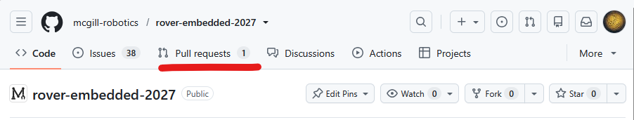
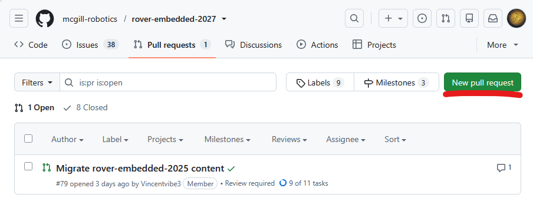
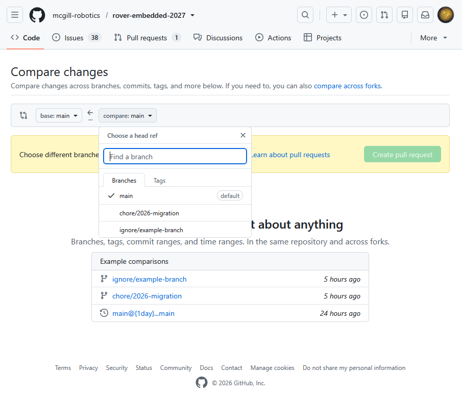
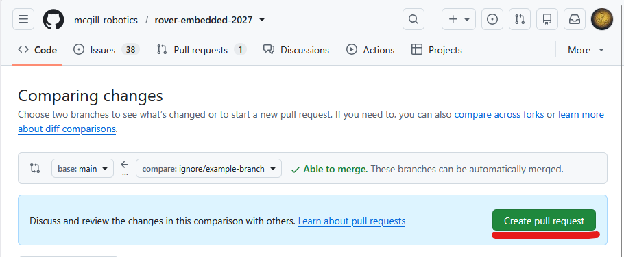
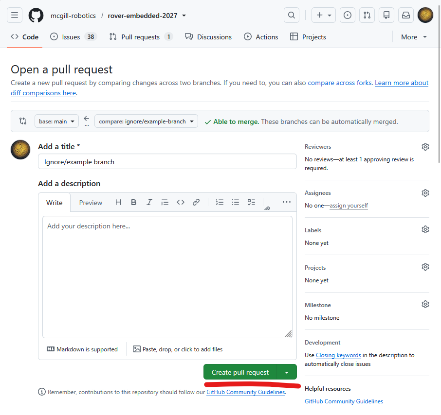

**Git Basics**

We use Git for version control and for collaborating when writing our code. The code is stored on Github at [https://github.com/mcgill-robotics/rover-embedded-2027](https://github.com/mcgill-robotics/rover-embedded-2027) (Complain to your leads if this link has not been updated for the correct year). This document will help you learn (or serve as a cheatsheet) how to use some basic Git commands.

**Learn Git\!**

If you have never used git before here’s a tutorial to get to know the basics (and more):  
[https://learngitbranching.js.org/](https://learngitbranching.js.org/) 

**Pull Requests**

Because we use Github for our repository, we make use of pull requests within the Github ui to merge our code changes. Here’s a quick basic guide on how to open a pull request.

1. Go to our repo on Github and go to the Pull requests page.  
2. Press on New pull request  
3. Press on the compare button and select your branch in the drop down.  
4. Click on Create pull request  
5. Add a descriptive name and a more detailed description of what the pull request changes in the repo then press the Create pull request button.   
6. Now your pull request is ready\! Wait for a lead to review it and they will merge it into main once your changes have been checked.

**Cheat sheet:**

Here’s a cheatsheet of common git commands to use when working.

Stage files before to prepare for a commit:

git add \<files\>

Make a commit:

git commit

Make a commit and directly pass a message

git commit \-m “\<message\>”

Send commits to Github

git push

Update repo from Github

git pull

Create a branch from the current branch

git branch \<branch name\>

List existing branches on your computer

git branch

Change the current branch

git switch \<branch name\>

**What Next?**

Now that you know how to use Git, the next step is checking our rules and guidelines when working on our repository to make sure we stay organized. You’ll find all that information in the “Working with the Git repository” section of this guidebook.

