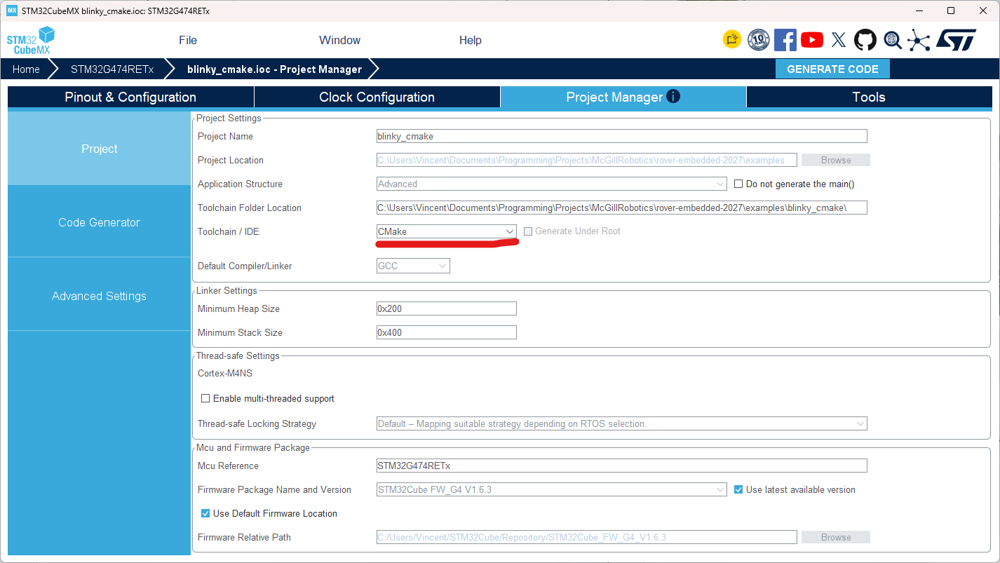

**Advanced Topics/Extras**

This section covers various things about projects in our Git repo that are not necessary for all members. 

**Using CMake**

In STM32CubeMX, there is the option to use CMake as the build system.  
  
This has some advantages, the project can be built from the command line (provided you download the correct compilers and other tools) and can be compatible with the STM32 extension for VSCode as well as STM32CubeIDE.

An example project can be found here as a reference for how to setup a simple project: [https://github.com/mcgill-robotics/rover-embedded-2027/tree/main/examples/blinky\_cmake](https://github.com/mcgill-robotics/rover-embedded-2027/tree/main/examples/blinky_cmake) 

When using CMake there are some important things to know about. CMake uses a file called CMakeLists.txt to determine what to compile in your project. Files need to manually be added in that file otherwise they will not be compiled unlike when using the STM32CubeMX build. For .c files they need to all individually be added to the target\_sources section. Use the variable $\{CMAKE\_CURRENT\_SOURCE\_DIR\} to get the path where CMakeLists.txt is, then you can add the relative path after it to get the full path to your file. For example: $\{CMAKE\_CURRENT\_SOURCE\_DIR\}/Core/Src/file.c 

For header files (.h files), they do not need to be individually included but the folders they are part of need to be added in the same way. To add the folders where header files can be added use the target\_include\_directories section. If you create a subdirectory of a folder already added you will need to add that subdirectory to the list too.

Note: By default, Core/Inc is added by STM32CubeMX’s configuration so any header files in there do not need to be added. All the .c files created by default by STM32CubeMX also do not need to be manually added.

**Libraries**

To create libraries that are reusable without needing to copy the files into each project using it (vendoring), we make use of CMake as it allows more flexibility and makes it easier to add external code than using the STM32CubeIDE build system.  
   
We have some scripts to help automate importing libraries and maintaining compatibility. This guide will demonstrate how to use them to create and import libraries. The scripts can be found here [https://github.com/mcgill-robotics/rover-embedded-2027/tree/main/other/cmake](https://github.com/mcgill-robotics/rover-embedded-2027/tree/main/other/cmake) 

Examples of libraries using these scripts can be found in the examples folder of the repo: [https://github.com/mcgill-robotics/rover-embedded-2027/tree/main/examples](https://github.com/mcgill-robotics/rover-embedded-2027/tree/main/examples). The following sections will be using these examples as a base.

**Creating Libraries**

In the folder for your project, create a src folder where you will put the code. In that folder, you will need to create a CMakeLists.txt (the casing matters). In the src folder, you will also add all the files for your library and put them in the CMakeLists.txt to compile. 

For the structure of the CMakeLists.txt follow these files:  
[https://github.com/mcgill-robotics/rover-embedded-2027/blob/main/examples/library\_uart\_handler/src/CMakeLists.txt](https://github.com/mcgill-robotics/rover-embedded-2027/blob/main/examples/library_uart_handler/src/CMakeLists.txt) for a library that needs the STM32 HAL and [https://github.com/mcgill-robotics/rover-embedded-2027/blob/main/examples/library\_command\_parser/src/CMakeLists.txt](https://github.com/mcgill-robotics/rover-embedded-2027/blob/main/examples/library_command_parser/src/CMakeLists.txt) for a library that does not need the STM32 HAL.

Adding the info to make it importable is done with the set\_lib\_info function which is provided by our custom system created in version-checker.cmake found here [https://github.com/mcgill-robotics/rover-embedded-2027/blob/main/other/cmake/version-checker.cmake](https://github.com/mcgill-robotics/rover-embedded-2027/blob/main/other/cmake/version-checker.cmake). This file is already included in the template from the examples but you may need to adjust the relative path to it depending on where you put your project.

Once including the version-checker.cmake script and calling set\_lib\_info, the src folder becomes usable as a library. If you want, you can now add another CMakeLists.txt and a test folder to write tests. See the library\_command\_parser example to see how this can be done. If your test cases require to be run on an actual board because you need the STM32 HAL, check the library\_uart\_handle example instead.

**Using Libraries**

To use a library you will first need to include the version-check.cmake script: [https://github.com/mcgill-robotics/rover-embedded-2027/blob/main/other/cmake/version-checker.cmake](https://github.com/mcgill-robotics/rover-embedded-2027/blob/main/other/cmake/version-checker.cmake). See the library\_consumer\_cmake example project for how to include it. [https://github.com/mcgill-robotics/rover-embedded-2027/blob/main/examples/library\_consumer\_cmake/CMakeLists.txt](https://github.com/mcgill-robotics/rover-embedded-2027/blob/main/examples/library_consumer_cmake/CMakeLists.txt). Make sure to adjust the relative path so it works for your project. 

Once the script is set up, you can use the use\_lib function to include other directories as a library. To use the function you need to specify 4 things, the directory where to find the library, a version number, how to verify the version (use APPROX) and a folder where to store files while building (for this use "$\{CMAKE\_CURRENT\_BINARY\_DIR\}/\<library name\>\_build").

If you’re using a library that can be added using CMake’s add\_subdirectory but has no version because it’s not from our repo then you can use ANY as the type of version verification and the build will succeed.

To add third party libraries, prefer using git submodules so they can be downloaded using git. If not possible, then you can 
