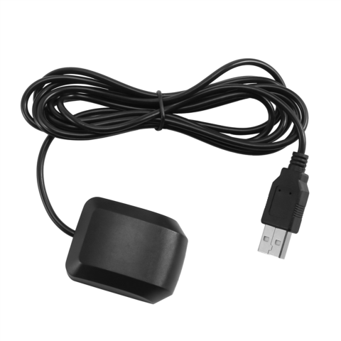

# USB GPS — VK-162G

## Overview:

**Component Number:** VK-162

* The following documentation is in regard to the following GPS module: 

    [https://drive.google.com/file/d/1H8cyCdSBa4FFs5ogC8JUG0isAaRp8GWu/view](https://drive.google.com/file/d/1H8cyCdSBa4FFs5ogC8JUG0isAaRp8GWu/view)  
* This module works with WindowsOS, MacOS, Linux, Android, and Raspberry pi

### Image:



## Extracting GPS data:

* The information that the GPS outputs is latitude and longitude data  
* The process is very simple, you connect the GPS to your device, then access that data using a python script (shown below) through the serial port displayed in Device Manager (assuming you are using a Windows system)  
* Make sure to run this command in the terminal before running the code below:   


  > pip install pyserial pynmea2


```python
import serial  
import pynmea2

\# Replace COMx with your GPS module's COM port (check in Device Manager)  
gps\_port \= 'COM7'  
baud\_rate \= 9600

ser \= serial.Serial(gps\_port, baud\_rate, timeout\=1)

while True:  
    try:  
        line \= ser.readline().decode('utf-8', errors\='ignore')  
        if line.startswith('$GPGGA') or line.startswith('$GPRMC'):  
            msg \= pynmea2.parse(line)  
            print(f"Latitude: {msg.latitude}, Longitude: {msg.longitude}")  
    except Exception as e:  
        print("Error:", e)  
