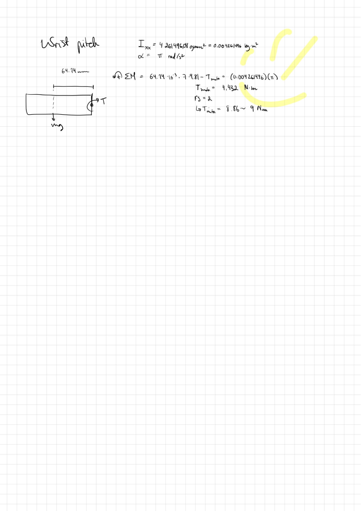

# **Wrist Roll Motor**
## Motor and Gearbox Specifications

Electrical requirements:

* Must be brushed  
* Must include an encoder  
* Must draw the least amount of current  
* Must be 24V

Technical Specifications

| Rated Torque (Nm) | 8.82 |
| :---- | :---- |
| Rated RPM | 13 |
| Rated Voltage (DC) | 12 |
| Rated Current (A) | 3 |
| Gearbox ratio | 1:625 |
| Weight | \- |
| Data sheet link | [Link](https://drive.google.com/file/d/13U5swvCJxRlo7_JIyFcc0mwr1mnc3qjD/view?usp=drive_link) |

Supplier info

| Supplier | Robot Shop |
| :---- | :---- |
| Brand | E-S Motor |
| Part Number (SKU)  | RM-ESMO-0CP |
| Manufacturer number | 42PG-775-625-EN 24V |
| Price ($) | 68.12 |
| Link | https://ca.robotshop.com/products/e-s-motor-42mm-high-torque-planetary-gear-motor-w-encoder-24v-13rpm?qd=27b67613532d703a35f7fc44657f9aa6 |

## Mechanical Simulation and Analysis

### Hand Calculations:

Since dynamic analysis is more appropriate here (than static analysis), we have to consider the moment of inertia. So, it was established that the wrist must be able to make half a rotation in one second:

  
 

The moment equation about the center of the small gear is:  

   
  
  
 (approximate weight of wrist, end-effector, and weight picked up by end-effector)  

   
  

**With a factor of safety of 2:**  
  

#### Original notes:

