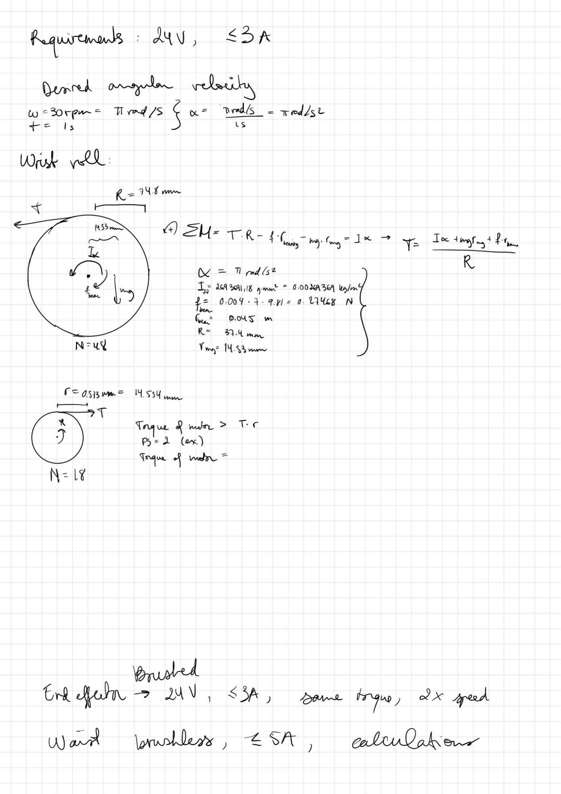

# **Wrist Roll Motor**
## Motor and Gearbox Specifications

Electrical requirements:

* Must be brushed  
* Must include an encoder  
* Must draw the least amount of current  
* Must be 24V

Technical Specifications

| Rated Torque (Nm) | 1.57 |
| :---- | :---- |
| Rated RPM | 15 |
| Rated Voltage (DC) | 24 |
| Rated Current (A) | 0.25 |
| Gearbox ratio | 1:510 |
| Weight | \- |
| Data sheet | [Link](https://drive.google.com/file/d/1Q5SFLJgTcfGxkA1OUCjCg6Zq66Pl4O3W/view?usp=drive_link) |

Supplier info

| Supplier | Robot Shop |
| :---- | :---- |
| Manufacturer | E-S Motors |
| Part Number (SKU)  | RM-ESMO-11S |
| Manufacturer number | 22PG-2230-510-EN 24V |
| Price ($) | 43.25 |
| Link | https://ca.robotshop.com/products/e-s-motor-22mm-planetary-gear-motor-w-encoder-24v-18rpm?qd=9673e2d07c8ff26a622d4504290be117 |

## Mechanical Simulation and Analysis

### Hand Calculations:

Two gears meshed with a belt are located at the base of the wrist with a gear ratio of 48:18. Note that the wrist roll motor is coupled to the smaller gear. In this case, dynamic analysis was considered. As a rule of thumb, it was established that the wrist must be able to make one rotation in 2 seconds (30rpm). In addition, the motor must reach that velocity in one second. From there, an approximate angular acceleration can be computed:

  
  
First, the force required to turn the larger pulley is determined. It is the tension force in the belt that transmits movement from the small gear to the larger gear.

The moments equation about the center of the large gear:

Where:  

   

  
 (approximate weight of wrist, end-effector, and weight picked up by end-effector)  

 

Then, the required torque of the motor can be computed, with a factor of safety of 2:  
 

#### Original notes:  

