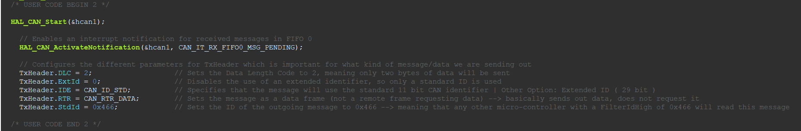

# CAN Bus — STM32

### **General Overview of CAN:**

- CAN (Controller Area Network) is a type of serial communication, whereby microcontrollers and devices exchange data without a central host. All transmission is done on one bus, where each device acts as a “node”  
- Please look more into CAN before reading the rest of the document, as it assumes at least SOME knowledge of CAN  
- This document also assumes some knowledge of how to use the CubeIDE; if you are completely new to it, you may continue, but if you are ever confused about a certain topic, please look it up before proceeding to the next step\!

## **Goal of this document:**

- To achieve sending a package from one STM32 to another (bidirectionally) which will tell the receiving STM32 to blink the LED on it’s NUCLEO board

## **STM32 Configuration:**

- For the sake of this document, the F446RE model of STM32 will be used  
  * If you are using a different model, the setup and initialization and pinouts may vary  
- We will be using STM32CubeIDE for this project  
1) Create a project, and select the F446RE board (or whatever board you are using)  
2) Once the project is created, you will see a page similar to the one below (yours will not be configured properly like mine just yet):

****

## **Clock Configuration:**

1) We will begin by configuring the clock that the STM32 will run on, so please select the “A-\>Z” tab on the left side of your screen, and then head to “RCC”  
2) Once there, find “High Speed Clock (HSE)” and select “Crystal/Ceramic Resonator”. What this essentially does is it forces the STM32 to use the external crystal (type of clock) which is built onto the NUCLEO board. We would like to have this configuration as it is more accurate than using the built-in clock. **NOTE: IF YOU ARE USING A DIFFERENT BOARD MODEL, PLEASE VERIFY THAT THERE IS INDEED A CRYSTAL ON THE BOARD FROM THE USER MANUAL OF THE BOARD. IF THERE IS NOT, PROCEED BY USING THE HSI (INTERNAL CLOCK)**

****

3) Now, please click on “Clock Configuration” near the top of the page, as we will now configure the actual clock frequency. In the “PLL Source Mux”, please select “HSE”, which in our case has the crystal frequency operating at 8MHz. Once that is selected, we want to make sure that “PLLCLK” is selected in the “System Clock Mux”. Once that is done, we can configure the output clock frequency; I chose to operate at a 72MHz clock frequency, as demonstrated below (arbitrary)

****

4) Now, before moving on, go back to the “A-\>Z” tab on the left once more, click on “SYS” and in the “Debug” row, select “Serial Wire”

## **CAN Configuration:**

1) Please select “CAN” under the “A-\>Z” tab, and enable it by clicking “Activated”  
   1. After doing this, you should notice that your PA12 pin was assigned to CAN\_TX and your PA11 pin was assigned to CAN\_RX

2) Now within the CAN tab you are currently in, you will see a “Configuration” block. Under this block, please select “Parameter Settings”; we will proceed to configure the baud rate. Usually, you will have to play around with the Prescaler value to get your desired baud rate, but in our case, our desired baud rate is 500000 bit/s (arbitrary choice), so please configure everything as indicated below:

3) Now, please head to the “NVIC Settings” tab and select “CAN1 RX0 interrupt” and “CAN1 RX1 interrupt”. This is crucial as without this, your STM32 board will not detect incoming packages on the CAN line

### **Configuring the Blue Button and Green LED:**

1) On your NUCLEO board, you may see a blue button. This button will be the button we press to send a package on the CAN line from the current STM32 to the other board(s). This in turn, will cause the LED on the other NUCLEO board(s) to blink

2) On the pinout view (the big diagram on the right), go to “PC13” and select “GPIO\_EXTI13” (this will be your blue button – you can see which pin the button corresponds to in the User Manual of your STM board)

3) Now once again, on the pinout view (the big diagram on the right), go to “PA5” and select “GPIO\_Output” (this will be your green LED – you can see which pin the LED corresponds to in the User Manual of your STM board)

4) Now, going back to the “A-\>Z” tab on the left, click on “GPIO”. You should now have a table in front of you. Please rename PA5 and PC13, and select the proper GPIO modes just like below:   
     
     
    
5) Finally, your Pinout View should look something like this:  
   

### **Generating the code:**

1) Now that we are done with all the configuration, we will proceed to the code. Save your project, and CubeIDE will automatically generate a header file (.h) and a .c file. We will use both for programming the STM32 for CAN  
2) Do not be overwhelmed with this generated code. Although it may seem like a lot, we are required to write code ONLY between the comments that say, “USER CODE BEGIN” and “USER CODE END”. This is crucial as doing otherwise will result in unexpected errors. Keep in mind that we will be using the ### **HAL library** from STM throughout the code. This library provides us with lots of functions we may utilize for CAN  
3) The only file we will be changing is the .c file, as the .h file will be used as reference for the ports and pins that different variables will be assigned to. This is important as the .h file reflects the physical ports and pins of the STM32 board. For example, when looking at the .h file generated, you can see that the blue button has pin “GPIO\_PIN\_13” and has port “GPIOC”. When referring to the STM32 pinout schematic of your model in the user manual, you will see where these ports and pins are on the board\!

## **Writing the CAN code in C:**

CAN Initialization: (under *“/\* CAN Bus Initialization BEGIN \*/*”)

1) First, we will begin by defining the TxHeader   
   1. CAN\_TxHeaderTypeDef is a data structure provided by the STM32 HAL library. It encapsulates all the necessary settings for a CAN transmission, including the **message ID**, **data length**, and other frame attributes, which we will see

    

2) Second, we will define the RxHeader  
   1. This is the same idea as before, except it encapsulates all the necessary settings for **incoming** CAN packages

   

3) Third, we will define the TxMailBox  
   1. A CAN transmit mailbox is a buffer inside the STM32 CAN peripheral where your outgoing CAN message is temporarily stored before being sent onto the CAN bus. The STM32 CAN peripheral has **three transmit mailboxes** (indexed as 0, 1, and 2\)  
      1. Think of the mailboxes as "slots" for outgoing messages

   

4) Fourth, we will define the outgoing and incoming messages  
   1. This is done through TxData and RxData  
      1. We will assume that TxData and RxData both need 8 bytes per message due to the diagram below

   

   

      

5) Finally, we will now define an int variable called datacheck. As we will see, this variable simply indicates whether there is an incoming CAN package or not (we will use it in our functions later)

### Configuring the TxHeader:

1) We will now move down to line 142 of the code provided, where we will configure the TxHeader. As I mentioned before, the TxHeader has multiple fields relevant to CAN; here, we will define them. Below is an image of every field with comments explaining each one for you to follow:

1. One critical component to highlight is the TxHeader.StdId field, which acts as the "address" for the outgoing message. This means that only the STM32 or other devices on the CAN bus configured to match this identifier (address) will process and read the message (we will see how to configure the address of an STM32 in the CANFilter section below). Basically, TxHeader.StdId indicates the address byte of the device you want to send to 

### Configuring the RxHeader:

1) In the code, RxHeader is not explicitly configured like TxHeader because it is populated automatically by the CAN peripheral hardware when a message is received. The CAN peripheral takes care of extracting the metadata (e.g., message ID, data length, etc.) from the incoming message and fills the RxHeader structure accordingly

## Configuring the CANFilter:

1) The CAN filter is a mechanism within the STM32 CAN peripheral that allows you to control which incoming messages are accepted by the CAN hardware and processed by your application. It works by comparing the identifier (ID) of incoming messages against a set of predefined rules, discarding those that don’t match  
2) If you proceed to line 264 in the code, you will see how the CAN filter configuration is done. All the comments indicate what each field means and what it is meant for:

Two key fields to highlight are “FilterIdHigh” and “FilterMaskIdHigh”  
   1. FilterIdHigh is the field that dictates the identifier of the current STM32 that we are flashing. This is the “address” field that was mentioned earlier. For example, in the code above, if we want the current STM32 to read incoming messages, that means that the incoming package should have the identifier “0x103” (meaning that the incoming package’s TxHeader.StdId field should have the value “0x103”). Basically, FilterIdHigh indicates the address byte of the current device  
      2. The FilterMaskIdHigh field essentially tells that out of the 11 bits in the CAN ID, every single bit is relevant to the identifier (since 0x7FF is 11111111111 in binary – indicating that every bit matters)  
      3. To avoid confusion, the reason we do “\<\<5” is to shift the hexadecimal number by 5 bits. You may ask yourself, why do we do this? The reason is that the CAN filter configuration in STM32 uses **16-bit fields** to represent message IDs in the FilterIdHigh and FilterMaskIdHigh registers. These fields are offset by 5 bits due to the way the CAN frame format aligns identifiers. However, if you refer to the diagram of the CAN package above, we use **11 bits** to represent the identifier, hence, we shift by 5 bits\!

## Blue Button Function:

1) Please go to line 95 of the code. Here we create the function that sends out a package on the CAN line once the blue button is pressed on the NUCLEO board  
2) First, we use the “**HAL\_GPIO\_EXTI\_Callback**” function. This function is essentially ran once an interrupt is detected  
   1. Inside of this function, you will see the line “**if** (GPIO\_Pin \== Blue\_Button\_Pin)”. What this line is saying is once the blue button is pressed, then run the code below. It is **very important** that we know how to determine which variable to use as arugments. In this case, the function takes as argument a pin (GPIO\_Pin \== Blue\_Button\_Pin), hence we use the variable “Blue\_Button\_Pin”. However, you may ask, how did we know that this is the variable we should use? This is done by referring to the **header file** as mentioned briefly earlier. **This means that every time a function from the HAL library requires either a pin or port as argument, you must refer to the header file and find the correct one you intend to use**. In our case, the pin is displayed like this in the header file:  
      
   2. Now, focusing on the actual implementation of the function, we use a HAL function called “**HAL\_GPIO\_WritePin**”. This function results in turning on the green led once the blue button is pressed **(honestly idk why this is still in the code, i think ima remove it)**   
   3. TxData\[0\] is us configuring the first byte, setting it to a value of 100, meaning that there will be a delay of 100ms between each LED blink on the other STM32 (we will see how this is done in the following section)  
   4. TxData\[1\] is us configuring the second byte, setting it to a value of 10, meaning that there will be 10 loop repetitions (we will see how this is done in the following section)  
   5. **HAL\_CAN\_AddTxMessage**(\&hcan1, \&TxHeader, TxData, \&TxMailbox) is a built in HAL function which is responsible for sending out the package with the arguments in the brackets (which we have defined earlier)

## Green LED Blinking:

### Receiving the relevant package:

1) Please go to line 73 of the code. Here, we use a built in HAL function to determine whether we have an incoming package in the RxHeader. If there is a package with size of 2 bytes, then we set the datacheck variable to 1, which means that we will now commence blinking the LED (you will see it in action in the part below)

### Blinking the LED:

1) Please go to line 160 of the code. Here, we will define how our STM32 will blink it’s LED once it receives a package with its designated identifier  
2) We use the datacheck variable to determine whether there a relevant package received from another STM32/device  
3) As we indicated earlier, TxData\[1\] indicates the number of loop repetitions. Thus, by having a for loop with RxData\[1\], we are determining how many times we want the LED to blink 10 times  
4) The functions within the for loop are built in HAL functions which are used to toggle the LED on the NUCLEO board: 

## **Important Notes:**

- If you are using two different STM32 models, then you will have to create two separate projects for each model, and also configure each one differently depending on their pinouts and potentially varying configurations (for example, not all STM32s have an HSE, but rather only have an HSI)  
- If you are flashing two different STM32s to communicate with one another, you must make sure to change the **TxHeader.StdId** and **canfilterconfig.FilterIdHigh** parameters. For example, say my first STM32 has TxHeader as 0x103 (address byte of other board), and FilterIdHigh as 0x466 (address byte of current board), then my second STM32 should have TxHeader as 0x466, and FilterIdHigh as 0x103  
- **MOST IMPORTANT OF ALL, ALL BOARDS ON THE CAN LINE SHOULD HAVE A MATCHING BAUD RATE, OTHERWISE COMMUNICATION WILL NOT WORK\!** (baud rate was configured in the “CAN Configuration” section)